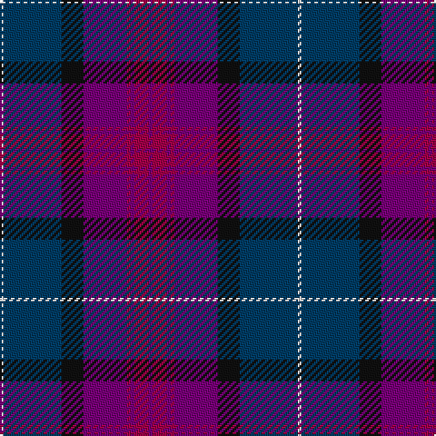

**Bands:** [BRBRBKBW](/stripes/brbrbkbw/) · **Stripes:** [DP M DP M DP K DT W](/stripes/stripes8/) DP M DP M DP K DT W

This was sourced from register-of-tartans.  It is a [8 band tartan](/bands/bands8/).

Original link https://www.tartanregister.gov.uk/tartanDetails.aspx?ref=1191

## Register references

External register numbers recorded for this tartan.

- Scottish Register of Tartans: [1191](https://www.tartanregister.gov.uk/tartanDetails.aspx?ref=1191)
- Scottish Tartans Authority (ITI): 6904

## Thread count
LN/2 DB32 K12 P24 R2 P2 R8 P/2

## Palette
Each colour and its ΔE from the base-6 reference it is a variant of.

| Colour | Shade | Base | ΔE (OKLab) |
|---|---|---|---|
| DB | <code style="background-color:#003C64;">#003C64</code> `#003C64` | B <code style="background-color:#2A418A;">#2A418A</code> | 0.08 |
| K | <code style="background-color:#101010;">#101010</code> `#101010` | K <code style="background-color:#000000;">#000000</code> | 0.17 |
| LN | <code style="background-color:#E0E0E0;">#E0E0E0</code> `#E0E0E0` | W <code style="background-color:#F7F7F7;">#F7F7F7</code> | 0.07 |
| P | <code style="background-color:#780078;">#780078</code> `#780078` | B <code style="background-color:#2A418A;">#2A418A</code> | 0.17 |
| R | <code style="background-color:#A00048;">#A00048</code> `#A00048` | R <code style="background-color:#CC0000;">#CC0000</code> | 0.12 |

# Sample pattern

## Nearest tartans

The nearest existing variants by ΔTartan distance.

1. [First (Corporate)](/setts/s7/m4dp1m1dp12k6dt16w1~x2/) — ΔT 0.38
1. [Wardlaw](/setts/s10/k4dp30k3dp2db2r2g12k3db18r3~x2/) — ΔT 0.66
1. [Alba](/setts/s8/dp24dt2g3m2g3k11dt29w2~x2/) — ΔT 1.02
1. [Charleston Police Department](/setts/s7/dp22lo10dp6lr18dp50db71k6/) — ΔT 1.02
1. [KPMG (Corporate)](/setts/s10/r12lo2db3k3db30k20dr6k10lo2dr4~x2/) — ΔT 1.20
1. [D'Souza (Personal)](/setts/s10/dp24k2dp2lo2dp2k20db16o2db2o3~x2/) — ΔT 1.37
1. [Rangers Football Club Dress](/setts/s11/r2db6lr2db2k9db30k9db5lr4db2r2~x2/) — ΔT 1.44
1. [Murdoch](/setts/s6/k2m1db17m17dt1ly2~x4/) — ΔT 1.45
1. [Riley's Theme (Fashion)](/setts/s6/db20k4g5dp14w1db2~x2/) — ΔT 1.46
1. [Scotch House 2000 Antique](/setts/s8/db22r3db2r3db2k17dy18g4~x2/) — ΔT 1.50

## Neighbour map

Every grey dot is one of 14313 variants placed by the first two principal components of the ΔTartan feature space (44% of its variance). Red is this tartan; blue dots are its nearest — click one to open its page.

<svg viewBox="0 0 640 380" role="img" style="max-width:100%;height:auto;border:1px solid #e0e0e0;border-radius:4px;display:block" xmlns="http://www.w3.org/2000/svg"><image href="/nn/cloud.v1.png" width="640" height="380"/><a href="/setts/s7/m4dp1m1dp12k6dt16w1~x2/"><circle cx="252.4" cy="183.1" r="4" fill="#3465a4"><title>First (Corporate)</title></circle></a><a href="/setts/s10/k4dp30k3dp2db2r2g12k3db18r3~x2/"><circle cx="249.3" cy="153.2" r="4" fill="#3465a4"><title>Wardlaw</title></circle></a><a href="/setts/s8/dp24dt2g3m2g3k11dt29w2~x2/"><circle cx="237.1" cy="153.8" r="4" fill="#3465a4"><title>Alba</title></circle></a><a href="/setts/s7/dp22lo10dp6lr18dp50db71k6/"><circle cx="262.1" cy="199.9" r="4" fill="#3465a4"><title>Charleston Police Department</title></circle></a><a href="/setts/s10/r12lo2db3k3db30k20dr6k10lo2dr4~x2/"><circle cx="217.8" cy="163.7" r="4" fill="#3465a4"><title>KPMG (Corporate)</title></circle></a><a href="/setts/s10/dp24k2dp2lo2dp2k20db16o2db2o3~x2/"><circle cx="261.9" cy="184.9" r="4" fill="#3465a4"><title>D'Souza (Personal)</title></circle></a><a href="/setts/s11/r2db6lr2db2k9db30k9db5lr4db2r2~x2/"><circle cx="241.4" cy="152.2" r="4" fill="#3465a4"><title>Rangers Football Club Dress</title></circle></a><a href="/setts/s6/k2m1db17m17dt1ly2~x4/"><circle cx="314.5" cy="171.7" r="4" fill="#3465a4"><title>Murdoch</title></circle></a><a href="/setts/s6/db20k4g5dp14w1db2~x2/"><circle cx="311.3" cy="197.0" r="4" fill="#3465a4"><title>Riley's Theme (Fashion)</title></circle></a><a href="/setts/s8/db22r3db2r3db2k17dy18g4~x2/"><circle cx="213.1" cy="197.5" r="4" fill="#3465a4"><title>Scotch House 2000 Antique</title></circle></a><circle cx="254.7" cy="171.5" r="5" fill="#c00000"/></svg>

ID: /setts/s8/dp1m4dp1m1dp12k6dt16w1~x2/
