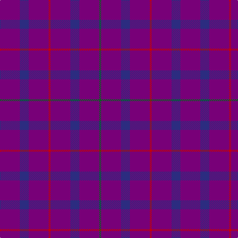

In pattern [BBBRBBBG](/stripes/bbbrbbbg/).

This was sourced from register-of-tartans.  It is a [8 stripe tartan](/stripes/stripes8/).

Original link https://www.tartanregister.gov.uk/tartanDetails.aspx?ref=3734

## Register references

External register numbers recorded for this tartan.

- Scottish Register of Tartans: [3734](https://www.tartanregister.gov.uk/tartanDetails.aspx?ref=3734)
- Scottish Tartans Authority (ITI): 689
- Scottish Tartans World Register: 689

## Thread count
P/40 DB18 P40 R4 P40 DB18 P40 G/4

## Palette
Each colour and its ΔE from the base-6 reference it is a variant of.

| Colour | Shade | Base | ΔE (OKLab) |
|---|---|---|---|
| DB | <code style="background-color:#2C2C80;">#2C2C80</code> `#2C2C80` | B <code style="background-color:#2A418A;">#2A418A</code> | 0.06 |
| G | <code style="background-color:#006818;">#006818</code> `#006818` | G <code style="background-color:#006100;">#006100</code> | 0.02 |
| P | <code style="background-color:#780078;">#780078</code> `#780078` | B <code style="background-color:#2A418A;">#2A418A</code> | 0.17 |
| R | <code style="background-color:#C80000;">#C80000</code> `#C80000` | R <code style="background-color:#CC0000;">#CC0000</code> | 0.01 |

# Sample pattern

## Nearest tartans

The nearest existing variants by ΔTartan distance.

1. [Scottish Netball (1987) (Corporate)](/setts/s5/r2dp20db9dp20g2~x2/) — ΔT 1.59
1. [Meanwood McMain (Personal)](/setts/s9/dp30db10m5db10dp30db3dp5db3dp30~x2/) — ΔT 1.87
1. [Scottish Netball Association](/setts/s5/r2p20db9p20g2~x2/) — ΔT 1.90
1. [Thomas Blake Glover](/setts/s12/db4dr16o6dr16o6dr16db8dr6db4dr16db2o1~x2/) — ΔT 3.09
1. [Meanwood McMain Personal Tartan Tartan Number: 6813. Earliest known date: 2005 December This was a gift from her colleagues to Dr. McMain from the meanwood Group Practice in Leeds on the occasion of her relocation to Australia after 16 years in Leeds. Designed by Maxine Scott of the House of Tartan. See products available Copyright © Blair Urquhart, Comrie, 2015](/setts/s16/dp30db10m5db10dp30db3dp5db3dp30~x2/) — ΔT 3.11
1. [Elliot](/setts/s4/db16m4db3r1~x2/) — ΔT 3.17
1. [Elliot Clan Tartan Tartan Number: 596. Earliest known date: pre 1906 The Elliot tartan was first recorded by H. Whyte in his book, 'The Tartans of the Clans and Septs of Scotland' (1906), along with many others in use at the time. The colouring is unique among traditional tartans, being described as maroon and blue. The Elliots are a 'Border Clan', founders of the Minto family. The Chiefship once belonged to to the Elliots of Redheugh but passed to the Elliots of Stobs near Hawick in Roxburghshire. The present Chief is Mrs Margaret Elliot of that Ilk. See products available Copyright © Blair Urquhart, Comrie, 2015](/setts/s4/db16dr4db3r1~x6/) — ΔT 3.33
1. [Highland Spring Corporate Tartan Tartan Number: 130. Earliest known date: 1987 Highland Spring manufacture bottled drinking water at Blackford in Perthshire, Scotland. See products available Copyright © Blair Urquhart, Comrie, 2015](/setts/s4/dp5g2dp19r5~x2/) — ΔT 3.37
1. [Elliot (Clan)](/setts/s4/db44dy12db9r3~x2/) — ΔT 3.40
1. [Elliot](/setts/s6/db9dy12db44dy12db9r3~x2/) — ΔT 3.45

## Neighbour map

Every grey dot is one of 14299 variants placed by the first two principal components of the ΔTartan feature space (44% of its variance). Red is this tartan; blue dots are its nearest — click one to open its page.

<svg viewBox="0 0 640 380" role="img" style="max-width:100%;height:auto;border:1px solid #e0e0e0;border-radius:4px;display:block" xmlns="http://www.w3.org/2000/svg"><image href="/nn/cloud.v1.png" width="640" height="380"/><a href="/setts/s5/r2dp20db9dp20g2~x2/"><circle cx="555.9" cy="281.1" r="4" fill="#3465a4"><title>Scottish Netball (1987) (Corporate)</title></circle></a><a href="/setts/s9/dp30db10m5db10dp30db3dp5db3dp30~x2/"><circle cx="539.4" cy="272.4" r="4" fill="#3465a4"><title>Meanwood McMain (Personal)</title></circle></a><a href="/setts/s5/r2p20db9p20g2~x2/"><circle cx="543.6" cy="272.8" r="4" fill="#3465a4"><title>Scottish Netball Association</title></circle></a><a href="/setts/s12/db4dr16o6dr16o6dr16db8dr6db4dr16db2o1~x2/"><circle cx="502.6" cy="245.8" r="4" fill="#3465a4"><title>Thomas Blake Glover</title></circle></a><a href="/setts/s16/dp30db10m5db10dp30db3dp5db3dp30~x2/"><circle cx="457.4" cy="234.0" r="4" fill="#3465a4"><title>Meanwood McMain Personal Tartan Tartan Number: 6813. Earliest known date: 2005 December This was a gift from her colleagues to Dr. McMain from the meanwood Group Practice in Leeds on the occasion of her relocation to Australia after 16 years in Leeds. Designed by Maxine Scott of the House of Tartan. See products available Copyright © Blair Urquhart, Comrie, 2015</title></circle></a><a href="/setts/s4/db16m4db3r1~x2/"><circle cx="626.0" cy="291.2" r="4" fill="#3465a4"><title>Elliot</title></circle></a><a href="/setts/s4/db16dr4db3r1~x6/"><circle cx="626.0" cy="305.3" r="4" fill="#3465a4"><title>Elliot Clan Tartan Tartan Number: 596. Earliest known date: pre 1906 The Elliot tartan was first recorded by H. Whyte in his book, 'The Tartans of the Clans and Septs of Scotland' (1906), along with many others in use at the time. The colouring is unique among traditional tartans, being described as maroon and blue. The Elliots are a 'Border Clan', founders of the Minto family. The Chiefship once belonged to to the Elliots of Redheugh but passed to the Elliots of Stobs near Hawick in Roxburghshire. The present Chief is Mrs Margaret Elliot of that Ilk. See products available Copyright © Blair Urquhart, Comrie, 2015</title></circle></a><a href="/setts/s4/dp5g2dp19r5~x2/"><circle cx="561.7" cy="271.6" r="4" fill="#3465a4"><title>Highland Spring Corporate Tartan Tartan Number: 130. Earliest known date: 1987 Highland Spring manufacture bottled drinking water at Blackford in Perthshire, Scotland. See products available Copyright © Blair Urquhart, Comrie, 2015</title></circle></a><a href="/setts/s4/db44dy12db9r3~x2/"><circle cx="612.0" cy="290.5" r="4" fill="#3465a4"><title>Elliot (Clan)</title></circle></a><a href="/setts/s6/db9dy12db44dy12db9r3~x2/"><circle cx="532.3" cy="267.3" r="4" fill="#3465a4"><title>Elliot</title></circle></a><circle cx="585.3" cy="294.1" r="5" fill="#c00000"/></svg>

ID: /setts/s8/dp20db9dp20r2dp20db9dp20g2~x2/
