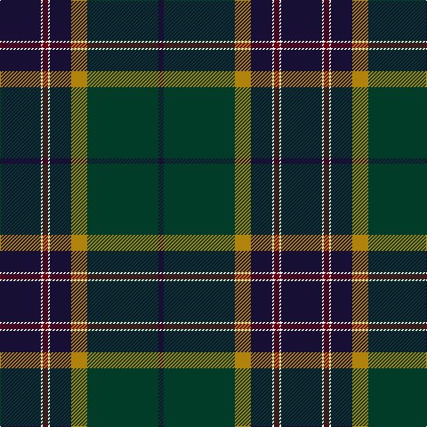

In pattern [BGYBWRWB](/stripes/bgybwrwb/).

This was sourced from register-of-tartans.  It is a [8 stripe tartan](/stripes/stripes8/).

Original link https://www.tartanregister.gov.uk/tartanDetails.aspx?ref=3334

## Attestations

This cloth appears in 2 source records; the oldest owns this page.

- 01/02/2007 — Pictou County (register-of-tartans, [record](https://www.tartanregister.gov.uk/tartanDetails.aspx?ref=3334))
- Feb.2007 — Pictou County (District) (tartans-authority, [record](http://www.tartansauthority.com/tartan-ferret/display/7113/))

## Register references

External register numbers recorded for this tartan.

- Scottish Register of Tartans: [3334](https://www.tartanregister.gov.uk/tartanDetails.aspx?ref=3334)
- Scottish Tartans Authority (ITI): 7113

## Thread count
DBa/46 W2 DR6 W2 DBa24 DY18 DG80 DB/6

## Palette
Each colour and its ΔE from the base-6 reference it is a variant of.

| Colour | Shade | Base | ΔE (OKLab) |
|---|---|---|---|
| DB | <code style="background-color:#181034;">#181034</code> `#181034` | B <code style="background-color:#2A418A;">#2A418A</code> | 0.20 |
| DBa | <code style="background-color:#181034;">#181034</code> `#181034` | B <code style="background-color:#2A418A;">#2A418A</code> | 0.20 |
| DG | <code style="background-color:#003C28;">#003C28</code> `#003C28` | G <code style="background-color:#006100;">#006100</code> | 0.14 |
| DR | <code style="background-color:#700014;">#700014</code> `#700014` | R <code style="background-color:#CC0000;">#CC0000</code> | 0.20 |
| DY | <code style="background-color:#B0840C;">#B0840C</code> `#B0840C` | Y <code style="background-color:#F2BF00;">#F2BF00</code> | 0.19 |
| W | <code style="background-color:#FCF8EC;">#FCF8EC</code> `#FCF8EC` | W <code style="background-color:#F7F7F7;">#F7F7F7</code> | 0.02 |

# Sample pattern

## Nearest tartans

The nearest existing variants by ΔTartan distance.

1. [Scragg Moran (Personal)](/setts/s10/g1dt28k11r5w1r5k11lr1k2g1~x2/) — ΔT 0.92
1. [Sidey Family Tartan (Name)](/setts/s10/db4w1k2db25k12b1k2g16k2r1~x2/) — ΔT 1.06
1. [Young](/setts/s8/db3t3g30db25dp4r3ly2dp1~x2/) — ΔT 1.09
1. [Highland Gathering (Fashion?)](/setts/s10/k45r4k4do4lo16do76dt8lo6dt2w4/) — ΔT 1.10
1. [Lusk (Personal)](/setts/s9/k2g30k3db4k2db18t1k3r2~x2/) — ΔT 1.12
1. [Brighton Mac Dermotte](/setts/s9/dt47ly1do27lr4dg5ly1lr8t1do1~x2/) — ΔT 1.15
1. [Johnston, Diana Hunting (Personal)](/setts/s8/ly3dt1k2dg26dt28w1dt1r2~x2/) — ΔT 1.20
1. [Highland Pride of Scotland (Fashion)](/setts/s11/db9dg2dp2dp2dg18dp2k2dg1k19db33w2~x2/) — ΔT 1.20
1. [Buschke (Skye) (Personal)](/setts/s7/ly2dr4dg11k30r2db16w1~x2/) — ΔT 1.23
1. [Rikaco Heirloom (Fashion)](/setts/s10/db3db3db1g26db10n1db3dp5db4lo2~x2/) — ΔT 1.25

## Neighbour map

Every grey dot is one of 14299 variants placed by the first two principal components of the ΔTartan feature space (44% of its variance). Red is this tartan; blue dots are its nearest — click one to open its page.

<svg viewBox="0 0 640 380" role="img" style="max-width:100%;height:auto;border:1px solid #e0e0e0;border-radius:4px;display:block" xmlns="http://www.w3.org/2000/svg"><image href="/nn/cloud.v1.png" width="640" height="380"/><a href="/setts/s10/g1dt28k11r5w1r5k11lr1k2g1~x2/"><circle cx="276.5" cy="116.2" r="4" fill="#3465a4"><title>Scragg Moran (Personal)</title></circle></a><a href="/setts/s10/db4w1k2db25k12b1k2g16k2r1~x2/"><circle cx="275.2" cy="129.7" r="4" fill="#3465a4"><title>Sidey Family Tartan (Name)</title></circle></a><a href="/setts/s8/db3t3g30db25dp4r3ly2dp1~x2/"><circle cx="268.8" cy="117.2" r="4" fill="#3465a4"><title>Young</title></circle></a><a href="/setts/s10/k45r4k4do4lo16do76dt8lo6dt2w4/"><circle cx="299.6" cy="90.9" r="4" fill="#3465a4"><title>Highland Gathering (Fashion?)</title></circle></a><a href="/setts/s9/k2g30k3db4k2db18t1k3r2~x2/"><circle cx="291.0" cy="120.4" r="4" fill="#3465a4"><title>Lusk (Personal)</title></circle></a><a href="/setts/s9/dt47ly1do27lr4dg5ly1lr8t1do1~x2/"><circle cx="322.8" cy="85.3" r="4" fill="#3465a4"><title>Brighton Mac Dermotte</title></circle></a><a href="/setts/s8/ly3dt1k2dg26dt28w1dt1r2~x2/"><circle cx="319.1" cy="125.7" r="4" fill="#3465a4"><title>Johnston, Diana Hunting (Personal)</title></circle></a><a href="/setts/s11/db9dg2dp2dp2dg18dp2k2dg1k19db33w2~x2/"><circle cx="297.0" cy="119.8" r="4" fill="#3465a4"><title>Highland Pride of Scotland (Fashion)</title></circle></a><a href="/setts/s7/ly2dr4dg11k30r2db16w1~x2/"><circle cx="253.1" cy="126.2" r="4" fill="#3465a4"><title>Buschke (Skye) (Personal)</title></circle></a><a href="/setts/s10/db3db3db1g26db10n1db3dp5db4lo2~x2/"><circle cx="276.2" cy="124.0" r="4" fill="#3465a4"><title>Rikaco Heirloom (Fashion)</title></circle></a><circle cx="294.3" cy="124.3" r="5" fill="#c00000"/></svg>

ID: /setts/s8/dp23w1o3w1dp12lo9dg40dp3~x2/
