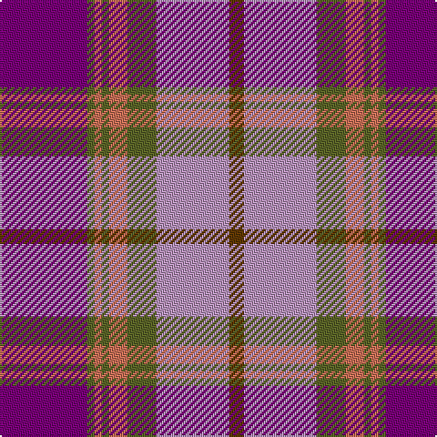

**Bands:** [BGRGRGYG](/stripes/bgrgrgyg/) · **Stripes:** [DP Y O Y O Y LR DY](/stripes/stripes8/) DP Y O Y O Y LR DY

This was sourced from register-of-tartans.  It is a [8 band tartan](/bands/bands8/).

Original link https://www.tartanregister.gov.uk/tartanDetails.aspx?ref=1397

## Attestations

This cloth appears in 2 source records; the oldest owns this page.

- 01/01/1978 — Glen Shee (register-of-tartans, [record](https://www.tartanregister.gov.uk/tartanDetails.aspx?ref=1397))
- pre 1978 — Glen Shee #2 (Fashion) (tartans-authority, [record](http://www.tartansauthority.com/tartan-ferret/display/5023/))

## Register references

External register numbers recorded for this tartan.

- Scottish Register of Tartans: [1397](https://www.tartanregister.gov.uk/tartanDetails.aspx?ref=1397)
- Scottish Tartans Authority (ITI): 5023

## Thread count
P/48 G4 DO4 G4 DO10 G16 LP40 T/8

## Palette
Each colour and its ΔE from the base-6 reference it is a variant of.

| Colour | Shade | Base | ΔE (OKLab) |
|---|---|---|---|
| DO | <code style="background-color:#C87058;">#C87058</code> `#C87058` | R <code style="background-color:#CC0000;">#CC0000</code> | 0.15 |
| G | <code style="background-color:#5C6428;">#5C6428</code> `#5C6428` | G <code style="background-color:#006100;">#006100</code> | 0.10 |
| LP | <code style="background-color:#B894BC;">#B894BC</code> `#B894BC` | Y <code style="background-color:#F2BF00;">#F2BF00</code> | 0.25 |
| P | <code style="background-color:#780078;">#780078</code> `#780078` | B <code style="background-color:#2A418A;">#2A418A</code> | 0.17 |
| T | <code style="background-color:#603800;">#603800</code> `#603800` | G <code style="background-color:#006100;">#006100</code> | 0.16 |

# Sample pattern

## Nearest tartans

The nearest existing variants by ΔTartan distance.

1. [Wild Rose (Commemorative)](/setts/s9/dp12n3r13dp4r10w2lb18n22r4~x2/) — ΔT 1.37
1. [NHK Asaichi](/setts/s11/dy2r11db1r1db1r1db4db6dy1db1ly1~x4/) — ΔT 1.43
1. [Intelligent Finance](/setts/s10/n5dp40n5lr5n32lr5n5lr40dp7w5/) — ΔT 1.44
1. [Clarks No. 1 (Fashion)](/setts/s10/db5t2db11g2db2g6r17lo9db1r1~x2/) — ΔT 1.46
1. [Afternoon Tea / Assam](/setts/s6/r15r98dp72t25dp8w15/) — ΔT 1.46
1. [Akins (Clan)](/setts/s8/m21r3m3r3m3db19g22t3~x2/) — ΔT 1.49
1. [Balfour Family Tartan Tartan Number: 683. Earliest known date: 1984 Presented by William Balfour. See products available Copyright © Blair Urquhart, Comrie, 2015](/setts/s6/db30ly3dy11ly3o33r6~x2/) — ΔT 1.56
1. [Stevens #3](/setts/s6/dp2t9dp3r7r19ly2~x2/) — ΔT 1.58
1. [Eidart, Scotch House](/setts/s12/y4w2y2w3y20db6r3db2r2db2r17db3~x2/) — ΔT 1.58
1. [Scottish Highlander Dress (Fashion)](/setts/s8/p26w2p3db15o26r2o3db4~x2/) — ΔT 1.58

## Neighbour map

Every grey dot is one of 14313 variants placed by the first two principal components of the ΔTartan feature space (44% of its variance). Red is this tartan; blue dots are its nearest — click one to open its page.

<svg viewBox="0 0 640 380" role="img" style="max-width:100%;height:auto;border:1px solid #e0e0e0;border-radius:4px;display:block" xmlns="http://www.w3.org/2000/svg"><image href="/nn/cloud.v1.png" width="640" height="380"/><a href="/setts/s9/dp12n3r13dp4r10w2lb18n22r4~x2/"><circle cx="135.6" cy="172.2" r="4" fill="#3465a4"><title>Wild Rose (Commemorative)</title></circle></a><a href="/setts/s11/dy2r11db1r1db1r1db4db6dy1db1ly1~x4/"><circle cx="231.1" cy="138.7" r="4" fill="#3465a4"><title>NHK Asaichi</title></circle></a><a href="/setts/s10/n5dp40n5lr5n32lr5n5lr40dp7w5/"><circle cx="201.9" cy="181.3" r="4" fill="#3465a4"><title>Intelligent Finance</title></circle></a><a href="/setts/s10/db5t2db11g2db2g6r17lo9db1r1~x2/"><circle cx="183.7" cy="144.0" r="4" fill="#3465a4"><title>Clarks No. 1 (Fashion)</title></circle></a><a href="/setts/s6/r15r98dp72t25dp8w15/"><circle cx="237.3" cy="178.3" r="4" fill="#3465a4"><title>Afternoon Tea / Assam</title></circle></a><a href="/setts/s8/m21r3m3r3m3db19g22t3~x2/"><circle cx="180.2" cy="194.2" r="4" fill="#3465a4"><title>Akins (Clan)</title></circle></a><a href="/setts/s6/db30ly3dy11ly3o33r6~x2/"><circle cx="199.1" cy="187.5" r="4" fill="#3465a4"><title>Balfour Family Tartan Tartan Number: 683. Earliest known date: 1984 Presented by William Balfour. See products available Copyright © Blair Urquhart, Comrie, 2015</title></circle></a><a href="/setts/s6/dp2t9dp3r7r19ly2~x2/"><circle cx="245.7" cy="194.1" r="4" fill="#3465a4"><title>Stevens #3</title></circle></a><a href="/setts/s12/y4w2y2w3y20db6r3db2r2db2r17db3~x2/"><circle cx="239.1" cy="159.6" r="4" fill="#3465a4"><title>Eidart, Scotch House</title></circle></a><a href="/setts/s8/p26w2p3db15o26r2o3db4~x2/"><circle cx="213.6" cy="163.0" r="4" fill="#3465a4"><title>Scottish Highlander Dress (Fashion)</title></circle></a><circle cx="203.8" cy="161.5" r="5" fill="#c00000"/></svg>

ID: /setts/s8/dp24y2o2y2o5y8lr20dy4~x2/
