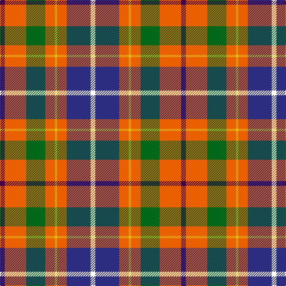

In pattern [BRGRYRBW](/stripes/brgryrbw/).

This was sourced from register-of-tartans.  It is a [8 stripe tartan](/stripes/stripes8/).

Original link https://www.tartanregister.gov.uk/tartanDetails.aspx?ref=899

## Also known as

This cloth is also recorded under:

- de Maynard

## Attestations

This cloth appears in 2 source records; the oldest owns this page.

- 01/08/1988 — De Maynard (Personal) (register-of-tartans, [record](https://www.tartanregister.gov.uk/tartanDetails.aspx?ref=899))
- Aug 1988 — de Maynard (Personal) (tartans-authority, [record](http://www.tartansauthority.com/tartan-ferret/display/5927/))

## Register references

External register numbers recorded for this tartan.

- Scottish Register of Tartans: [899](https://www.tartanregister.gov.uk/tartanDetails.aspx?ref=899)
- Scottish Tartans Authority (ITI): 5927

## Thread count
DP/8 O36 G32 O16 Y4 O16 DB40 W/8

## Palette
Each colour and the base-6 reference it is a variant of.

| Colour | Shade | Base |
|---|---|---|
| DB | <code style="background-color:#2C2C80;">#2C2C80</code> `oklch(35.0% 0.138 276.6)` <small>#2C2C80</small> | B <code style="background-color:#2A418A;">#2A418A</code> |
| DP | <code style="background-color:#440044;">#440044</code> `oklch(27.1% 0.125 328.4)` <small>#440044</small> | B <code style="background-color:#2A418A;">#2A418A</code> |
| G | <code style="background-color:#006818;">#006818</code> `oklch(45.0% 0.142 145.0)` <small>#006818</small> | G <code style="background-color:#006100;">#006100</code> |
| O | <code style="background-color:#E86000;">#E86000</code> `oklch(65.3% 0.187 44.9)` <small>#E86000</small> | R <code style="background-color:#CC0000;">#CC0000</code> |
| W | <code style="background-color:#FCFCFC;">#FCFCFC</code> `oklch(99.1% 0.000 89.9)` <small>#FCFCFC</small> | W <code style="background-color:#F7F7F7;">#F7F7F7</code> |
| Y | <code style="background-color:#E8C000;">#E8C000</code> `oklch(81.9% 0.168 93.7)` <small>#E8C000</small> | Y <code style="background-color:#F2BF00;">#F2BF00</code> |

# Sample pattern

## Nearest tartans

The nearest existing variants by ΔTartan distance.

1. [Wilson's, No 2](/setts/s8/dp2r11t9dp11ly2g13r21w2~x2/) — ΔT 0.86
1. [Wilson's, No 109](/setts/s8/g8r11k3ly2p8g15r5w2~x2/) — ΔT 0.96
1. [Unidentified No 57](/setts/s10/r6w1r6db2r6dg12ly1db8t4r4~x2/) — ΔT 1.01
1. [Ball](/setts/s6/lo13b8r5k3w2g1~x4/) — ΔT 1.06
1. [Unnamed No 57](/setts/s10/r6w1r6db2r6g12ly1db8t4r4~x2/) — ΔT 1.06
1. [Nicolson of Taransay (Personal)](/setts/s7/w6g10r22db16g2g4g5~x2/) — ΔT 1.08
1. [Connelly, James (Personal)](/setts/s8/dg12dp6r1dp6dp4ly8w2ly2~x4/) — ΔT 1.08
1. [Brittany Hunting French Fancy Tartan Tartan Number: 5977. Earliest known date: 2003 For Richard and Anne-Marie Duclos of Le Coudray-Montceaux, France. Based on the Breton National at 3902. The term Randonnée (Walking) is used in the sense of the Scottish category, Hunting. See products available Copyright © Blair Urquhart, Comrie, 2015](/setts/s9/t4dy27lr8k4lr8k4lr8r11ly3~x2/) — ΔT 1.11
1. [Thirkill](/setts/s9/w4k2r15k2r5y7dg7k2ly4~x2/) — ΔT 1.13
1. [Nicolson of Taransay (Personal)](/setts/s7/w6g10r22db16g2k4k5~x2/) — ΔT 1.27

## Neighbour map

Every grey dot is one of 14299 variants placed by the first two principal components of the ΔTartan feature space (44% of its variance). Red is this tartan; blue dots are its nearest — click one to open its page.

<svg viewBox="0 0 640 380" role="img" style="max-width:100%;height:auto;border:1px solid #e0e0e0;border-radius:4px;display:block" xmlns="http://www.w3.org/2000/svg"><image href="/nn/cloud.v1.png" width="640" height="380"/><a href="/setts/s8/dp2r11t9dp11ly2g13r21w2~x2/"><circle cx="170.8" cy="159.6" r="4" fill="#3465a4"><title>Wilson's, No 2</title></circle></a><a href="/setts/s8/g8r11k3ly2p8g15r5w2~x2/"><circle cx="132.8" cy="178.4" r="4" fill="#3465a4"><title>Wilson's, No 109</title></circle></a><a href="/setts/s10/r6w1r6db2r6dg12ly1db8t4r4~x2/"><circle cx="173.5" cy="157.8" r="4" fill="#3465a4"><title>Unidentified No 57</title></circle></a><a href="/setts/s6/lo13b8r5k3w2g1~x4/"><circle cx="151.1" cy="151.4" r="4" fill="#3465a4"><title>Ball</title></circle></a><a href="/setts/s10/r6w1r6db2r6g12ly1db8t4r4~x2/"><circle cx="177.3" cy="162.3" r="4" fill="#3465a4"><title>Unnamed No 57</title></circle></a><a href="/setts/s7/w6g10r22db16g2g4g5~x2/"><circle cx="105.7" cy="161.2" r="4" fill="#3465a4"><title>Nicolson of Taransay (Personal)</title></circle></a><a href="/setts/s8/dg12dp6r1dp6dp4ly8w2ly2~x4/"><circle cx="122.8" cy="155.5" r="4" fill="#3465a4"><title>Connelly, James (Personal)</title></circle></a><a href="/setts/s9/t4dy27lr8k4lr8k4lr8r11ly3~x2/"><circle cx="119.5" cy="150.5" r="4" fill="#3465a4"><title>Brittany Hunting French Fancy Tartan Tartan Number: 5977. Earliest known date: 2003 For Richard and Anne-Marie Duclos of Le Coudray-Montceaux, France. Based on the Breton National at 3902. The term Randonnée (Walking) is used in the sense of the Scottish category, Hunting. See products available Copyright © Blair Urquhart, Comrie, 2015</title></circle></a><a href="/setts/s9/w4k2r15k2r5y7dg7k2ly4~x2/"><circle cx="121.0" cy="157.4" r="4" fill="#3465a4"><title>Thirkill</title></circle></a><a href="/setts/s7/w6g10r22db16g2k4k5~x2/"><circle cx="104.8" cy="160.2" r="4" fill="#3465a4"><title>Nicolson of Taransay (Personal)</title></circle></a><circle cx="141.3" cy="162.2" r="5" fill="#c00000"/></svg>

ID: /setts/s8/dp2o9g8o4ly1o4db10w2~x4/
