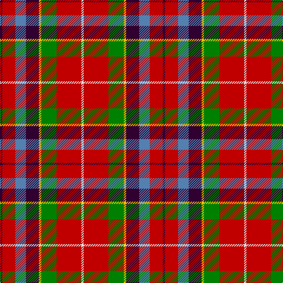

In pattern [BRBBYGRW](/stripes/brbbygrw/).

This was sourced from weddslist.  It is a [8 stripe tartan](/stripes/stripes8/).

Original link http://www.weddslist.com/cgi-bin/tartans/pg.pl?source=sts

## Thread count
DP/4 R22 B18 DP22 Y4 G26 R42 LN/4

## Palette
Each colour and the base-6 reference it is a variant of.

| Colour | Shade | Base |
|---|---|---|
| B | <code style="background-color:#5480B0;">#5480B0</code> `oklch(58.8% 0.089 251.5)` <small>#5480B0</small> | B <code style="background-color:#2A418A;">#2A418A</code> |
| DP | <code style="background-color:#300030;">#300030</code> `oklch(21.7% 0.100 328.4)` <small>#300030</small> | B <code style="background-color:#2A418A;">#2A418A</code> |
| G | <code style="background-color:#008000;">#008000</code> `oklch(52.0% 0.177 142.5)` <small>#008000</small> | G <code style="background-color:#006100;">#006100</code> |
| LN | <code style="background-color:#E0E0E0;">#E0E0E0</code> `oklch(90.7% 0.000 89.9)` <small>#E0E0E0</small> | W <code style="background-color:#F7F7F7;">#F7F7F7</code> |
| R | <code style="background-color:#C00000;">#C00000</code> `oklch(50.7% 0.208 29.2)` <small>#C00000</small> | R <code style="background-color:#CC0000;">#CC0000</code> |
| Y | <code style="background-color:#F0C000;">#F0C000</code> `oklch(82.7% 0.169 90.5)` <small>#F0C000</small> | Y <code style="background-color:#F2BF00;">#F2BF00</code> |

# Sample pattern

## Nearest tartans

The nearest existing variants by ΔTartan distance.

1. [Unidentified No 57](/setts/s10/r6w1r6db2r6dg12ly1db8t4r4~x2/) — ΔT 0.74
1. [De Maynard (Personal)](/setts/s8/dp2o9g8o4ly1o4db10w2~x4/) — ΔT 0.86
1. [Thirkill](/setts/s9/w4k2r15k2r5y7dg7k2ly4~x2/) — ΔT 0.94
1. [Unnamed No 57](/setts/s10/r6w1r6db2r6g12ly1db8t4r4~x2/) — ΔT 0.97
1. [East Kilbride](/setts/s7/y3r10g7db10r15k1w2~x2/) — ΔT 1.04
1. [Indiana "Cardinal"](/setts/s8/db8ly1dg12r10o2r6o2r4~x4/) — ΔT 1.08
1. [Hewitt](/setts/s7/r30db12k6dg12ly2dg3w2~x2/) — ΔT 1.08
1. [East Kilbride (Original) District Tartan Tartan Number: 2061. Earliest known date: 1990 Colours chosen echo the symbolism of the armorial ensigns granted by Lord Lyon: White/Silver and Blue - Stewarts of Torrance White/Silver and Black - Maxwells of Calderwood Red and White - Lindsays White/Silver and Black - Industry Green and Gold - Agriculture. Black guards are added to the blue stripe when woven in reproduction colours. See products available Copyright © Blair Urquhart, Comrie, 2015](/setts/s7/ly3r10g7db10r15k1w2~x2/) — ΔT 1.11
1. [East Kilbride](/setts/s7/lo3r10dg7db10r15k1w2~x2/) — ΔT 1.17
1. [Caledonia](/setts/s14/r21t9k2t2k2t9k18ly3g21r13k3r13w2r13~x2/) — ΔT 1.18

## Neighbour map

Every grey dot is one of 14299 variants placed by the first two principal components of the ΔTartan feature space (44% of its variance). Red is this tartan; blue dots are its nearest — click one to open its page.

<svg viewBox="0 0 640 380" role="img" style="max-width:100%;height:auto;border:1px solid #e0e0e0;border-radius:4px;display:block" xmlns="http://www.w3.org/2000/svg"><image href="/nn/cloud.v1.png" width="640" height="380"/><a href="/setts/s10/r6w1r6db2r6dg12ly1db8t4r4~x2/"><circle cx="173.5" cy="157.8" r="4" fill="#3465a4"><title>Unidentified No 57</title></circle></a><a href="/setts/s8/dp2o9g8o4ly1o4db10w2~x4/"><circle cx="141.3" cy="162.2" r="4" fill="#3465a4"><title>De Maynard (Personal)</title></circle></a><a href="/setts/s9/w4k2r15k2r5y7dg7k2ly4~x2/"><circle cx="121.0" cy="157.4" r="4" fill="#3465a4"><title>Thirkill</title></circle></a><a href="/setts/s10/r6w1r6db2r6g12ly1db8t4r4~x2/"><circle cx="177.3" cy="162.3" r="4" fill="#3465a4"><title>Unnamed No 57</title></circle></a><a href="/setts/s7/y3r10g7db10r15k1w2~x2/"><circle cx="238.9" cy="159.6" r="4" fill="#3465a4"><title>East Kilbride</title></circle></a><a href="/setts/s8/db8ly1dg12r10o2r6o2r4~x4/"><circle cx="212.2" cy="181.7" r="4" fill="#3465a4"><title>Indiana &quot;Cardinal&quot;</title></circle></a><a href="/setts/s7/r30db12k6dg12ly2dg3w2~x2/"><circle cx="207.8" cy="131.2" r="4" fill="#3465a4"><title>Hewitt</title></circle></a><a href="/setts/s7/ly3r10g7db10r15k1w2~x2/"><circle cx="230.2" cy="152.7" r="4" fill="#3465a4"><title>East Kilbride (Original) District Tartan Tartan Number: 2061. Earliest known date: 1990 Colours chosen echo the symbolism of the armorial ensigns granted by Lord Lyon: White/Silver and Blue - Stewarts of Torrance White/Silver and Black - Maxwells of Calderwood Red and White - Lindsays White/Silver and Black - Industry Green and Gold - Agriculture. Black guards are added to the blue stripe when woven in reproduction colours. See products available Copyright © Blair Urquhart, Comrie, 2015</title></circle></a><a href="/setts/s7/lo3r10dg7db10r15k1w2~x2/"><circle cx="241.8" cy="159.1" r="4" fill="#3465a4"><title>East Kilbride</title></circle></a><a href="/setts/s14/r21t9k2t2k2t9k18ly3g21r13k3r13w2r13~x2/"><circle cx="165.8" cy="133.1" r="4" fill="#3465a4"><title>Caledonia</title></circle></a><circle cx="170.8" cy="159.6" r="5" fill="#c00000"/></svg>

ID: /setts/s8/dp2r11t9dp11ly2g13r21w2~x2/
