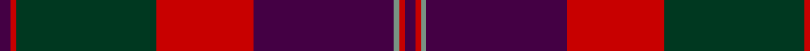

This page is one **sett** — a single exact thread-count. It belongs to the [tartan](/tartans/dp2r1dg26r18dp26y1r1dp2/)
(the same proportion at any scale), whose colour order is pattern [BRGBRGRB](/stripes/brgbrgrb/).

Sourced from tartans-authority.  It is a [8 stripe tartan](/stripes/stripes8/).

Original link http://www.tartansauthority.com/tartan-ferret/display/3158/

## Also known as

This cloth is also recorded under:

- Robb Red
- Robb Red Personal

3 attestations — the source records this cloth was collapsed from (oldest owns this page)

<ul>
<li>1994 — Robb Dress (Personal) (tartans-authority, <a href="http://www.tartansauthority.com/tartan-ferret/display/3158/">record</a>)</li>
<li>undated — Robb Red (Personal) (register-of-tartans, <a href="https://www.tartanregister.gov.uk/tartanDetails.aspx?ref=4850">record</a>)</li>
<li>undated — Robb Red (Personal) Personal Tartan Tartan Number: 3158. Earliest known date: 1994 Designed by Peter MacDonald for Martin Robb of Carroglen, Comrie, Perthshire, Scotland. Can be worn by anyone of the name but Martin Robb would appreciate being advised. See products available Copyright © Blair Urquhart, Comrie, 2015 (house-of-tartan, <a href="http://www.house-of-tartan.scotland.net/house/TartanViewjs.asp?colr=Def&tnam=3158">record</a>)</li>
</ul>

## Register references

External register numbers recorded for this tartan.

- Scottish Register of Tartans: [4850](https://www.tartanregister.gov.uk/tartanDetails.aspx?ref=4850)
- Scottish Tartans Authority (ITI): 3158

## Thread count
DP/4 R2 DG52 R36 DP52 LG2 R2 DP/4

## Palette

Palette: <strong>Tartan Register</strong>
<table><thead><tr><th>Colour</th><th>Threads</th><th>Shade</th><th>Base</th><th>OKLCh</th></tr></thead><tbody><tr><td>DP/</td><td style="text-align:right;font-variant-numeric:tabular-nums">4</td><td><code style="background-color:#440044;">#440044</code> <small style="color:#888">#440044</small></td><td>B <code style="background-color:#2A418A;">#2A418A</code></td><td><small style="color:#888">oklch(27.1% 0.125 328.4)</small></td></tr><tr><td>R</td><td style="text-align:right;font-variant-numeric:tabular-nums">2</td><td><code style="background-color:#C80000;">#C80000</code> <small style="color:#888">#C80000</small></td><td>R <code style="background-color:#CC0000;">#CC0000</code></td><td><small style="color:#888">oklch(52.3% 0.215 29.2)</small></td></tr><tr><td>DG</td><td style="text-align:right;font-variant-numeric:tabular-nums">52</td><td><code style="background-color:#003820;">#003820</code> <small style="color:#888">#003820</small></td><td>G <code style="background-color:#006100;">#006100</code></td><td><small style="color:#888">oklch(30.0% 0.070 158.3)</small></td></tr><tr><td>R</td><td style="text-align:right;font-variant-numeric:tabular-nums">36</td><td><code style="background-color:#C80000;">#C80000</code> <small style="color:#888">#C80000</small></td><td>R <code style="background-color:#CC0000;">#CC0000</code></td><td><small style="color:#888">oklch(52.3% 0.215 29.2)</small></td></tr><tr><td>DP</td><td style="text-align:right;font-variant-numeric:tabular-nums">52</td><td><code style="background-color:#440044;">#440044</code> <small style="color:#888">#440044</small></td><td>B <code style="background-color:#2A418A;">#2A418A</code></td><td><small style="color:#888">oklch(27.1% 0.125 328.4)</small></td></tr><tr><td>LG</td><td style="text-align:right;font-variant-numeric:tabular-nums">2</td><td><code style="background-color:#789484;">#789484</code> <small style="color:#888">#789484</small></td><td>G <code style="background-color:#006100;">#006100</code></td><td><small style="color:#888">oklch(64.0% 0.040 160.0)</small></td></tr><tr><td>R</td><td style="text-align:right;font-variant-numeric:tabular-nums">2</td><td><code style="background-color:#C80000;">#C80000</code> <small style="color:#888">#C80000</small></td><td>R <code style="background-color:#CC0000;">#CC0000</code></td><td><small style="color:#888">oklch(52.3% 0.215 29.2)</small></td></tr><tr><td>DP/</td><td style="text-align:right;font-variant-numeric:tabular-nums">4</td><td><code style="background-color:#440044;">#440044</code> <small style="color:#888">#440044</small></td><td>B <code style="background-color:#2A418A;">#2A418A</code></td><td><small style="color:#888">oklch(27.1% 0.125 328.4)</small></td></tr></tbody></table>

# Sample pattern

## Nearest tartans

The nearest existing variants by ΔTartan distance, with this tartan at the top so the swatches line up against it.

ΔTartan

Tartan

Sett

—

<a href="/ttd/edit/#slug=dp2r1dg26r18dp26y1r1dp2~x2">Robb Dress (Personal)</a> <a class="nn-out" href="/setts/s8/dp2r1dg26r18dp26y1r1dp2~x2/" title="open its dictionary page">↗</a>

1.10

<a href="/ttd/edit/#slug=w2k35db30k3r30k2r4k2r30k3w2">Gwyn Welsh Name Tartan Tartan Number: 5734. Earliest known date: 2002 The tartan for this Welsh surname and its spelling variation, Wynn, is actually woven in Wales at the Cambrian Woollen Mill, weaving on the same site since 1830. This tartan differs from many traditional patterns in that the warp and weft differ, giving the finished worsted wool cloth more of a predominant stripe, vertically noticeable in the finished Kilt, or Cilt in Wales. See products available Copyright © Blair Urquhart, Comrie, 2015</a> <a class="nn-out" href="/setts/s11/w2k35db30k3r30k2r4k2r30k3w2/" title="open its dictionary page">↗</a>

1.11

<a href="/ttd/edit/#slug=g22k3g1k3g2dp8r1dp8r16~x2">Queen of Scots (Commemorative))</a> <a class="nn-out" href="/setts/s9/g22k3g1k3g2dp8r1dp8r16~x2/" title="open its dictionary page">↗</a>

1.13

<a href="/ttd/edit/#slug=r4n4dt2n24lb1dt14n2r18n4dt3~x4">Marshall</a> <a class="nn-out" href="/setts/s10/r4n4dt2n24lb1dt14n2r18n4dt3~x4/" title="open its dictionary page">↗</a>

1.21

<a href="/ttd/edit/#slug=db6r1db2r1db2k18r8g2~x4">Brown Family Tartan Tartan Number: 432. Earliest known date: 1850 The Scott Adie collection, a book of manufacturers samples, was recently sold at auction. The book is dated 1850 and the samples are thought to represent the tartans available for purchase between 1840-50. See products available Copyright © Blair Urquhart, Comrie, 2015</a> <a class="nn-out" href="/setts/s8/db6r1db2r1db2k18r8g2~x4/" title="open its dictionary page">↗</a>

1.26

<a href="/ttd/edit/#slug=r3dg12r12r5dg2db30r2dg2~x2">Rannoch Moor (Fashion)</a> <a class="nn-out" href="/setts/s8/r3dg12r12r5dg2db30r2dg2~x2/" title="open its dictionary page">↗</a>

1.32

<a href="/ttd/edit/#slug=n19r2n3r2n3k43r22g3~x2">Carson Red (Personal)</a> <a class="nn-out" href="/setts/s8/n19r2n3r2n3k43r22g3~x2/" title="open its dictionary page">↗</a>

1.32

<a href="/ttd/edit/#slug=ri9k2ri2r13k2r2w1ri13k26w2~x2">Pride of Wales (Fashion)</a> <a class="nn-out" href="/setts/s10/ri9k2ri2r13k2r2w1ri13k26w2~x2/" title="open its dictionary page">↗</a>

1.33

<a href="/ttd/edit/#slug=r34dp4r1dp4g2k3g1k3g22~x2">Queen of Scots</a> <a class="nn-out" href="/setts/s9/r34dp4r1dp4g2k3g1k3g22~x2/" title="open its dictionary page">↗</a>

1.34

<a href="/ttd/edit/#slug=g9db2dp2g2dp18g2db2g1db19r33g2~x2">Pride of Scotland Autumn</a> <a class="nn-out" href="/setts/s11/g9db2dp2g2dp18g2db2g1db19r33g2~x2/" title="open its dictionary page">↗</a>

1.35

<a href="/ttd/edit/#slug=r25k2n4k2r8k31db32k8">Black and Red</a> <a class="nn-out" href="/setts/s8/r25k2n4k2r8k31db32k8/" title="open its dictionary page">↗</a>

## Neighbour map

Every grey dot is one of 14359 variants placed by the first two principal components of the ΔTartan feature space (44% of its variance). Red is this tartan; blue dots are its nearest — click one to open its page.

<svg viewBox="0 0 640 380" role="img" style="max-width:100%;height:auto;border:1px solid #e0e0e0;border-radius:4px;display:block" xmlns="http://www.w3.org/2000/svg"><image href="/nn/cloud.v1.png" width="640" height="380"/><a href="/setts/s11/w2k35db30k3r30k2r4k2r30k3w2/"><circle cx="297.4" cy="159.7" r="4" fill="#3465a4"><title>Gwyn Welsh Name Tartan Tartan Number: 5734. Earliest known date: 2002 The tartan for this Welsh surname and its spelling variation, Wynn, is actually woven in Wales at the Cambrian Woollen Mill, weaving on the same site since 1830. This tartan differs from many traditional patterns in that the warp and weft differ, giving the finished worsted wool cloth more of a predominant stripe, vertically noticeable in the finished Kilt, or Cilt in Wales. See products available Copyright © Blair Urquhart, Comrie, 2015</title></circle></a><a href="/setts/s9/g22k3g1k3g2dp8r1dp8r16~x2/"><circle cx="267.3" cy="166.7" r="4" fill="#3465a4"><title>Queen of Scots (Commemorative))</title></circle></a><a href="/setts/s10/r4n4dt2n24lb1dt14n2r18n4dt3~x4/"><circle cx="313.7" cy="156.2" r="4" fill="#3465a4"><title>Marshall</title></circle></a><a href="/setts/s8/db6r1db2r1db2k18r8g2~x4/"><circle cx="284.4" cy="165.2" r="4" fill="#3465a4"><title>Brown Family Tartan Tartan Number: 432. Earliest known date: 1850 The Scott Adie collection, a book of manufacturers samples, was recently sold at auction. The book is dated 1850 and the samples are thought to represent the tartans available for purchase between 1840-50. See products available Copyright © Blair Urquhart, Comrie, 2015</title></circle></a><a href="/setts/s8/r3dg12r12r5dg2db30r2dg2~x2/"><circle cx="289.0" cy="186.3" r="4" fill="#3465a4"><title>Rannoch Moor (Fashion)</title></circle></a><a href="/setts/s8/n19r2n3r2n3k43r22g3~x2/"><circle cx="284.3" cy="148.4" r="4" fill="#3465a4"><title>Carson Red (Personal)</title></circle></a><a href="/setts/s10/ri9k2ri2r13k2r2w1ri13k26w2~x2/"><circle cx="281.1" cy="132.5" r="4" fill="#3465a4"><title>Pride of Wales (Fashion)</title></circle></a><a href="/setts/s9/r34dp4r1dp4g2k3g1k3g22~x2/"><circle cx="365.6" cy="133.6" r="4" fill="#3465a4"><title>Queen of Scots</title></circle></a><a href="/setts/s11/g9db2dp2g2dp18g2db2g1db19r33g2~x2/"><circle cx="295.9" cy="137.2" r="4" fill="#3465a4"><title>Pride of Scotland Autumn</title></circle></a><a href="/setts/s8/r25k2n4k2r8k31db32k8/"><circle cx="240.0" cy="182.0" r="4" fill="#3465a4"><title>Black and Red</title></circle></a><circle cx="305.2" cy="155.5" r="5" fill="#c00000"/></svg>

ID: /setts/s8/dp2r1dg26r18dp26y1r1dp2~x2/
