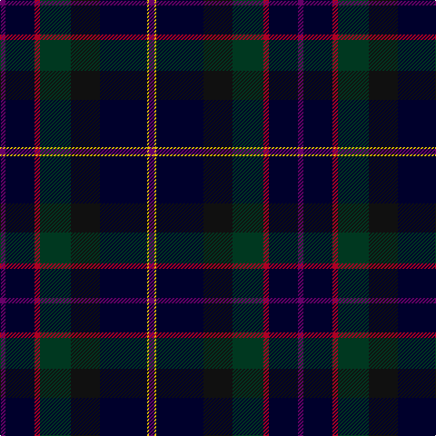

In pattern [BKRGKKYB](/stripes/bkrgkkyb/).

This was sourced from register-of-tartans.  It is a [8 stripe tartan](/stripes/stripes8/).

Original link https://www.tartanregister.gov.uk/tartanDetails.aspx?ref=225

## Attestations

This cloth appears in 2 source records; the oldest owns this page.

- 01/01/1999 — Barton-Watson de Bavidge (Personal) (register-of-tartans, [record](https://www.tartanregister.gov.uk/tartanDetails.aspx?ref=225))
- 2000 — Barton-Watson de Bavidge (Personal) (tartans-authority, [record](http://www.tartansauthority.com/tartan-ferret/display/2664/))

## Register references

External register numbers recorded for this tartan.

- Scottish Register of Tartans: [225](https://www.tartanregister.gov.uk/tartanDetails.aspx?ref=225)
- Scottish Tartans Authority (ITI): 2664
- Scottish Tartans World Register: 2664

## Thread count
P/6 DBa32 DR6 DG34 K32 DBa52 Y2 P/6

## Palette
Each colour and the base-6 reference it is a variant of.

| Colour | Shade | Base |
|---|---|---|
| DB | <code style="background-color:#003C64;">#003C64</code> `oklch(34.5% 0.089 246.0)` <small>#003C64</small> | B <code style="background-color:#2A418A;">#2A418A</code> |
| DBa | <code style="background-color:#00002C;">#00002C</code> `oklch(13.2% 0.092 264.1)` <small>#00002C</small> | K <code style="background-color:#000000;">#000000</code> |
| DG | <code style="background-color:#003820;">#003820</code> `oklch(30.0% 0.070 158.3)` <small>#003820</small> | G <code style="background-color:#006100;">#006100</code> |
| DR | <code style="background-color:#AC0024;">#AC0024</code> `oklch(47.0% 0.189 22.1)` <small>#AC0024</small> | R <code style="background-color:#CC0000;">#CC0000</code> |
| G | <code style="background-color:#006818;">#006818</code> `oklch(45.0% 0.142 145.0)` <small>#006818</small> | G <code style="background-color:#006100;">#006100</code> |
| K | <code style="background-color:#101010;">#101010</code> `oklch(17.3% 0.000 89.9)` <small>#101010</small> | K <code style="background-color:#000000;">#000000</code> |
| P | <code style="background-color:#680068;">#680068</code> `oklch(36.3% 0.167 328.4)` <small>#680068</small> | B <code style="background-color:#2A418A;">#2A418A</code> |
| Y | <code style="background-color:#E8C000;">#E8C000</code> `oklch(81.9% 0.168 93.7)` <small>#E8C000</small> | Y <code style="background-color:#F2BF00;">#F2BF00</code> |

# Sample pattern

## Nearest tartans

The nearest existing variants by ΔTartan distance, with this tartan at the top so the swatches line up against it.

ΔTartan

Tartan

Sett

—

<a href="/ttd/edit/#slug=dp3k16r3dg17k16k26ly1dp3~x2">Barton-Watson de Bavidge (Personal)</a> <a class="nn-out" href="/setts/s8/dp3k16r3dg17k16k26ly1dp3~x2/" title="open its dictionary page">↗</a>

1.15

<a href="/ttd/edit/#slug=k12g8ly1dg13t1db31k8~x2">Chesters, Eric (Personal)</a> <a class="nn-out" href="/setts/s7/k12g8ly1dg13t1db31k8~x2/" title="open its dictionary page">↗</a>

1.50

<a href="/ttd/edit/#slug=db3t2db21k12dg24r1lo3~x2">Nova Scotia Int. Tattoo (Corporate)</a> <a class="nn-out" href="/setts/s7/db3t2db21k12dg24r1lo3~x2/" title="open its dictionary page">↗</a>

1.50

<a href="/ttd/edit/#slug=k12g8ly1dg13lb1db31k8~x2">Chesters, Eric (Personal)</a> <a class="nn-out" href="/setts/s7/k12g8ly1dg13lb1db31k8~x2/" title="open its dictionary page">↗</a>

1.51

<a href="/ttd/edit/#slug=dp5db8dt13g21db34dt55o3">Bouncing Blackie (Personal)</a> <a class="nn-out" href="/setts/s7/dp5db8dt13g21db34dt55o3/" title="open its dictionary page">↗</a>

1.61

<a href="/ttd/edit/#slug=r2db38k20w1dg20r2">Waterfront</a> <a class="nn-out" href="/setts/s6/r2db38k20w1dg20r2/" title="open its dictionary page">↗</a>

1.64

<a href="/ttd/edit/#slug=k4w1dg12k3db16r1db1r1~x2">Purves (2014)</a> <a class="nn-out" href="/setts/s8/k4w1dg12k3db16r1db1r1~x2/" title="open its dictionary page">↗</a>

1.68

<a href="/ttd/edit/#slug=k10n4k34db3g3db3g3db26n2lb3~x2">Dugan (Personal)</a> <a class="nn-out" href="/setts/s10/k10n4k34db3g3db3g3db26n2lb3~x2/" title="open its dictionary page">↗</a>

1.69

<a href="/ttd/edit/#slug=dg1k8n5k23n5db3n5dp3n5dg5n3w1~x2">Hand, Edinburgh</a> <a class="nn-out" href="/setts/s12/dg1k8n5k23n5db3n5dp3n5dg5n3w1~x2/" title="open its dictionary page">↗</a>

1.69

<a href="/ttd/edit/#slug=w2k2r1dt20k15dg30ly1~x2">Muir-Hill (Personal)</a> <a class="nn-out" href="/setts/s7/w2k2r1dt20k15dg30ly1~x2/" title="open its dictionary page">↗</a>

1.70

<a href="/ttd/edit/#slug=k26db3k1dp2k1db3k3db12dg14k2w2~x2">Royal Highland Yacht Club</a> <a class="nn-out" href="/setts/s11/k26db3k1dp2k1db3k3db12dg14k2w2~x2/" title="open its dictionary page">↗</a>

## Neighbour map

Every grey dot is one of 14299 variants placed by the first two principal components of the ΔTartan feature space (44% of its variance). Red is this tartan; blue dots are its nearest — click one to open its page.

<svg viewBox="0 0 640 380" role="img" style="max-width:100%;height:auto;border:1px solid #e0e0e0;border-radius:4px;display:block" xmlns="http://www.w3.org/2000/svg"><image href="/nn/cloud.v1.png" width="640" height="380"/><a href="/setts/s7/k12g8ly1dg13t1db31k8~x2/"><circle cx="285.4" cy="177.4" r="4" fill="#3465a4"><title>Chesters, Eric (Personal)</title></circle></a><a href="/setts/s7/db3t2db21k12dg24r1lo3~x2/"><circle cx="245.7" cy="172.9" r="4" fill="#3465a4"><title>Nova Scotia Int. Tattoo (Corporate)</title></circle></a><a href="/setts/s7/k12g8ly1dg13lb1db31k8~x2/"><circle cx="253.9" cy="164.5" r="4" fill="#3465a4"><title>Chesters, Eric (Personal)</title></circle></a><a href="/setts/s7/dp5db8dt13g21db34dt55o3/"><circle cx="344.6" cy="218.4" r="4" fill="#3465a4"><title>Bouncing Blackie (Personal)</title></circle></a><a href="/setts/s6/r2db38k20w1dg20r2/"><circle cx="355.5" cy="191.1" r="4" fill="#3465a4"><title>Waterfront</title></circle></a><a href="/setts/s8/k4w1dg12k3db16r1db1r1~x2/"><circle cx="263.4" cy="163.6" r="4" fill="#3465a4"><title>Purves (2014)</title></circle></a><a href="/setts/s10/k10n4k34db3g3db3g3db26n2lb3~x2/"><circle cx="301.0" cy="150.8" r="4" fill="#3465a4"><title>Dugan (Personal)</title></circle></a><a href="/setts/s12/dg1k8n5k23n5db3n5dp3n5dg5n3w1~x2/"><circle cx="297.1" cy="147.3" r="4" fill="#3465a4"><title>Hand, Edinburgh</title></circle></a><a href="/setts/s7/w2k2r1dt20k15dg30ly1~x2/"><circle cx="291.3" cy="161.0" r="4" fill="#3465a4"><title>Muir-Hill (Personal)</title></circle></a><a href="/setts/s11/k26db3k1dp2k1db3k3db12dg14k2w2~x2/"><circle cx="324.6" cy="153.5" r="4" fill="#3465a4"><title>Royal Highland Yacht Club</title></circle></a><circle cx="307.3" cy="185.9" r="5" fill="#c00000"/></svg>

ID: /setts/s8/dp3k16r3dg17k16k26ly1dp3~x2/
