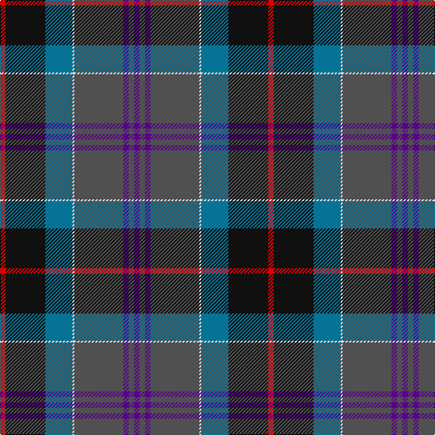

This page is one **sett** — a single exact thread-count. It belongs to the [tartan](/tartans/dp3n3dp3n27w1t15k22r3/)
(the same proportion at any scale), whose colour order is pattern [BBBBWBKR](/stripes/bbbbwbkr/).

Sourced from register-of-tartans.  It is a [8 stripe tartan](/stripes/stripes8/).

Original link https://www.tartanregister.gov.uk/tartanDetails.aspx?ref=237

## Register references

External register numbers recorded for this tartan.

- Scottish Register of Tartans: [237](https://www.tartanregister.gov.uk/tartanDetails.aspx?ref=237)
- Scottish Tartans World Register: 2931

## Thread count
R/6 K44 B30 LN2 N54 P6 N6 P/6

## Palette

Palette: <strong>Tartan Register</strong> <small style="color:#888">(5 of 6 colours)</small>
<table><thead><tr><th>Colour</th><th>Threads</th><th>Shade</th><th>Base</th><th>OKLCh</th></tr></thead><tbody><tr><td>R/</td><td style="text-align:right;font-variant-numeric:tabular-nums">6</td><td><code style="background-color:#DC0000;">#DC0000</code> <small style="color:#888">#DC0000</small></td><td>R <code style="background-color:#CC0000;">#CC0000</code></td><td><small style="color:#888">oklch(56.2% 0.230 29.2)</small></td></tr><tr><td>K</td><td style="text-align:right;font-variant-numeric:tabular-nums">44</td><td><code style="background-color:#101010;">#101010</code> <small style="color:#888">#101010</small></td><td>K <code style="background-color:#000000;">#000000</code></td><td><small style="color:#888">oklch(17.3% 0.000 89.9)</small></td></tr><tr><td>B</td><td style="text-align:right;font-variant-numeric:tabular-nums">30</td><td><code style="background-color:#067396;">#067396</code> <small style="color:#888">#067396</small></td><td>B <code style="background-color:#2A418A;">#2A418A</code></td><td><small style="color:#888">oklch(51.9% 0.100 228.3)</small></td></tr><tr><td>LN</td><td style="text-align:right;font-variant-numeric:tabular-nums">2</td><td><code style="background-color:#E0E0E0;">#E0E0E0</code> <small style="color:#888">#E0E0E0</small></td><td>W <code style="background-color:#F7F7F7;">#F7F7F7</code></td><td><small style="color:#888">oklch(90.7% 0.000 89.9)</small></td></tr><tr><td>N</td><td style="text-align:right;font-variant-numeric:tabular-nums">54</td><td><code style="background-color:#505050;">#505050</code> <small style="color:#888">#505050</small></td><td>B <code style="background-color:#2A418A;">#2A418A</code></td><td><small style="color:#888">oklch(43.1% 0.000 89.9)</small></td></tr><tr><td>P</td><td style="text-align:right;font-variant-numeric:tabular-nums">6</td><td><code style="background-color:#5A008C;">#5A008C</code> <small style="color:#888">#5A008C</small></td><td>B <code style="background-color:#2A418A;">#2A418A</code></td><td><small style="color:#888">oklch(37.0% 0.191 306.3)</small></td></tr><tr><td>N</td><td style="text-align:right;font-variant-numeric:tabular-nums">6</td><td><code style="background-color:#505050;">#505050</code> <small style="color:#888">#505050</small></td><td>B <code style="background-color:#2A418A;">#2A418A</code></td><td><small style="color:#888">oklch(43.1% 0.000 89.9)</small></td></tr><tr><td>P/</td><td style="text-align:right;font-variant-numeric:tabular-nums">6</td><td><code style="background-color:#5A008C;">#5A008C</code> <small style="color:#888">#5A008C</small></td><td>B <code style="background-color:#2A418A;">#2A418A</code></td><td><small style="color:#888">oklch(37.0% 0.191 306.3)</small></td></tr></tbody></table>

# Sample pattern

## Nearest tartans

The nearest existing variants by ΔTartan distance, with this tartan at the top so the swatches line up against it.

ΔTartan

Tartan

Sett

—

<a href="/ttd/edit/#slug=dp3n3dp3n27w1t15k22r3~x2">Beauly Firth and Glens</a> <a class="nn-out" href="/setts/s8/dp3n3dp3n27w1t15k22r3~x2/" title="open its dictionary page">↗</a>

1.07

<a href="/ttd/edit/#slug=db2r2db2r2db20k24dg12ly1k2dg2t2~x2">Unidentified #7</a> <a class="nn-out" href="/setts/s11/db2r2db2r2db20k24dg12ly1k2dg2t2~x2/" title="open its dictionary page">↗</a>

1.07

<a href="/ttd/edit/#slug=y2dg9ri16r2b30y3dg6lb1~x2">The Climb (Fashion)</a> <a class="nn-out" href="/setts/s8/y2dg9ri16r2b30y3dg6lb1~x2/" title="open its dictionary page">↗</a>

1.07

<a href="/ttd/edit/#slug=yi4t3yi18dt14y2dt2dp18lo1dp2lo3~x2">Caisteal Leòdhais</a> <a class="nn-out" href="/setts/s10/yi4t3yi18dt14y2dt2dp18lo1dp2lo3~x2/" title="open its dictionary page">↗</a>

1.09

<a href="/ttd/edit/#slug=dp3o1db4g2r2g21o3dp21db25w3~x2">Accenture</a> <a class="nn-out" href="/setts/s10/dp3o1db4g2r2g21o3dp21db25w3~x2/" title="open its dictionary page">↗</a>

1.12

<a href="/ttd/edit/#slug=r4g4k2g17do5g5do17g6lb1db22r2~x2">Adams (Name)</a> <a class="nn-out" href="/setts/s11/r4g4k2g17do5g5do17g6lb1db22r2~x2/" title="open its dictionary page">↗</a>

1.14

<a href="/ttd/edit/#slug=r9dt8r8g52w2k32dt44b4">Highland Wedding (Fashion)</a> <a class="nn-out" href="/setts/s8/r9dt8r8g52w2k32dt44b4/" title="open its dictionary page">↗</a>

1.15

<a href="/ttd/edit/#slug=dg6r2db1r3db16n20w2~x2">MacCord (Personal)</a> <a class="nn-out" href="/setts/s7/dg6r2db1r3db16n20w2~x2/" title="open its dictionary page">↗</a>

1.15

<a href="/ttd/edit/#slug=dt11dti6dg25r1w2lo1dt25dti5w7~x2">Army Ranger</a> <a class="nn-out" href="/setts/s9/dt11dti6dg25r1w2lo1dt25dti5w7~x2/" title="open its dictionary page">↗</a>

1.16

<a href="/ttd/edit/#slug=db20y2w1y5dg8ly1dg2r1dg8y16~x4">Connecticut</a> <a class="nn-out" href="/setts/s10/db20y2w1y5dg8ly1dg2r1dg8y16~x4/" title="open its dictionary page">↗</a>

1.18

<a href="/ttd/edit/#slug=r7g20ly2g4k5b4k2b20k3w1~x2">McMeeken (Name)</a> <a class="nn-out" href="/setts/s10/r7g20ly2g4k5b4k2b20k3w1~x2/" title="open its dictionary page">↗</a>

## Neighbour map

Every grey dot is one of 14359 variants placed by the first two principal components of the ΔTartan feature space (44% of its variance). Red is this tartan; blue dots are its nearest — click one to open its page.

<svg viewBox="0 0 640 380" role="img" style="max-width:100%;height:auto;border:1px solid #e0e0e0;border-radius:4px;display:block" xmlns="http://www.w3.org/2000/svg"><image href="/nn/cloud.v1.png" width="640" height="380"/><a href="/setts/s11/db2r2db2r2db20k24dg12ly1k2dg2t2~x2/"><circle cx="232.5" cy="118.8" r="4" fill="#3465a4"><title>Unidentified #7</title></circle></a><a href="/setts/s8/y2dg9ri16r2b30y3dg6lb1~x2/"><circle cx="266.5" cy="128.0" r="4" fill="#3465a4"><title>The Climb (Fashion)</title></circle></a><a href="/setts/s10/yi4t3yi18dt14y2dt2dp18lo1dp2lo3~x2/"><circle cx="188.0" cy="138.2" r="4" fill="#3465a4"><title>Caisteal Leòdhais</title></circle></a><a href="/setts/s10/dp3o1db4g2r2g21o3dp21db25w3~x2/"><circle cx="204.2" cy="117.2" r="4" fill="#3465a4"><title>Accenture</title></circle></a><a href="/setts/s11/r4g4k2g17do5g5do17g6lb1db22r2~x2/"><circle cx="208.0" cy="142.3" r="4" fill="#3465a4"><title>Adams (Name)</title></circle></a><a href="/setts/s8/r9dt8r8g52w2k32dt44b4/"><circle cx="193.6" cy="145.0" r="4" fill="#3465a4"><title>Highland Wedding (Fashion)</title></circle></a><a href="/setts/s7/dg6r2db1r3db16n20w2~x2/"><circle cx="248.0" cy="165.8" r="4" fill="#3465a4"><title>MacCord (Personal)</title></circle></a><a href="/setts/s9/dt11dti6dg25r1w2lo1dt25dti5w7~x2/"><circle cx="228.6" cy="135.6" r="4" fill="#3465a4"><title>Army Ranger</title></circle></a><a href="/setts/s10/db20y2w1y5dg8ly1dg2r1dg8y16~x4/"><circle cx="217.7" cy="140.3" r="4" fill="#3465a4"><title>Connecticut</title></circle></a><a href="/setts/s10/r7g20ly2g4k5b4k2b20k3w1~x2/"><circle cx="190.2" cy="134.5" r="4" fill="#3465a4"><title>McMeeken (Name)</title></circle></a><circle cx="233.7" cy="139.1" r="5" fill="#c00000"/></svg>

ID: /setts/s8/dp3n3dp3n27w1t15k22r3~x2/
