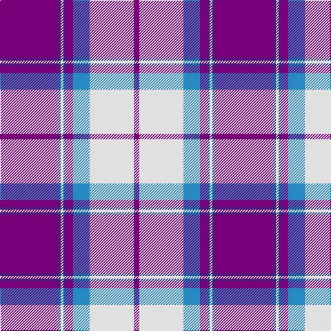

This page is one **sett** — a single exact thread-count. It belongs to the [tartan](/tartans/dp42db2w2db2dp5t12w32dp4/)
(the same proportion at any scale), whose colour order is pattern [BBWBBBWB](/stripes/bbwbbbwb/).

Sourced from house-of-tartan.  It is a [8 stripe tartan](/stripes/stripes8/).

Original link http://www.house-of-tartan.scotland.net/house/TartanViewjs.asp?colr=Def&tnam=88

## Thread count
P/84 DB4 LN4 DB4 P10 B24 LN64 P/8

## Palette

Palette: <strong>Tartan Register</strong>
<table><thead><tr><th>Colour</th><th>Threads</th><th>Shade</th><th>Base</th><th>OKLCh</th></tr></thead><tbody><tr><td>P/</td><td style="text-align:right;font-variant-numeric:tabular-nums">84</td><td><code style="background-color:#780078;">#780078</code> <small style="color:#888">#780078</small></td><td>B <code style="background-color:#2A418A;">#2A418A</code></td><td><small style="color:#888">oklch(40.2% 0.185 328.4)</small></td></tr><tr><td>DB</td><td style="text-align:right;font-variant-numeric:tabular-nums">4</td><td><code style="background-color:#2C2C80;">#2C2C80</code> <small style="color:#888">#2C2C80</small></td><td>B <code style="background-color:#2A418A;">#2A418A</code></td><td><small style="color:#888">oklch(35.0% 0.138 276.6)</small></td></tr><tr><td>LN</td><td style="text-align:right;font-variant-numeric:tabular-nums">4</td><td><code style="background-color:#E0E0E0;">#E0E0E0</code> <small style="color:#888">#E0E0E0</small></td><td>W <code style="background-color:#F7F7F7;">#F7F7F7</code></td><td><small style="color:#888">oklch(90.7% 0.000 89.9)</small></td></tr><tr><td>DB</td><td style="text-align:right;font-variant-numeric:tabular-nums">4</td><td><code style="background-color:#2C2C80;">#2C2C80</code> <small style="color:#888">#2C2C80</small></td><td>B <code style="background-color:#2A418A;">#2A418A</code></td><td><small style="color:#888">oklch(35.0% 0.138 276.6)</small></td></tr><tr><td>P</td><td style="text-align:right;font-variant-numeric:tabular-nums">10</td><td><code style="background-color:#780078;">#780078</code> <small style="color:#888">#780078</small></td><td>B <code style="background-color:#2A418A;">#2A418A</code></td><td><small style="color:#888">oklch(40.2% 0.185 328.4)</small></td></tr><tr><td>B</td><td style="text-align:right;font-variant-numeric:tabular-nums">24</td><td><code style="background-color:#2888C4;">#2888C4</code> <small style="color:#888">#2888C4</small></td><td>B <code style="background-color:#2A418A;">#2A418A</code></td><td><small style="color:#888">oklch(60.1% 0.125 241.5)</small></td></tr><tr><td>LN</td><td style="text-align:right;font-variant-numeric:tabular-nums">64</td><td><code style="background-color:#E0E0E0;">#E0E0E0</code> <small style="color:#888">#E0E0E0</small></td><td>W <code style="background-color:#F7F7F7;">#F7F7F7</code></td><td><small style="color:#888">oklch(90.7% 0.000 89.9)</small></td></tr><tr><td>P/</td><td style="text-align:right;font-variant-numeric:tabular-nums">8</td><td><code style="background-color:#780078;">#780078</code> <small style="color:#888">#780078</small></td><td>B <code style="background-color:#2A418A;">#2A418A</code></td><td><small style="color:#888">oklch(40.2% 0.185 328.4)</small></td></tr></tbody></table>

# Sample pattern

## Nearest tartans

The nearest existing variants by ΔTartan distance, with this tartan at the top so the swatches line up against it.

ΔTartan

Tartan

Sett

—

<a href="/ttd/edit/#slug=dp42db2w2db2dp5t12w32dp4~x2">Longniddry Dress District Tartan Tartan Number: 88. Earliest known date: pre 2003 A dancers tartan from D.C. Dalgleish weavers of Selkirk See products available Copyright © Blair Urquhart, Comrie, 2015</a> <a class="nn-out" href="/setts/s8/dp42db2w2db2dp5t12w32dp4~x2/" title="open its dictionary page">↗</a>

0.15

<a href="/ttd/edit/#slug=dp42lb2w2lb2dp5t12w32dp4~x2">Longniddry Dress (Dance)</a> <a class="nn-out" href="/setts/s8/dp42lb2w2lb2dp5t12w32dp4~x2/" title="open its dictionary page">↗</a>

0.35

<a href="/ttd/edit/#slug=p42db2w2db2p5b12w32p4~x2">Longniddry, dress</a> <a class="nn-out" href="/setts/s8/p42db2w2db2p5b12w32p4~x2/" title="open its dictionary page">↗</a>

0.91

<a href="/ttd/edit/#slug=t2dp1k1dp20w20dp1w2~x4">Cunningham Dress Purple (Dance) Fashion Tartan Tartan Number: 6531. Earliest known date: 01/01/1986 A dancers' tartan from D C Dalgliesh of Selkirk. See products available Copyright © Blair Urquhart, Comrie, 2015</a> <a class="nn-out" href="/setts/s7/t2dp1k1dp20w20dp1w2~x4/" title="open its dictionary page">↗</a>

1.12

<a href="/ttd/edit/#slug=db42o2lb2o2db5p12lb32db4~x2">Longniddry Lavender (Dance)</a> <a class="nn-out" href="/setts/s8/db42o2lb2o2db5p12lb32db4~x2/" title="open its dictionary page">↗</a>

1.14

<a href="/ttd/edit/#slug=w5dp2w34dp34k2dp2t4~x2">Cunningham Dress Purple (Dance)</a> <a class="nn-out" href="/setts/s7/w5dp2w34dp34k2dp2t4~x2/" title="open its dictionary page">↗</a>

1.28

<a href="/ttd/edit/#slug=dp8db2dp24db5w26k2w8~x2">Lennox Purple Dress District Tartan Tartan Number: 8189. Earliest known date: pre 2003 Families with the surname 'Lennox' are usually considered related to Clans Stewart or MacFarlane. Some of this surname also choose to wear the distinctive and ancient 'Lennox' tartan. D W Stewart reproduced the sett from a 'lost' portrait of the Countess of Lennox dating from the 16th century./Threadcount and colours aren't 100% original. Generated manually./ See products available Copyright © Blair Urquhart, Comrie, 2015</a> <a class="nn-out" href="/setts/s7/dp8db2dp24db5w26k2w8~x2/" title="open its dictionary page">↗</a>

1.31

<a href="/ttd/edit/#slug=lb40k14dp22ly1dp1ly3~x2">British Energy Corporate Tartan Tartan Number: 2324. Earliest known date: 1996 Nothing See products available Copyright © Blair Urquhart, Comrie, 2015</a> <a class="nn-out" href="/setts/s6/lb40k14dp22ly1dp1ly3~x2/" title="open its dictionary page">↗</a>

1.36

<a href="/ttd/edit/#slug=r15n3w10n7dp40w3dp6~x2">Loughborough Sport</a> <a class="nn-out" href="/setts/s7/r15n3w10n7dp40w3dp6~x2/" title="open its dictionary page">↗</a>

1.37

<a href="/ttd/edit/#slug=lr30lp4lr3dp2r2dp24w2~x2">St. Andrew's Links Dress (Corporate)</a> <a class="nn-out" href="/setts/s7/lr30lp4lr3dp2r2dp24w2~x2/" title="open its dictionary page">↗</a>

1.42

<a href="/ttd/edit/#slug=r25k1ly2k1ly2k1r10db18w2db12~x2">Richardson</a> <a class="nn-out" href="/setts/s10/r25k1ly2k1ly2k1r10db18w2db12~x2/" title="open its dictionary page">↗</a>

## Neighbour map

Every grey dot is one of 14359 variants placed by the first two principal components of the ΔTartan feature space (44% of its variance). Red is this tartan; blue dots are its nearest — click one to open its page.

<svg viewBox="0 0 640 380" role="img" style="max-width:100%;height:auto;border:1px solid #e0e0e0;border-radius:4px;display:block" xmlns="http://www.w3.org/2000/svg"><image href="/nn/cloud.v1.png" width="640" height="380"/><a href="/setts/s8/dp42lb2w2lb2dp5t12w32dp4~x2/"><circle cx="291.9" cy="122.4" r="4" fill="#3465a4"><title>Longniddry Dress (Dance)</title></circle></a><a href="/setts/s8/p42db2w2db2p5b12w32p4~x2/"><circle cx="296.5" cy="122.5" r="4" fill="#3465a4"><title>Longniddry, dress</title></circle></a><a href="/setts/s7/t2dp1k1dp20w20dp1w2~x4/"><circle cx="299.7" cy="120.5" r="4" fill="#3465a4"><title>Cunningham Dress Purple (Dance) Fashion Tartan Tartan Number: 6531. Earliest known date: 01/01/1986 A dancers' tartan from D C Dalgliesh of Selkirk. See products available Copyright © Blair Urquhart, Comrie, 2015</title></circle></a><a href="/setts/s8/db42o2lb2o2db5p12lb32db4~x2/"><circle cx="304.5" cy="137.3" r="4" fill="#3465a4"><title>Longniddry Lavender (Dance)</title></circle></a><a href="/setts/s7/w5dp2w34dp34k2dp2t4~x2/"><circle cx="279.0" cy="124.5" r="4" fill="#3465a4"><title>Cunningham Dress Purple (Dance)</title></circle></a><a href="/setts/s7/dp8db2dp24db5w26k2w8~x2/"><circle cx="236.7" cy="160.9" r="4" fill="#3465a4"><title>Lennox Purple Dress District Tartan Tartan Number: 8189. Earliest known date: pre 2003 Families with the surname 'Lennox' are usually considered related to Clans Stewart or MacFarlane. Some of this surname also choose to wear the distinctive and ancient 'Lennox' tartan. D W Stewart reproduced the sett from a 'lost' portrait of the Countess of Lennox dating from the 16th century./Threadcount and colours aren't 100% original. Generated manually./ See products available Copyright © Blair Urquhart, Comrie, 2015</title></circle></a><a href="/setts/s6/lb40k14dp22ly1dp1ly3~x2/"><circle cx="298.6" cy="122.8" r="4" fill="#3465a4"><title>British Energy Corporate Tartan Tartan Number: 2324. Earliest known date: 1996 Nothing See products available Copyright © Blair Urquhart, Comrie, 2015</title></circle></a><a href="/setts/s7/r15n3w10n7dp40w3dp6~x2/"><circle cx="290.5" cy="155.0" r="4" fill="#3465a4"><title>Loughborough Sport</title></circle></a><a href="/setts/s7/lr30lp4lr3dp2r2dp24w2~x2/"><circle cx="282.6" cy="130.6" r="4" fill="#3465a4"><title>St. Andrew's Links Dress (Corporate)</title></circle></a><a href="/setts/s10/r25k1ly2k1ly2k1r10db18w2db12~x2/"><circle cx="262.2" cy="91.8" r="4" fill="#3465a4"><title>Richardson</title></circle></a><circle cx="291.5" cy="123.1" r="5" fill="#c00000"/></svg>

ID: /setts/s8/dp42db2w2db2dp5t12w32dp4~x2/
