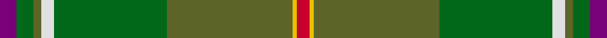

In pattern [BGGWGGYR](/stripes/bggwggyr/).

This was sourced from tartans-authority.  It is a [8 stripe tartan](/stripes/stripes8/).

Original link http://www.tartansauthority.com/tartan-ferret/display/2685/

## Thread count
P/8 G8 Ga4 LN6 G54 Ga60 Y2 R/6

## Palette
Each colour and the base-6 reference it is a variant of.

| Colour | Shade | Base |
|---|---|---|
| G | <code style="background-color:#006818;">#006818</code> `oklch(45.0% 0.142 145.0)` <small>#006818</small> | G <code style="background-color:#006100;">#006100</code> |
| Ga | <code style="background-color:#5C6428;">#5C6428</code> `oklch(48.3% 0.084 116.0)` <small>#5C6428</small> | G <code style="background-color:#006100;">#006100</code> |
| LN | <code style="background-color:#E0E0E0;">#E0E0E0</code> `oklch(90.7% 0.000 89.9)` <small>#E0E0E0</small> | W <code style="background-color:#F7F7F7;">#F7F7F7</code> |
| P | <code style="background-color:#780078;">#780078</code> `oklch(40.2% 0.185 328.4)` <small>#780078</small> | B <code style="background-color:#2A418A;">#2A418A</code> |
| R | <code style="background-color:#C8002C;">#C8002C</code> `oklch(52.6% 0.212 22.0)` <small>#C8002C</small> | R <code style="background-color:#CC0000;">#CC0000</code> |
| Y | <code style="background-color:#E8C000;">#E8C000</code> `oklch(81.9% 0.168 93.7)` <small>#E8C000</small> | Y <code style="background-color:#F2BF00;">#F2BF00</code> |

# Sample pattern

## Nearest tartans

The nearest existing variants by ΔTartan distance.

1. [Hannigan of Dirleton](/setts/s8/p4g4dy2w3g27dy30ly1r3~x2/) — ΔT 1.25
1. [Yorkland (Personal)](/setts/s8/n36r2n4w1y14g4ly2g18~x2/) — ΔT 1.26
1. [Fitzgibbon (Name)](/setts/s9/dg2lo6g24r2y2dg1y6dg10g2~x2/) — ΔT 1.33
1. [Hannigan of Dirleton (Personal)](/setts/s14/dp4g4y2w3g27y30ly1r3~x2/) — ΔT 1.40
1. [Broons, The (DC Thomson)](/setts/s9/r3k1y8ly1dy7ly1y19y25k1~x2/) — ΔT 1.48
1. [Chisholm Colonial](/setts/s10/dt6w1lo24g6n3g1n3g1n12r1~x2/) — ΔT 1.62
1. [Chisholm Hunting Clan Tartan Tartan Number: 1458. Earliest known date: 1906 This is a classic example of the process that began during the late Victorian period when the new analine dyes of the 1860s were considered to be too bright. Subtler forms of the tartan were produced, often replacing the red ground with green or brown. See products available Copyright © Blair Urquhart, Comrie, 2015](/setts/s10/dy6w1dy24db6g2db1g2db1g12r1~x2/) — ΔT 1.70
1. [Elbrick Hunting (Personal)](/setts/s8/g6t22g6dy20ly1g45t1w5~x2/) — ΔT 1.70
1. [Chisholm hunting](/setts/s10/o6w1o24db6g2db1g2db1g12r1~x2/) — ΔT 1.74
1. [Telfer Green](/setts/s8/g7lo2g5dg37db6r16db5b2~x2/) — ΔT 1.74

## Neighbour map

Every grey dot is one of 14299 variants placed by the first two principal components of the ΔTartan feature space (44% of its variance). Red is this tartan; blue dots are its nearest — click one to open its page.

<svg viewBox="0 0 640 380" role="img" style="max-width:100%;height:auto;border:1px solid #e0e0e0;border-radius:4px;display:block" xmlns="http://www.w3.org/2000/svg"><image href="/nn/cloud.v1.png" width="640" height="380"/><a href="/setts/s8/p4g4dy2w3g27dy30ly1r3~x2/"><circle cx="306.1" cy="129.9" r="4" fill="#3465a4"><title>Hannigan of Dirleton</title></circle></a><a href="/setts/s8/n36r2n4w1y14g4ly2g18~x2/"><circle cx="364.3" cy="154.6" r="4" fill="#3465a4"><title>Yorkland (Personal)</title></circle></a><a href="/setts/s9/dg2lo6g24r2y2dg1y6dg10g2~x2/"><circle cx="329.0" cy="171.5" r="4" fill="#3465a4"><title>Fitzgibbon (Name)</title></circle></a><a href="/setts/s14/dp4g4y2w3g27y30ly1r3~x2/"><circle cx="354.2" cy="138.0" r="4" fill="#3465a4"><title>Hannigan of Dirleton (Personal)</title></circle></a><a href="/setts/s9/r3k1y8ly1dy7ly1y19y25k1~x2/"><circle cx="321.4" cy="153.7" r="4" fill="#3465a4"><title>Broons, The (DC Thomson)</title></circle></a><a href="/setts/s10/dt6w1lo24g6n3g1n3g1n12r1~x2/"><circle cx="265.1" cy="127.5" r="4" fill="#3465a4"><title>Chisholm Colonial</title></circle></a><a href="/setts/s10/dy6w1dy24db6g2db1g2db1g12r1~x2/"><circle cx="390.1" cy="159.4" r="4" fill="#3465a4"><title>Chisholm Hunting Clan Tartan Tartan Number: 1458. Earliest known date: 1906 This is a classic example of the process that began during the late Victorian period when the new analine dyes of the 1860s were considered to be too bright. Subtler forms of the tartan were produced, often replacing the red ground with green or brown. See products available Copyright © Blair Urquhart, Comrie, 2015</title></circle></a><a href="/setts/s8/g6t22g6dy20ly1g45t1w5~x2/"><circle cx="345.8" cy="127.7" r="4" fill="#3465a4"><title>Elbrick Hunting (Personal)</title></circle></a><a href="/setts/s10/o6w1o24db6g2db1g2db1g12r1~x2/"><circle cx="382.7" cy="152.0" r="4" fill="#3465a4"><title>Chisholm hunting</title></circle></a><a href="/setts/s8/g7lo2g5dg37db6r16db5b2~x2/"><circle cx="285.3" cy="163.1" r="4" fill="#3465a4"><title>Telfer Green</title></circle></a><circle cx="333.1" cy="146.4" r="5" fill="#c00000"/></svg>

ID: /setts/s8/dp4g4y2w3g27y30ly1r3~x2/
