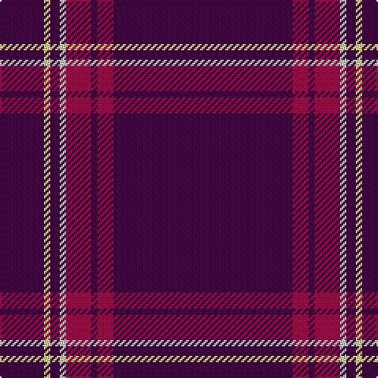

This page is one **sett** — a single exact thread-count. It belongs to the [tartan](/tartans/dp57m5dp2m8lb2dp3ly2dp14/)
(the same proportion at any scale), whose colour order is pattern [BRBRWBYB](/stripes/brbrwbyb/).

Sourced from register-of-tartans.  It is a [8 stripe tartan](/stripes/stripes8/).

Original link https://www.tartanregister.gov.uk/tartanDetails.aspx?ref=11197

## Register references

External register numbers recorded for this tartan.

- Scottish Register of Tartans: [11197](https://www.tartanregister.gov.uk/tartanDetails.aspx?ref=11197)

## Thread count
DP/114 R10 DP4 R16 N4 DP6 LY4 DP/28

## Palette

Palette: <strong>Tartan Register</strong>
<table><thead><tr><th>Colour</th><th>Threads</th><th>Shade</th><th>Base</th><th>OKLCh</th></tr></thead><tbody><tr><td>DP/</td><td style="text-align:right;font-variant-numeric:tabular-nums">114</td><td><code style="background-color:#440044;">#440044</code> <small style="color:#888">#440044</small></td><td>B <code style="background-color:#2A418A;">#2A418A</code></td><td><small style="color:#888">oklch(27.1% 0.125 328.4)</small></td></tr><tr><td>R</td><td style="text-align:right;font-variant-numeric:tabular-nums">10</td><td><code style="background-color:#A00048;">#A00048</code> <small style="color:#888">#A00048</small></td><td>R <code style="background-color:#CC0000;">#CC0000</code></td><td><small style="color:#888">oklch(45.4% 0.182 5.3)</small></td></tr><tr><td>DP</td><td style="text-align:right;font-variant-numeric:tabular-nums">4</td><td><code style="background-color:#440044;">#440044</code> <small style="color:#888">#440044</small></td><td>B <code style="background-color:#2A418A;">#2A418A</code></td><td><small style="color:#888">oklch(27.1% 0.125 328.4)</small></td></tr><tr><td>R</td><td style="text-align:right;font-variant-numeric:tabular-nums">16</td><td><code style="background-color:#A00048;">#A00048</code> <small style="color:#888">#A00048</small></td><td>R <code style="background-color:#CC0000;">#CC0000</code></td><td><small style="color:#888">oklch(45.4% 0.182 5.3)</small></td></tr><tr><td>N</td><td style="text-align:right;font-variant-numeric:tabular-nums">4</td><td><code style="background-color:#C8C8C8;">#C8C8C8</code> <small style="color:#888">#C8C8C8</small></td><td>W <code style="background-color:#F7F7F7;">#F7F7F7</code></td><td><small style="color:#888">oklch(83.3% 0.000 89.9)</small></td></tr><tr><td>DP</td><td style="text-align:right;font-variant-numeric:tabular-nums">6</td><td><code style="background-color:#440044;">#440044</code> <small style="color:#888">#440044</small></td><td>B <code style="background-color:#2A418A;">#2A418A</code></td><td><small style="color:#888">oklch(27.1% 0.125 328.4)</small></td></tr><tr><td>LY</td><td style="text-align:right;font-variant-numeric:tabular-nums">4</td><td><code style="background-color:#F8E38C;">#F8E38C</code> <small style="color:#888">#F8E38C</small></td><td>Y <code style="background-color:#F2BF00;">#F2BF00</code></td><td><small style="color:#888">oklch(91.4% 0.110 96.2)</small></td></tr><tr><td>DP/</td><td style="text-align:right;font-variant-numeric:tabular-nums">28</td><td><code style="background-color:#440044;">#440044</code> <small style="color:#888">#440044</small></td><td>B <code style="background-color:#2A418A;">#2A418A</code></td><td><small style="color:#888">oklch(27.1% 0.125 328.4)</small></td></tr></tbody></table>

# Sample pattern

## Nearest tartans

The nearest existing variants by ΔTartan distance, with this tartan at the top so the swatches line up against it.

ΔTartan

Tartan

Sett

—

<a href="/ttd/edit/#slug=dp57m5dp2m8lb2dp3ly2dp14~x2">Cairngorms National Park</a> <a class="nn-out" href="/setts/s8/dp57m5dp2m8lb2dp3ly2dp14~x2/" title="open its dictionary page">↗</a>

1.26

<a href="/ttd/edit/#slug=dg1k2dp27k2ly1~x2">Carolina University, Western</a> <a class="nn-out" href="/setts/s5/dg1k2dp27k2ly1~x2/" title="open its dictionary page">↗</a>

1.28

<a href="/ttd/edit/#slug=dp13w2dp8k5lo10dp75lo3~x2">East Carolina University (Corp.)</a> <a class="nn-out" href="/setts/s7/dp13w2dp8k5lo10dp75lo3~x2/" title="open its dictionary page">↗</a>

1.40

<a href="/ttd/edit/#slug=dg2dp19dg2dp46t2dp10dg3lp2r2~x2">Spirit of Hoxa (District)</a> <a class="nn-out" href="/setts/s9/dg2dp19dg2dp46t2dp10dg3lp2r2~x2/" title="open its dictionary page">↗</a>

1.72

<a href="/ttd/edit/#slug=ri2dp30w1lo2r1~x2">Wedding (Fashion)</a> <a class="nn-out" href="/setts/s5/ri2dp30w1lo2r1~x2/" title="open its dictionary page">↗</a>

1.95

<a href="/ttd/edit/#slug=o2w1dp30dr1oi2~x2">Wedding</a> <a class="nn-out" href="/setts/s5/o2w1dp30dr1oi2~x2/" title="open its dictionary page">↗</a>

2.02

<a href="/ttd/edit/#slug=r12dp3r7dp52dg4dp4~x2">Lynch Variant</a> <a class="nn-out" href="/setts/s6/r12dp3r7dp52dg4dp4~x2/" title="open its dictionary page">↗</a>

2.05

<a href="/ttd/edit/#slug=m6k2m4ly3m60db14m3db3w1~x2">Stenhousemuir F.C.</a> <a class="nn-out" href="/setts/s9/m6k2m4ly3m60db14m3db3w1~x2/" title="open its dictionary page">↗</a>

2.12

<a href="/ttd/edit/#slug=r6k2r4ly3r60db14r3db3w1~x2">Stenhousemuir Football Club (Sports)</a> <a class="nn-out" href="/setts/s9/r6k2r4ly3r60db14r3db3w1~x2/" title="open its dictionary page">↗</a>

2.17

<a href="/ttd/edit/#slug=k4r40k1r3k1w3k4~x2">Salt Lake County (District)</a> <a class="nn-out" href="/setts/s7/k4r40k1r3k1w3k4~x2/" title="open its dictionary page">↗</a>

2.18

<a href="/ttd/edit/#slug=ri92db10ri8w3ri8g4ri8r4~x2">Burnett of Leys Hunting</a> <a class="nn-out" href="/setts/s8/ri92db10ri8w3ri8g4ri8r4~x2/" title="open its dictionary page">↗</a>

## Neighbour map

Every grey dot is one of 14359 variants placed by the first two principal components of the ΔTartan feature space (44% of its variance). Red is this tartan; blue dots are its nearest — click one to open its page.

<svg viewBox="0 0 640 380" role="img" style="max-width:100%;height:auto;border:1px solid #e0e0e0;border-radius:4px;display:block" xmlns="http://www.w3.org/2000/svg"><image href="/nn/cloud.v1.png" width="640" height="380"/><a href="/setts/s5/dg1k2dp27k2ly1~x2/"><circle cx="622.1" cy="161.2" r="4" fill="#3465a4"><title>Carolina University, Western</title></circle></a><a href="/setts/s7/dp13w2dp8k5lo10dp75lo3~x2/"><circle cx="617.4" cy="129.4" r="4" fill="#3465a4"><title>East Carolina University (Corp.)</title></circle></a><a href="/setts/s9/dg2dp19dg2dp46t2dp10dg3lp2r2~x2/"><circle cx="626.0" cy="152.6" r="4" fill="#3465a4"><title>Spirit of Hoxa (District)</title></circle></a><a href="/setts/s5/ri2dp30w1lo2r1~x2/"><circle cx="588.2" cy="129.6" r="4" fill="#3465a4"><title>Wedding (Fashion)</title></circle></a><a href="/setts/s5/o2w1dp30dr1oi2~x2/"><circle cx="592.8" cy="143.2" r="4" fill="#3465a4"><title>Wedding</title></circle></a><a href="/setts/s6/r12dp3r7dp52dg4dp4~x2/"><circle cx="528.9" cy="190.9" r="4" fill="#3465a4"><title>Lynch Variant</title></circle></a><a href="/setts/s9/m6k2m4ly3m60db14m3db3w1~x2/"><circle cx="584.9" cy="99.4" r="4" fill="#3465a4"><title>Stenhousemuir F.C.</title></circle></a><a href="/setts/s9/r6k2r4ly3r60db14r3db3w1~x2/"><circle cx="578.7" cy="91.7" r="4" fill="#3465a4"><title>Stenhousemuir Football Club (Sports)</title></circle></a><a href="/setts/s7/k4r40k1r3k1w3k4~x2/"><circle cx="593.5" cy="132.3" r="4" fill="#3465a4"><title>Salt Lake County (District)</title></circle></a><a href="/setts/s8/ri92db10ri8w3ri8g4ri8r4~x2/"><circle cx="626.0" cy="126.1" r="4" fill="#3465a4"><title>Burnett of Leys Hunting</title></circle></a><circle cx="613.7" cy="146.2" r="5" fill="#c00000"/></svg>

ID: /setts/s8/dp57m5dp2m8lb2dp3ly2dp14~x2/
