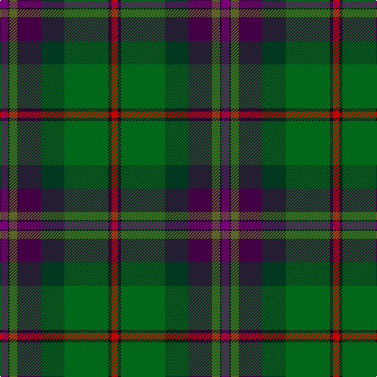

This page is one **sett** — a single exact thread-count. It belongs to the [tartan](/tartans/p5k1ga5dp15dg15gb28k2r4/)
(the same proportion at any scale), whose colour order is pattern [BKGBGGKR](/stripes/bkgbggkr/).

Sourced from house-of-tartan.  It is a [8 stripe tartan](/stripes/stripes8/).

Original link http://www.house-of-tartan.scotland.net/house/TartanViewjs.asp?colr=Def&tnam=5768

## Thread count
P/10 K2 Ga10 DP30 DG30 Gb56 K4 R/8

## Palette
Each colour and the base-6 reference it is a variant of.

| Colour | Shade | Base |
|---|---|---|
| DG | <code style="background-color:#003820;">#003820</code> `oklch(30.0% 0.070 158.3)` <small>#003820</small> | G <code style="background-color:#006100;">#006100</code> |
| DP | <code style="background-color:#440044;">#440044</code> `oklch(27.1% 0.125 328.4)` <small>#440044</small> | B <code style="background-color:#2A418A;">#2A418A</code> |
| DR | <code style="background-color:#880000;">#880000</code> `oklch(39.4% 0.162 29.2)` <small>#880000</small> | R <code style="background-color:#CC0000;">#CC0000</code> |
| G | <code style="background-color:#285800;">#285800</code> `oklch(41.0% 0.122 135.8)` <small>#285800</small> | G <code style="background-color:#006100;">#006100</code> |
| Ga | <code style="background-color:#5C6428;">#5C6428</code> `oklch(48.3% 0.084 116.0)` <small>#5C6428</small> | G <code style="background-color:#006100;">#006100</code> |
| Gb | <code style="background-color:#006818;">#006818</code> `oklch(45.0% 0.142 145.0)` <small>#006818</small> | G <code style="background-color:#006100;">#006100</code> |
| K | <code style="background-color:#101010;">#101010</code> `oklch(17.3% 0.000 89.9)` <small>#101010</small> | K <code style="background-color:#000000;">#000000</code> |
| LP | <code style="background-color:#9C68A4;">#9C68A4</code> `oklch(59.4% 0.107 322.0)` <small>#9C68A4</small> | R <code style="background-color:#CC0000;">#CC0000</code> |
| P | <code style="background-color:#780078;">#780078</code> `oklch(40.2% 0.185 328.4)` <small>#780078</small> | B <code style="background-color:#2A418A;">#2A418A</code> |
| R | <code style="background-color:#C80000;">#C80000</code> `oklch(52.3% 0.215 29.2)` <small>#C80000</small> | R <code style="background-color:#CC0000;">#CC0000</code> |

# Sample pattern

## Nearest tartans

The nearest existing variants by ΔTartan distance, with this tartan at the top so the swatches line up against it.

ΔTartan

Tartan

Sett

—

<a href="/ttd/edit/#slug=dp5k1y5dp15dg15g28k2r4~x2">Batten of Argyll Clan Tartan Tartan Number: 5768. Earliest known date: 2003 The Baddenach family originally emigrated from Argyll, Scotland to Jamestown, Virginia. This can be worn by all of the name or its anglicised variants (Batten, Batton, Battin, Badden etc). IT is also to serve as the official tartan for the St Andrews Legion/St Andrews Legion Pipes &amp; Drums headquartered in Richmond Virginia, whose founder is the designer of this tartan. It may also serve as a tartan for anyone having Scottish ancestors who settled in the Virginia Colony. See products available Copyright © Blair Urquhart, Comrie, 2015</a> <a class="nn-out" href="/setts/s8/dp5k1y5dp15dg15g28k2r4~x2/" title="open its dictionary page">↗</a>

0.91

<a href="/ttd/edit/#slug=k5b3dy4ly1db13dy13g29w2~x2">Teviotdale</a> <a class="nn-out" href="/setts/s8/k5b3dy4ly1db13dy13g29w2~x2/" title="open its dictionary page">↗</a>

1.05

<a href="/ttd/edit/#slug=m8k2dy10dp30dy30g55k4lo6">Aberuchill</a> <a class="nn-out" href="/setts/s8/m8k2dy10dp30dy30g55k4lo6/" title="open its dictionary page">↗</a>

1.07

<a href="/ttd/edit/#slug=m8k2y10dp30y30g55k4o6">Aberuchill District Tartan Tartan Number: 6814. Earliest known date: 2005 Aberuchill lends it name to the area south of Comrie where the river Ruchil meets the river Earn. The two rivers form the boundaries of the Aberuchill Estate for which this tartan was created. See products available Copyright © Blair Urquhart, Comrie, 2015</a> <a class="nn-out" href="/setts/s8/m8k2y10dp30y30g55k4o6/" title="open its dictionary page">↗</a>

1.16

<a href="/ttd/edit/#slug=w1db6dp9r12k12g32k6ly1~x2">Fujitsu</a> <a class="nn-out" href="/setts/s8/w1db6dp9r12k12g32k6ly1~x2/" title="open its dictionary page">↗</a>

1.29

<a href="/ttd/edit/#slug=k4r1k3r2lo3k12dg10dg18db3o3db3~x2">Blake (Personal)</a> <a class="nn-out" href="/setts/s11/k4r1k3r2lo3k12dg10dg18db3o3db3~x2/" title="open its dictionary page">↗</a>

1.30

<a href="/ttd/edit/#slug=r9dt8r8g52w2k32dt44b4">Highland Wedding (Fashion)</a> <a class="nn-out" href="/setts/s8/r9dt8r8g52w2k32dt44b4/" title="open its dictionary page">↗</a>

1.32

<a href="/ttd/edit/#slug=db1r4db12r1k7y12k7dy21lb1~x2">Redgate Htg #1 (Name)</a> <a class="nn-out" href="/setts/s9/db1r4db12r1k7y12k7dy21lb1~x2/" title="open its dictionary page">↗</a>

1.35

<a href="/ttd/edit/#slug=o20dp2o2dp2o3dp8dg9g8y8dg1lr2~x2">Isle of Skye</a> <a class="nn-out" href="/setts/s11/o20dp2o2dp2o3dp8dg9g8y8dg1lr2~x2/" title="open its dictionary page">↗</a>

1.39

<a href="/ttd/edit/#slug=t1dr4t12dr1k7dg12k7do21w1~x2">Redgate (Connecticut) Hunting</a> <a class="nn-out" href="/setts/s9/t1dr4t12dr1k7dg12k7do21w1~x2/" title="open its dictionary page">↗</a>

1.40

<a href="/ttd/edit/#slug=lb4k1y19lo1k19n13r2n4r2~x4">Whitson (Name)</a> <a class="nn-out" href="/setts/s9/lb4k1y19lo1k19n13r2n4r2~x4/" title="open its dictionary page">↗</a>

## Neighbour map

Every grey dot is one of 14299 variants placed by the first two principal components of the ΔTartan feature space (44% of its variance). Red is this tartan; blue dots are its nearest — click one to open its page.

<svg viewBox="0 0 640 380" role="img" style="max-width:100%;height:auto;border:1px solid #e0e0e0;border-radius:4px;display:block" xmlns="http://www.w3.org/2000/svg"><image href="/nn/cloud.v1.png" width="640" height="380"/><a href="/setts/s8/k5b3dy4ly1db13dy13g29w2~x2/"><circle cx="224.0" cy="124.1" r="4" fill="#3465a4"><title>Teviotdale</title></circle></a><a href="/setts/s8/m8k2dy10dp30dy30g55k4lo6/"><circle cx="232.4" cy="141.4" r="4" fill="#3465a4"><title>Aberuchill</title></circle></a><a href="/setts/s8/m8k2y10dp30y30g55k4o6/"><circle cx="243.5" cy="151.0" r="4" fill="#3465a4"><title>Aberuchill District Tartan Tartan Number: 6814. Earliest known date: 2005 Aberuchill lends it name to the area south of Comrie where the river Ruchil meets the river Earn. The two rivers form the boundaries of the Aberuchill Estate for which this tartan was created. See products available Copyright © Blair Urquhart, Comrie, 2015</title></circle></a><a href="/setts/s8/w1db6dp9r12k12g32k6ly1~x2/"><circle cx="200.6" cy="112.1" r="4" fill="#3465a4"><title>Fujitsu</title></circle></a><a href="/setts/s11/k4r1k3r2lo3k12dg10dg18db3o3db3~x2/"><circle cx="134.9" cy="131.6" r="4" fill="#3465a4"><title>Blake (Personal)</title></circle></a><a href="/setts/s8/r9dt8r8g52w2k32dt44b4/"><circle cx="193.7" cy="144.4" r="4" fill="#3465a4"><title>Highland Wedding (Fashion)</title></circle></a><a href="/setts/s9/db1r4db12r1k7y12k7dy21lb1~x2/"><circle cx="191.0" cy="159.6" r="4" fill="#3465a4"><title>Redgate Htg #1 (Name)</title></circle></a><a href="/setts/s11/o20dp2o2dp2o3dp8dg9g8y8dg1lr2~x2/"><circle cx="192.4" cy="138.2" r="4" fill="#3465a4"><title>Isle of Skye</title></circle></a><a href="/setts/s9/t1dr4t12dr1k7dg12k7do21w1~x2/"><circle cx="166.4" cy="148.1" r="4" fill="#3465a4"><title>Redgate (Connecticut) Hunting</title></circle></a><a href="/setts/s9/lb4k1y19lo1k19n13r2n4r2~x4/"><circle cx="175.7" cy="145.3" r="4" fill="#3465a4"><title>Whitson (Name)</title></circle></a><circle cx="201.1" cy="133.3" r="5" fill="#c00000"/></svg>

ID: /setts/s8/dp5k1y5dp15dg15g28k2r4~x2/
