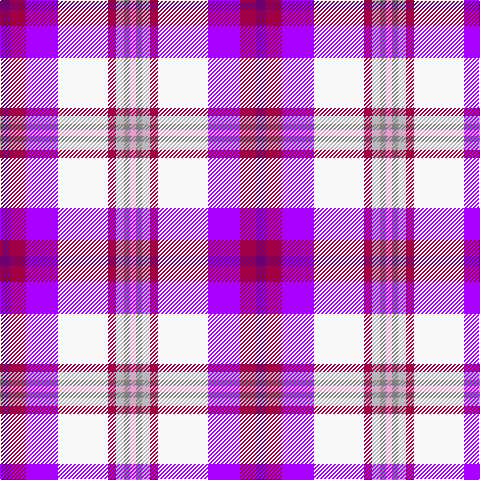

In pattern [BRBWRYGW](/stripes/brbwrygw/).

This was sourced from register-of-tartans.  It is a [8 stripe tartan](/stripes/stripes8/).

Original link https://www.tartanregister.gov.uk/tartanDetails.aspx?ref=11522

## Register references

External register numbers recorded for this tartan.

- Scottish Register of Tartans: [11522](https://www.tartanregister.gov.uk/tartanDetails.aspx?ref=11522)

## Thread count
P/10 R16 Pa32 W50 R8 Na8 N6 LP/6

## Palette
Each colour and the base-6 reference it is a variant of.

| Colour | Shade | Base |
|---|---|---|
| LP | <code style="background-color:#E69DD4;">#E69DD4</code> `oklch(78.4% 0.112 336.0)` <small>#E69DD4</small> | W <code style="background-color:#F7F7F7;">#F7F7F7</code> |
| N | <code style="background-color:#808080;">#808080</code> `oklch(60.0% 0.000 89.9)` <small>#808080</small> | G <code style="background-color:#006100;">#006100</code> |
| Na | <code style="background-color:#B8B8B8;">#B8B8B8</code> `oklch(78.3% 0.000 89.9)` <small>#B8B8B8</small> | Y <code style="background-color:#F2BF00;">#F2BF00</code> |
| P | <code style="background-color:#6C0070;">#6C0070</code> `oklch(37.6% 0.174 326.5)` <small>#6C0070</small> | B <code style="background-color:#2A418A;">#2A418A</code> |
| Pa | <code style="background-color:#AA00FF;">#AA00FF</code> `oklch(58.1% 0.299 307.0)` <small>#AA00FF</small> | B <code style="background-color:#2A418A;">#2A418A</code> |
| R | <code style="background-color:#A00048;">#A00048</code> `oklch(45.4% 0.182 5.3)` <small>#A00048</small> | R <code style="background-color:#CC0000;">#CC0000</code> |
| W | <code style="background-color:#F8F8F8;">#F8F8F8</code> `oklch(97.9% 0.000 89.9)` <small>#F8F8F8</small> | W <code style="background-color:#F7F7F7;">#F7F7F7</code> |

# Sample pattern

## Nearest tartans

The nearest existing variants by ΔTartan distance.

1. [Heather (R.S.S.P.C.C.) Corporate Tartan Tartan Number: 2108. Earliest known date: 1990 The design 'Heather Tartan' has been produced at the request of the Royal Society for Prevention of Cruelty to Children, as the Society's corporate tartan. The colours of the design are taken from the Society's badge and lettrhead. Dark Pink Mix, Light Pink Mix, Kingfisher and Emerald. See products available Copyright © Blair Urquhart, Comrie, 2015](/setts/s9/db4w3lb28w3dp16w4dp8lp46g4/) — ΔT 2.00
1. [Heather, (R.S.S.P.C.C.)](/setts/s9/db4w3lb28w3p16w4p8lp46g4/) — ΔT 2.03
1. [MacDonald of Glencoe (Dance) Fashion Tartan Tartan Number: 6553. Earliest known date: 01/01/2005 Threadcount taken from DC Dalgliesh Dancers' Swatch book, 2005./Threadcount and colours aren't 100% original. Generated manually./ See products available Copyright © Blair Urquhart, Comrie, 2015](/setts/s12/p6r2p2dt2w31dt12lb2p26g3p4db2p4~x2/) — ΔT 2.18
1. [Culloden Dress](/setts/s8/r6t3dp24ly2k23w23k2w6~x2/) — ΔT 2.19
1. [Praetorian Imperator](/setts/s14/w1dp1ly1p8k1lb1w8lb1k8lb1w1p8lb1w1~x6/) — ΔT 2.20
1. [Robieson Kith & Kin (Personal)](/setts/s13/w1r1b8lb1k1w8k1lo8lb1lo1b8lb1lo1~x6/) — ΔT 2.20
1. [Galvez-Brown](/setts/s7/db36ly5r12r9dp5w12ly7~x2/) — ΔT 2.22
1. [Humming Bird (Fashion)](/setts/s8/r6t3m20ly2k20w20k2w5~x2/) — ΔT 2.25
1. [Edgar-Feyen](/setts/s6/w18k1db4g4p10lo2~x4/) — ΔT 2.29
1. [Lashbrooke of Barrowfield](/setts/s12/db3w3r3w24ly4dy6db3r2db16b12ly2db3~x2/) — ΔT 2.31

## Neighbour map

Every grey dot is one of 14299 variants placed by the first two principal components of the ΔTartan feature space (44% of its variance). Red is this tartan; blue dots are its nearest — click one to open its page.

<svg viewBox="0 0 640 380" role="img" style="max-width:100%;height:auto;border:1px solid #e0e0e0;border-radius:4px;display:block" xmlns="http://www.w3.org/2000/svg"><image href="/nn/cloud.v1.png" width="640" height="380"/><a href="/setts/s9/db4w3lb28w3dp16w4dp8lp46g4/"><circle cx="185.4" cy="109.7" r="4" fill="#3465a4"><title>Heather (R.S.S.P.C.C.) Corporate Tartan Tartan Number: 2108. Earliest known date: 1990 The design 'Heather Tartan' has been produced at the request of the Royal Society for Prevention of Cruelty to Children, as the Society's corporate tartan. The colours of the design are taken from the Society's badge and lettrhead. Dark Pink Mix, Light Pink Mix, Kingfisher and Emerald. See products available Copyright © Blair Urquhart, Comrie, 2015</title></circle></a><a href="/setts/s9/db4w3lb28w3p16w4p8lp46g4/"><circle cx="185.1" cy="110.1" r="4" fill="#3465a4"><title>Heather, (R.S.S.P.C.C.)</title></circle></a><a href="/setts/s12/p6r2p2dt2w31dt12lb2p26g3p4db2p4~x2/"><circle cx="175.6" cy="64.2" r="4" fill="#3465a4"><title>MacDonald of Glencoe (Dance) Fashion Tartan Tartan Number: 6553. Earliest known date: 01/01/2005 Threadcount taken from DC Dalgliesh Dancers' Swatch book, 2005./Threadcount and colours aren't 100% original. Generated manually./ See products available Copyright © Blair Urquhart, Comrie, 2015</title></circle></a><a href="/setts/s8/r6t3dp24ly2k23w23k2w6~x2/"><circle cx="97.5" cy="122.4" r="4" fill="#3465a4"><title>Culloden Dress</title></circle></a><a href="/setts/s14/w1dp1ly1p8k1lb1w8lb1k8lb1w1p8lb1w1~x6/"><circle cx="106.8" cy="98.6" r="4" fill="#3465a4"><title>Praetorian Imperator</title></circle></a><a href="/setts/s13/w1r1b8lb1k1w8k1lo8lb1lo1b8lb1lo1~x6/"><circle cx="100.8" cy="106.2" r="4" fill="#3465a4"><title>Robieson Kith &amp; Kin (Personal)</title></circle></a><a href="/setts/s7/db36ly5r12r9dp5w12ly7~x2/"><circle cx="111.3" cy="150.6" r="4" fill="#3465a4"><title>Galvez-Brown</title></circle></a><a href="/setts/s8/r6t3m20ly2k20w20k2w5~x2/"><circle cx="91.0" cy="133.3" r="4" fill="#3465a4"><title>Humming Bird (Fashion)</title></circle></a><a href="/setts/s6/w18k1db4g4p10lo2~x4/"><circle cx="172.7" cy="112.7" r="4" fill="#3465a4"><title>Edgar-Feyen</title></circle></a><a href="/setts/s12/db3w3r3w24ly4dy6db3r2db16b12ly2db3~x2/"><circle cx="89.5" cy="98.2" r="4" fill="#3465a4"><title>Lashbrooke of Barrowfield</title></circle></a><circle cx="84.2" cy="113.2" r="5" fill="#c00000"/></svg>

ID: /setts/s8/dp5m8p16w25m4lr4y3lp3~x2/
