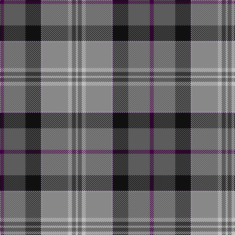

This page is one **sett** — a single exact thread-count. It belongs to the [tartan](/tartans/dp8n44k32lp2nb53na8n8na4/)
(the same proportion at any scale), whose colour order is pattern [BBKWRWBW](/stripes/bbkwrwbw/).

Sourced from tartans-authority.  It is a [8 stripe tartan](/stripes/stripes8/).

Original link http://www.tartansauthority.com/tartan-ferret/display/8956/

## Thread count
DP/8 N44 K32 LP2 Nb53 Na8 N8 Na/4

## Palette
Each colour and the base-6 reference it is a variant of.

| Colour | Shade | Base |
|---|---|---|
| DP | <code style="background-color:#440044;">#440044</code> `oklch(27.1% 0.125 328.4)` <small>#440044</small> | B <code style="background-color:#2A418A;">#2A418A</code> |
| K | <code style="background-color:#101010;">#101010</code> `oklch(17.3% 0.000 89.9)` <small>#101010</small> | K <code style="background-color:#000000;">#000000</code> |
| LP | <code style="background-color:#C49CD8;">#C49CD8</code> `oklch(75.0% 0.095 314.2)` <small>#C49CD8</small> | W <code style="background-color:#F7F7F7;">#F7F7F7</code> |
| N | <code style="background-color:#5C5C5C;">#5C5C5C</code> `oklch(47.5% 0.000 89.9)` <small>#5C5C5C</small> | B <code style="background-color:#2A418A;">#2A418A</code> |
| Na | <code style="background-color:#C0C0C0;">#C0C0C0</code> `oklch(80.8% 0.000 89.9)` <small>#C0C0C0</small> | W <code style="background-color:#F7F7F7;">#F7F7F7</code> |
| Nb | <code style="background-color:#888888;">#888888</code> `oklch(62.7% 0.000 89.9)` <small>#888888</small> | R <code style="background-color:#CC0000;">#CC0000</code> |

# Sample pattern

## Nearest tartans

The nearest existing variants by ΔTartan distance, with this tartan at the top so the swatches line up against it.

ΔTartan

Tartan

Sett

—

<a href="/ttd/edit/#slug=dp8n44k32lp2o53lb8n8lb4">Silver Wedding (Fashion)</a> <a class="nn-out" href="/setts/s8/dp8n44k32lp2o53lb8n8lb4/" title="open its dictionary page">↗</a>

1.11

<a href="/ttd/edit/#slug=db37g27r22w1dp6ly5~x2">Palazzo Bloise (Personal)</a> <a class="nn-out" href="/setts/s6/db37g27r22w1dp6ly5~x2/" title="open its dictionary page">↗</a>

1.13

<a href="/ttd/edit/#slug=t1ly3g14w2db22w2dp14t3ly1~x2">Yule (Name)</a> <a class="nn-out" href="/setts/s9/t1ly3g14w2db22w2dp14t3ly1~x2/" title="open its dictionary page">↗</a>

1.14

<a href="/ttd/edit/#slug=n12r2n3r4n15k24dg18ly1k3dg3w3~x2">Groen (Personal)</a> <a class="nn-out" href="/setts/s11/n12r2n3r4n15k24dg18ly1k3dg3w3~x2/" title="open its dictionary page">↗</a>

1.19

<a href="/ttd/edit/#slug=lb3m14w1k2g2k16t20lb1~x2">Vinther, Niels Christian (Personal)</a> <a class="nn-out" href="/setts/s8/lb3m14w1k2g2k16t20lb1~x2/" title="open its dictionary page">↗</a>

1.19

<a href="/ttd/edit/#slug=r7g20ly2g4k5b4k2b20k3w1~x2">McMeeken (Name)</a> <a class="nn-out" href="/setts/s10/r7g20ly2g4k5b4k2b20k3w1~x2/" title="open its dictionary page">↗</a>

1.20

<a href="/ttd/edit/#slug=k3w1r16k1g21b9k6w1~x4">Ford &amp; Etal</a> <a class="nn-out" href="/setts/s8/k3w1r16k1g21b9k6w1~x4/" title="open its dictionary page">↗</a>

1.22

<a href="/ttd/edit/#slug=r15g6db36w2k6w2g30r32k6t4">Steiff</a> <a class="nn-out" href="/setts/s10/r15g6db36w2k6w2g30r32k6t4/" title="open its dictionary page">↗</a>

1.23

<a href="/ttd/edit/#slug=g30db2o7r14o7r7w1db14~x2">Harding Personal Tartan Tartan Number: 6796. Earliest known date: 2005 The tartan is part of a personal design project bringing together textile, silver and jewelry design and leatherworking, all inspired by the richness of the Scottish design and craft heritage. See products available Copyright © Blair Urquhart, Comrie, 2015</a> <a class="nn-out" href="/setts/s8/g30db2o7r14o7r7w1db14~x2/" title="open its dictionary page">↗</a>

1.24

<a href="/ttd/edit/#slug=o30ly4dt9lb2dt1o6dt8r8~x4">Norwegian Migration Period</a> <a class="nn-out" href="/setts/s8/o30ly4dt9lb2dt1o6dt8r8~x4/" title="open its dictionary page">↗</a>

1.24

<a href="/ttd/edit/#slug=lo3k2o15k10dt23r2dt1w2~x2">Vienna Highlander (Fashion)</a> <a class="nn-out" href="/setts/s8/lo3k2o15k10dt23r2dt1w2~x2/" title="open its dictionary page">↗</a>

## Neighbour map

Every grey dot is one of 14299 variants placed by the first two principal components of the ΔTartan feature space (44% of its variance). Red is this tartan; blue dots are its nearest — click one to open its page.

<svg viewBox="0 0 640 380" role="img" style="max-width:100%;height:auto;border:1px solid #e0e0e0;border-radius:4px;display:block" xmlns="http://www.w3.org/2000/svg"><image href="/nn/cloud.v1.png" width="640" height="380"/><a href="/setts/s6/db37g27r22w1dp6ly5~x2/"><circle cx="212.9" cy="139.2" r="4" fill="#3465a4"><title>Palazzo Bloise (Personal)</title></circle></a><a href="/setts/s9/t1ly3g14w2db22w2dp14t3ly1~x2/"><circle cx="166.4" cy="112.0" r="4" fill="#3465a4"><title>Yule (Name)</title></circle></a><a href="/setts/s11/n12r2n3r4n15k24dg18ly1k3dg3w3~x2/"><circle cx="176.1" cy="120.9" r="4" fill="#3465a4"><title>Groen (Personal)</title></circle></a><a href="/setts/s8/lb3m14w1k2g2k16t20lb1~x2/"><circle cx="158.2" cy="114.7" r="4" fill="#3465a4"><title>Vinther, Niels Christian (Personal)</title></circle></a><a href="/setts/s10/r7g20ly2g4k5b4k2b20k3w1~x2/"><circle cx="190.4" cy="134.0" r="4" fill="#3465a4"><title>McMeeken (Name)</title></circle></a><a href="/setts/s8/k3w1r16k1g21b9k6w1~x4/"><circle cx="191.3" cy="135.4" r="4" fill="#3465a4"><title>Ford &amp; Etal</title></circle></a><a href="/setts/s10/r15g6db36w2k6w2g30r32k6t4/"><circle cx="158.9" cy="122.6" r="4" fill="#3465a4"><title>Steiff</title></circle></a><a href="/setts/s8/g30db2o7r14o7r7w1db14~x2/"><circle cx="217.8" cy="145.1" r="4" fill="#3465a4"><title>Harding Personal Tartan Tartan Number: 6796. Earliest known date: 2005 The tartan is part of a personal design project bringing together textile, silver and jewelry design and leatherworking, all inspired by the richness of the Scottish design and craft heritage. See products available Copyright © Blair Urquhart, Comrie, 2015</title></circle></a><a href="/setts/s8/o30ly4dt9lb2dt1o6dt8r8~x4/"><circle cx="228.7" cy="105.8" r="4" fill="#3465a4"><title>Norwegian Migration Period</title></circle></a><a href="/setts/s8/lo3k2o15k10dt23r2dt1w2~x2/"><circle cx="201.9" cy="119.3" r="4" fill="#3465a4"><title>Vienna Highlander (Fashion)</title></circle></a><circle cx="183.8" cy="124.6" r="5" fill="#c00000"/></svg>

ID: /setts/s8/dp8n44k32lp2o53lb8n8lb4/
