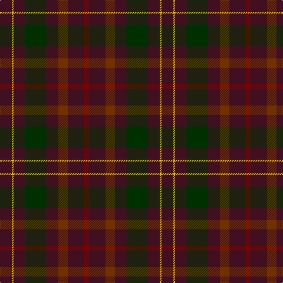

This page is one **sett** — a single exact thread-count. It belongs to the [tartan](/tartans/dr20y3dr20dg36dr20t16dr28dra8/)
(the same proportion at any scale), whose colour order is pattern [BYBGBRBR](/stripes/bybgbrbr/).

Sourced from weddslist.  It is a [8 stripe tartan](/stripes/stripes8/).

Original link http://www.weddslist.com/cgi-bin/tartans/pg.pl?source=sts

## Thread count
DR/20 Y3 DR20 DG36 DR20 T16 DR28 DRa/8

## Palette
Each colour and the base-6 reference it is a variant of.

| Colour | Shade | Base |
|---|---|---|
| DG | <code style="background-color:#003000;">#003000</code> `oklch(26.8% 0.091 142.5)` <small>#003000</small> | G <code style="background-color:#006100;">#006100</code> |
| DR | <code style="background-color:#401020;">#401020</code> `oklch(26.0% 0.076 3.6)` <small>#401020</small> | B <code style="background-color:#2A418A;">#2A418A</code> |
| DRa | <code style="background-color:#800000;">#800000</code> `oklch(37.7% 0.155 29.2)` <small>#800000</small> | R <code style="background-color:#CC0000;">#CC0000</code> |
| T | <code style="background-color:#703000;">#703000</code> `oklch(39.1% 0.105 49.1)` <small>#703000</small> | R <code style="background-color:#CC0000;">#CC0000</code> |
| Y | <code style="background-color:#F0C000;">#F0C000</code> `oklch(82.7% 0.169 90.5)` <small>#F0C000</small> | Y <code style="background-color:#F2BF00;">#F2BF00</code> |

# Sample pattern

## Nearest tartans

The nearest existing variants by ΔTartan distance, with this tartan at the top so the swatches line up against it.

ΔTartan

Tartan

Sett

—

<a href="/ttd/edit/#slug=dr20ly3dr20dg36dr20o16dr28r8">Leighton</a> <a class="nn-out" href="/setts/s8/dr20ly3dr20dg36dr20o16dr28r8/" title="open its dictionary page">↗</a>

1.82

<a href="/ttd/edit/#slug=db1dy9dg5dy1k5dy1dg5dy9w1~x2">Duchess of York</a> <a class="nn-out" href="/setts/s9/db1dy9dg5dy1k5dy1dg5dy9w1~x2/" title="open its dictionary page">↗</a>

1.92

<a href="/ttd/edit/#slug=dg1dr8dg8r1dg8dr8lr1~x4">MacKinnon Hunting</a> <a class="nn-out" href="/setts/s7/dg1dr8dg8r1dg8dr8lr1~x4/" title="open its dictionary page">↗</a>

1.92

<a href="/ttd/edit/#slug=dg1dr8dg8r1dg8dr8lr1~x2">MacKinnon Hunting</a> <a class="nn-out" href="/setts/s7/dg1dr8dg8r1dg8dr8lr1~x2/" title="open its dictionary page">↗</a>

2.01

<a href="/ttd/edit/#slug=r2do15dg12do2dt12do2dg12do15o2~x4">Amazing Union (Personal)</a> <a class="nn-out" href="/setts/s9/r2do15dg12do2dt12do2dg12do15o2~x4/" title="open its dictionary page">↗</a>

2.04

<a href="/ttd/edit/#slug=r2dy15dg12dy2dt12dy2dg12dy15o2~x4">Amazing Union (Personal)</a> <a class="nn-out" href="/setts/s9/r2dy15dg12dy2dt12dy2dg12dy15o2~x4/" title="open its dictionary page">↗</a>

2.12

<a href="/ttd/edit/#slug=dr20lo4dr20g35do20dy16dr28r8">Leighton (Personal)</a> <a class="nn-out" href="/setts/s8/dr20lo4dr20g35do20dy16dr28r8/" title="open its dictionary page">↗</a>

2.13

<a href="/ttd/edit/#slug=dr5lo1dr5g9do5dy4dr7r2~x4">Leighton (Personal)</a> <a class="nn-out" href="/setts/s8/dr5lo1dr5g9do5dy4dr7r2~x4/" title="open its dictionary page">↗</a>

2.14

<a href="/ttd/edit/#slug=r8lr2o30dg12o3dg12o3~x2">Wasko (Personal)</a> <a class="nn-out" href="/setts/s7/r8lr2o30dg12o3dg12o3~x2/" title="open its dictionary page">↗</a>

2.15

<a href="/ttd/edit/#slug=dg14k8dg21k2lo5k2dg21k11db18k2r5~x2">de Vere-Austin (Clan)</a> <a class="nn-out" href="/setts/s11/dg14k8dg21k2lo5k2dg21k11db18k2r5~x2/" title="open its dictionary page">↗</a>

2.16

<a href="/ttd/edit/#slug=n12y3n36k12n8k8n16k2n18k4n10">Bute Heather, Hunting (Fashion)</a> <a class="nn-out" href="/setts/s11/n12y3n36k12n8k8n16k2n18k4n10/" title="open its dictionary page">↗</a>

## Neighbour map

Every grey dot is one of 14299 variants placed by the first two principal components of the ΔTartan feature space (44% of its variance). Red is this tartan; blue dots are its nearest — click one to open its page.

<svg viewBox="0 0 640 380" role="img" style="max-width:100%;height:auto;border:1px solid #e0e0e0;border-radius:4px;display:block" xmlns="http://www.w3.org/2000/svg"><image href="/nn/cloud.v1.png" width="640" height="380"/><a href="/setts/s9/db1dy9dg5dy1k5dy1dg5dy9w1~x2/"><circle cx="327.8" cy="239.1" r="4" fill="#3465a4"><title>Duchess of York</title></circle></a><a href="/setts/s7/dg1dr8dg8r1dg8dr8lr1~x4/"><circle cx="361.8" cy="281.9" r="4" fill="#3465a4"><title>MacKinnon Hunting</title></circle></a><a href="/setts/s7/dg1dr8dg8r1dg8dr8lr1~x2/"><circle cx="361.8" cy="281.9" r="4" fill="#3465a4"><title>MacKinnon Hunting</title></circle></a><a href="/setts/s9/r2do15dg12do2dt12do2dg12do15o2~x4/"><circle cx="321.7" cy="276.7" r="4" fill="#3465a4"><title>Amazing Union (Personal)</title></circle></a><a href="/setts/s9/r2dy15dg12dy2dt12dy2dg12dy15o2~x4/"><circle cx="270.9" cy="242.5" r="4" fill="#3465a4"><title>Amazing Union (Personal)</title></circle></a><a href="/setts/s8/dr20lo4dr20g35do20dy16dr28r8/"><circle cx="222.0" cy="242.9" r="4" fill="#3465a4"><title>Leighton (Personal)</title></circle></a><a href="/setts/s8/dr5lo1dr5g9do5dy4dr7r2~x4/"><circle cx="222.0" cy="240.5" r="4" fill="#3465a4"><title>Leighton (Personal)</title></circle></a><a href="/setts/s7/r8lr2o30dg12o3dg12o3~x2/"><circle cx="385.7" cy="226.2" r="4" fill="#3465a4"><title>Wasko (Personal)</title></circle></a><a href="/setts/s11/dg14k8dg21k2lo5k2dg21k11db18k2r5~x2/"><circle cx="302.9" cy="233.2" r="4" fill="#3465a4"><title>de Vere-Austin (Clan)</title></circle></a><a href="/setts/s11/n12y3n36k12n8k8n16k2n18k4n10/"><circle cx="421.3" cy="227.4" r="4" fill="#3465a4"><title>Bute Heather, Hunting (Fashion)</title></circle></a><circle cx="364.6" cy="267.1" r="5" fill="#c00000"/></svg>

ID: /setts/s8/dr20ly3dr20dg36dr20o16dr28r8/
