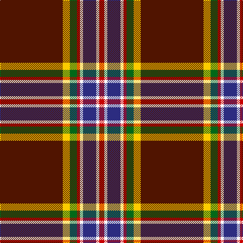

This page is one **sett** — a single exact thread-count. It belongs to the [tartan](/tartans/dr62ly7g7r3w3db13w3r5/)
(the same proportion at any scale), whose colour order is pattern [BYGRWBWR](/stripes/bygrwbwr/).

Sourced from tartans-authority.  It is a [8 stripe tartan](/stripes/stripes8/).

Original link http://www.tartansauthority.com/tartan-ferret/display/11168/

## Register references

External register numbers recorded for this tartan.

- Scottish Register of Tartans: [11168](https://www.tartanregister.gov.uk/tartanDetails?ref=11168)
- Scottish Tartans Authority (ITI): 11168

## Thread count
DR/124 Y14 G14 R6 W6 DB26 W6 R/10

## Palette

Palette: <strong>Tartan Register</strong> <small style="color:#888">(5 of 6 colours)</small>
<table><thead><tr><th>Colour</th><th>Threads</th><th>Shade</th><th>Base</th><th>OKLCh</th></tr></thead><tbody><tr><td>DR/</td><td style="text-align:right;font-variant-numeric:tabular-nums">124</td><td><code style="background-color:#501400;">#501400</code> <small style="color:#888">#501400</small></td><td>B <code style="background-color:#2A418A;">#2A418A</code></td><td><small style="color:#888">oklch(29.1% 0.094 38.4)</small></td></tr><tr><td>Y</td><td style="text-align:right;font-variant-numeric:tabular-nums">14</td><td><code style="background-color:#FCCC00;">#FCCC00</code> <small style="color:#888">#FCCC00</small></td><td>Y <code style="background-color:#F2BF00;">#F2BF00</code></td><td><small style="color:#888">oklch(86.2% 0.176 91.5)</small></td></tr><tr><td>G</td><td style="text-align:right;font-variant-numeric:tabular-nums">14</td><td><code style="background-color:#006818;">#006818</code> <small style="color:#888">#006818</small></td><td>G <code style="background-color:#006100;">#006100</code></td><td><small style="color:#888">oklch(45.0% 0.142 145.0)</small></td></tr><tr><td>R</td><td style="text-align:right;font-variant-numeric:tabular-nums">6</td><td><code style="background-color:#C80000;">#C80000</code> <small style="color:#888">#C80000</small></td><td>R <code style="background-color:#CC0000;">#CC0000</code></td><td><small style="color:#888">oklch(52.3% 0.215 29.2)</small></td></tr><tr><td>W</td><td style="text-align:right;font-variant-numeric:tabular-nums">6</td><td><code style="background-color:#FCFCFC;">#FCFCFC</code> <small style="color:#888">#FCFCFC</small></td><td>W <code style="background-color:#F7F7F7;">#F7F7F7</code></td><td><small style="color:#888">oklch(99.1% 0.000 89.9)</small></td></tr><tr><td>DB</td><td style="text-align:right;font-variant-numeric:tabular-nums">26</td><td><code style="background-color:#2C2C80;">#2C2C80</code> <small style="color:#888">#2C2C80</small></td><td>B <code style="background-color:#2A418A;">#2A418A</code></td><td><small style="color:#888">oklch(35.0% 0.138 276.6)</small></td></tr><tr><td>W</td><td style="text-align:right;font-variant-numeric:tabular-nums">6</td><td><code style="background-color:#FCFCFC;">#FCFCFC</code> <small style="color:#888">#FCFCFC</small></td><td>W <code style="background-color:#F7F7F7;">#F7F7F7</code></td><td><small style="color:#888">oklch(99.1% 0.000 89.9)</small></td></tr><tr><td>R/</td><td style="text-align:right;font-variant-numeric:tabular-nums">10</td><td><code style="background-color:#C80000;">#C80000</code> <small style="color:#888">#C80000</small></td><td>R <code style="background-color:#CC0000;">#CC0000</code></td><td><small style="color:#888">oklch(52.3% 0.215 29.2)</small></td></tr></tbody></table>

# Sample pattern

## Nearest tartans

The nearest existing variants by ΔTartan distance, with this tartan at the top so the swatches line up against it.

ΔTartan

Tartan

Sett

—

<a href="/ttd/edit/#slug=dr62ly7g7r3w3db13w3r5~x2">Legion of Frontiersmen</a> <a class="nn-out" href="/setts/s8/dr62ly7g7r3w3db13w3r5~x2/" title="open its dictionary page">↗</a>

0.56

<a href="/ttd/edit/#slug=do62ly7g7r3w3db13w3r5~x2">Legion of Frontiersmen</a> <a class="nn-out" href="/setts/s8/do62ly7g7r3w3db13w3r5~x2/" title="open its dictionary page">↗</a>

0.73

<a href="/ttd/edit/#slug=o2k37r10db3r5ly4r3w2~x2">Westin Kierland</a> <a class="nn-out" href="/setts/s8/o2k37r10db3r5ly4r3w2~x2/" title="open its dictionary page">↗</a>

0.83

<a href="/ttd/edit/#slug=o2k37r10db3r5lo4r3w2~x2">Westin Kierland</a> <a class="nn-out" href="/setts/s8/o2k37r10db3r5lo4r3w2~x2/" title="open its dictionary page">↗</a>

0.93

<a href="/ttd/edit/#slug=lo2k38r10db3r5ly4r3lb2~x2">Westin Kierland (Corporate)</a> <a class="nn-out" href="/setts/s8/lo2k38r10db3r5ly4r3lb2~x2/" title="open its dictionary page">↗</a>

1.26

<a href="/ttd/edit/#slug=r19ly1k2t1g7r2k1t1w1~x4">Drummond, Ancient</a> <a class="nn-out" href="/setts/s9/r19ly1k2t1g7r2k1t1w1~x4/" title="open its dictionary page">↗</a>

1.26

<a href="/ttd/edit/#slug=g18gi2dbi5r45db3dbi18db3r5w2">MacNiven</a> <a class="nn-out" href="/setts/s9/g18gi2dbi5r45db3dbi18db3r5w2/" title="open its dictionary page">↗</a>

1.29

<a href="/ttd/edit/#slug=lo24k7db1k1w1k1dy4r3k1r2lo1~x4">U.S. Customs &amp; Border Protection (C</a> <a class="nn-out" href="/setts/s11/lo24k7db1k1w1k1dy4r3k1r2lo1~x4/" title="open its dictionary page">↗</a>

1.32

<a href="/ttd/edit/#slug=k3r34g10r5b2k8dy2w3~x2">Lambert Greer (Personal)</a> <a class="nn-out" href="/setts/s8/k3r34g10r5b2k8dy2w3~x2/" title="open its dictionary page">↗</a>

1.33

<a href="/ttd/edit/#slug=k3r24k4ly1k2w1db4g6r3k1r2w1~x2">Stewart of Galloway</a> <a class="nn-out" href="/setts/s12/k3r24k4ly1k2w1db4g6r3k1r2w1~x2/" title="open its dictionary page">↗</a>

1.35

<a href="/ttd/edit/#slug=r6lb1r24db6dg2k1dg2k1dg12r1">Chisholm VS</a> <a class="nn-out" href="/setts/s10/r6lb1r24db6dg2k1dg2k1dg12r1/" title="open its dictionary page">↗</a>

## Neighbour map

Every grey dot is one of 14359 variants placed by the first two principal components of the ΔTartan feature space (44% of its variance). Red is this tartan; blue dots are its nearest — click one to open its page.

<svg viewBox="0 0 640 380" role="img" style="max-width:100%;height:auto;border:1px solid #e0e0e0;border-radius:4px;display:block" xmlns="http://www.w3.org/2000/svg"><image href="/nn/cloud.v1.png" width="640" height="380"/><a href="/setts/s8/do62ly7g7r3w3db13w3r5~x2/"><circle cx="315.0" cy="91.5" r="4" fill="#3465a4"><title>Legion of Frontiersmen</title></circle></a><a href="/setts/s8/o2k37r10db3r5ly4r3w2~x2/"><circle cx="296.4" cy="100.8" r="4" fill="#3465a4"><title>Westin Kierland</title></circle></a><a href="/setts/s8/o2k37r10db3r5lo4r3w2~x2/"><circle cx="299.4" cy="102.6" r="4" fill="#3465a4"><title>Westin Kierland</title></circle></a><a href="/setts/s8/lo2k38r10db3r5ly4r3lb2~x2/"><circle cx="312.5" cy="109.0" r="4" fill="#3465a4"><title>Westin Kierland (Corporate)</title></circle></a><a href="/setts/s9/r19ly1k2t1g7r2k1t1w1~x4/"><circle cx="327.4" cy="81.7" r="4" fill="#3465a4"><title>Drummond, Ancient</title></circle></a><a href="/setts/s9/g18gi2dbi5r45db3dbi18db3r5w2/"><circle cx="256.4" cy="94.7" r="4" fill="#3465a4"><title>MacNiven</title></circle></a><a href="/setts/s11/lo24k7db1k1w1k1dy4r3k1r2lo1~x4/"><circle cx="278.0" cy="61.9" r="4" fill="#3465a4"><title>U.S. Customs &amp; Border Protection (C</title></circle></a><a href="/setts/s8/k3r34g10r5b2k8dy2w3~x2/"><circle cx="306.4" cy="105.3" r="4" fill="#3465a4"><title>Lambert Greer (Personal)</title></circle></a><a href="/setts/s12/k3r24k4ly1k2w1db4g6r3k1r2w1~x2/"><circle cx="288.0" cy="59.6" r="4" fill="#3465a4"><title>Stewart of Galloway</title></circle></a><a href="/setts/s10/r6lb1r24db6dg2k1dg2k1dg12r1/"><circle cx="330.4" cy="103.1" r="4" fill="#3465a4"><title>Chisholm VS</title></circle></a><circle cx="325.8" cy="92.4" r="5" fill="#c00000"/></svg>

ID: /setts/s8/dr62ly7g7r3w3db13w3r5~x2/
