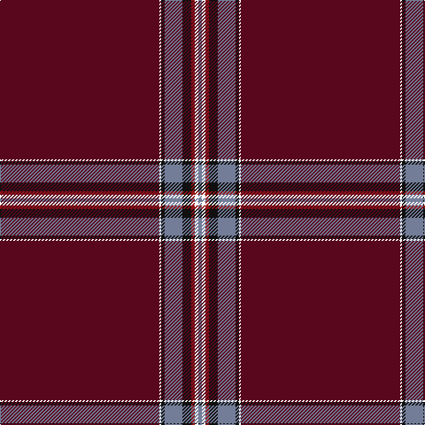

This page is one **sett** — a single exact thread-count. It belongs to the [tartan](/tartans/dr90k1ki2t10ki5r2k2t2/)
(the same proportion at any scale), whose colour order is pattern [BKKBKRKB](/stripes/bkkbkrkb/).

Sourced from register-of-tartans.  It is a [8 stripe tartan](/stripes/stripes8/).

Original link https://www.tartanregister.gov.uk/tartanDetails.aspx?ref=10445

## Register references

External register numbers recorded for this tartan.

- Scottish Register of Tartans: [10445](https://www.tartanregister.gov.uk/tartanDetails.aspx?ref=10445)

## Thread count
DR/180 W2 K4 B20 K10 DRa4 W4 B/4

## Palette

Palette: <strong>Logan (The Scottish Gael, 1831)</strong> <small style="color:#888">(1 of 4 colours)</small>
<table><thead><tr><th>Colour</th><th>Threads</th><th>Shade</th><th>Base</th><th>OKLCh</th></tr></thead><tbody><tr><td>DR/</td><td style="text-align:right;font-variant-numeric:tabular-nums">180</td><td><code style="background-color:#59071D;">#59071D</code> <small style="color:#888">#59071D</small></td><td>B <code style="background-color:#2A418A;">#2A418A</code></td><td><small style="color:#888">oklch(30.1% 0.112 13.4)</small></td></tr><tr><td></td><td style="text-align:right;font-variant-numeric:tabular-nums">2</td><td><code style="background-color:;"></code> <small style="color:#888"></small></td><td> <code style="background-color:;"></code></td><td><small style="color:#888"></small></td></tr><tr><td>K</td><td style="text-align:right;font-variant-numeric:tabular-nums">4</td><td><code style="background-color:#101010;">#101010</code> <small style="color:#888">#101010</small></td><td>K <code style="background-color:#000000;">#000000</code></td><td><small style="color:#888">oklch(17.3% 0.000 89.9)</small></td></tr><tr><td>B</td><td style="text-align:right;font-variant-numeric:tabular-nums">20</td><td><code style="background-color:#737D98;">#737D98</code> <small style="color:#888">#737D98</small></td><td>B <code style="background-color:#2A418A;">#2A418A</code></td><td><small style="color:#888">oklch(59.1% 0.043 269.1)</small></td></tr><tr><td>K</td><td style="text-align:right;font-variant-numeric:tabular-nums">10</td><td><code style="background-color:#101010;">#101010</code> <small style="color:#888">#101010</small></td><td>K <code style="background-color:#000000;">#000000</code></td><td><small style="color:#888">oklch(17.3% 0.000 89.9)</small></td></tr><tr><td>DRa</td><td style="text-align:right;font-variant-numeric:tabular-nums">4</td><td><code style="background-color:#921415;">#921415</code> <small style="color:#888">#921415</small></td><td>R <code style="background-color:#CC0000;">#CC0000</code></td><td><small style="color:#888">oklch(42.5% 0.160 27.2)</small></td></tr><tr><td></td><td style="text-align:right;font-variant-numeric:tabular-nums">4</td><td><code style="background-color:;"></code> <small style="color:#888"></small></td><td> <code style="background-color:;"></code></td><td><small style="color:#888"></small></td></tr><tr><td>B/</td><td style="text-align:right;font-variant-numeric:tabular-nums">4</td><td><code style="background-color:#737D98;">#737D98</code> <small style="color:#888">#737D98</small></td><td>B <code style="background-color:#2A418A;">#2A418A</code></td><td><small style="color:#888">oklch(59.1% 0.043 269.1)</small></td></tr></tbody></table>

# Sample pattern

## Nearest tartans

The nearest existing variants by ΔTartan distance, with this tartan at the top so the swatches line up against it.

ΔTartan

Tartan

Sett

—

<a href="/ttd/edit/#slug=dr90k1ki2t10ki5r2k2t2~x2">Lock in Northumberland</a> <a class="nn-out" href="/setts/s8/dr90k1ki2t10ki5r2k2t2~x2/" title="open its dictionary page">↗</a>

1.24

<a href="/ttd/edit/#slug=m6k2m4ly3m60db14m3db3w1~x2">Stenhousemuir F.C.</a> <a class="nn-out" href="/setts/s9/m6k2m4ly3m60db14m3db3w1~x2/" title="open its dictionary page">↗</a>

1.43

<a href="/ttd/edit/#slug=r6k2r4ly3r60db14r3db3w1~x2">Stenhousemuir Football Club (Sports)</a> <a class="nn-out" href="/setts/s9/r6k2r4ly3r60db14r3db3w1~x2/" title="open its dictionary page">↗</a>

1.71

<a href="/ttd/edit/#slug=ri92db10ri8w3ri8g4ri8r4~x2">Burnett of Leys Hunting</a> <a class="nn-out" href="/setts/s8/ri92db10ri8w3ri8g4ri8r4~x2/" title="open its dictionary page">↗</a>

1.77

<a href="/ttd/edit/#slug=r60db12t1db2w1db12r5k1r2o2~x2">Kervgant Dress (Personal))</a> <a class="nn-out" href="/setts/s10/r60db12t1db2w1db12r5k1r2o2~x2/" title="open its dictionary page">↗</a>

1.82

<a href="/ttd/edit/#slug=r29o1r2o1r60lo2r2db10gi2g1gi2db10r2lo2~x2">Burrell (Personal)</a> <a class="nn-out" href="/setts/s14/r29o1r2o1r60lo2r2db10gi2g1gi2db10r2lo2~x2/" title="open its dictionary page">↗</a>

1.97

<a href="/ttd/edit/#slug=db3r3db14r60ly3r4k2r6k2r4ly3r60db14r3db3w1~x2">Stenhousemuir Football Club</a> <a class="nn-out" href="/setts/s16/db3r3db14r60ly3r4k2r6k2r4ly3r60db14r3db3w1~x2/" title="open its dictionary page">↗</a>

1.99

<a href="/ttd/edit/#slug=k75g2k4dp10db1dp4db1dp4k4~x2">Laird (Restricted)</a> <a class="nn-out" href="/setts/s9/k75g2k4dp10db1dp4db1dp4k4~x2/" title="open its dictionary page">↗</a>

2.09

<a href="/ttd/edit/#slug=o4w1dp48r2m3r2dp3w1o4~x2">Wedding Day</a> <a class="nn-out" href="/setts/s9/o4w1dp48r2m3r2dp3w1o4~x2/" title="open its dictionary page">↗</a>

2.13

<a href="/ttd/edit/#slug=ri75db6ri6w2ri6g2ri6r2~x2">Burnett of Leys Htg (Clan)</a> <a class="nn-out" href="/setts/s8/ri75db6ri6w2ri6g2ri6r2~x2/" title="open its dictionary page">↗</a>

2.28

<a href="/ttd/edit/#slug=dp57m5dp2m8lb2dp3ly2dp14~x2">Cairngorms National Park</a> <a class="nn-out" href="/setts/s8/dp57m5dp2m8lb2dp3ly2dp14~x2/" title="open its dictionary page">↗</a>

## Neighbour map

Every grey dot is one of 14359 variants placed by the first two principal components of the ΔTartan feature space (44% of its variance). Red is this tartan; blue dots are its nearest — click one to open its page.

<svg viewBox="0 0 640 380" role="img" style="max-width:100%;height:auto;border:1px solid #e0e0e0;border-radius:4px;display:block" xmlns="http://www.w3.org/2000/svg"><image href="/nn/cloud.v1.png" width="640" height="380"/><a href="/setts/s9/m6k2m4ly3m60db14m3db3w1~x2/"><circle cx="584.9" cy="99.4" r="4" fill="#3465a4"><title>Stenhousemuir F.C.</title></circle></a><a href="/setts/s9/r6k2r4ly3r60db14r3db3w1~x2/"><circle cx="578.7" cy="91.7" r="4" fill="#3465a4"><title>Stenhousemuir Football Club (Sports)</title></circle></a><a href="/setts/s8/ri92db10ri8w3ri8g4ri8r4~x2/"><circle cx="626.0" cy="126.1" r="4" fill="#3465a4"><title>Burnett of Leys Hunting</title></circle></a><a href="/setts/s10/r60db12t1db2w1db12r5k1r2o2~x2/"><circle cx="517.9" cy="74.3" r="4" fill="#3465a4"><title>Kervgant Dress (Personal))</title></circle></a><a href="/setts/s14/r29o1r2o1r60lo2r2db10gi2g1gi2db10r2lo2~x2/"><circle cx="565.6" cy="63.1" r="4" fill="#3465a4"><title>Burrell (Personal)</title></circle></a><a href="/setts/s16/db3r3db14r60ly3r4k2r6k2r4ly3r60db14r3db3w1~x2/"><circle cx="567.3" cy="72.5" r="4" fill="#3465a4"><title>Stenhousemuir Football Club</title></circle></a><a href="/setts/s9/k75g2k4dp10db1dp4db1dp4k4~x2/"><circle cx="626.0" cy="131.7" r="4" fill="#3465a4"><title>Laird (Restricted)</title></circle></a><a href="/setts/s9/o4w1dp48r2m3r2dp3w1o4~x2/"><circle cx="541.0" cy="88.2" r="4" fill="#3465a4"><title>Wedding Day</title></circle></a><a href="/setts/s8/ri75db6ri6w2ri6g2ri6r2~x2/"><circle cx="626.0" cy="119.0" r="4" fill="#3465a4"><title>Burnett of Leys Htg (Clan)</title></circle></a><a href="/setts/s8/dp57m5dp2m8lb2dp3ly2dp14~x2/"><circle cx="613.7" cy="146.2" r="4" fill="#3465a4"><title>Cairngorms National Park</title></circle></a><circle cx="626.0" cy="104.3" r="5" fill="#c00000"/></svg>

ID: /setts/s8/dr90k1ki2t10ki5r2k2t2~x2/
