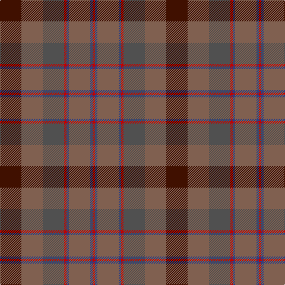

This page is one **sett** — a single exact thread-count. It belongs to the [tartan](/tartans/dr9o9n9r1db1o9db1r1/)
(the same proportion at any scale), whose colour order is pattern [BRBRBRBR](/stripes/brbrbrbr/).

Sourced from weddslist.  It is a [8 stripe tartan](/stripes/stripes8/).

Original link http://www.weddslist.com/cgi-bin/tartans/pg.pl?source=sts

## Thread count
DR/36 LT36 N36 R4 B4 LT36 B4 R/4

## Palette

Palette: <strong>Tartan Register</strong> <small style="color:#888">(1 of 5 colours)</small>
<table><thead><tr><th>Colour</th><th>Threads</th><th>Shade</th><th>Base</th><th>OKLCh</th></tr></thead><tbody><tr><td>DR/</td><td style="text-align:right;font-variant-numeric:tabular-nums">36</td><td><code style="background-color:#401000;">#401000</code> <small style="color:#888">#401000</small></td><td>B <code style="background-color:#2A418A;">#2A418A</code></td><td><small style="color:#888">oklch(25.3% 0.079 39.9)</small></td></tr><tr><td>LT</td><td style="text-align:right;font-variant-numeric:tabular-nums">36</td><td><code style="background-color:#806050;">#806050</code> <small style="color:#888">#806050</small></td><td>R <code style="background-color:#CC0000;">#CC0000</code></td><td><small style="color:#888">oklch(51.7% 0.049 47.8)</small></td></tr><tr><td>N</td><td style="text-align:right;font-variant-numeric:tabular-nums">36</td><td><code style="background-color:#505050;">#505050</code> <small style="color:#888">#505050</small></td><td>B <code style="background-color:#2A418A;">#2A418A</code></td><td><small style="color:#888">oklch(43.1% 0.000 89.9)</small></td></tr><tr><td>R</td><td style="text-align:right;font-variant-numeric:tabular-nums">4</td><td><code style="background-color:#C00000;">#C00000</code> <small style="color:#888">#C00000</small></td><td>R <code style="background-color:#CC0000;">#CC0000</code></td><td><small style="color:#888">oklch(50.7% 0.208 29.2)</small></td></tr><tr><td>B</td><td style="text-align:right;font-variant-numeric:tabular-nums">4</td><td><code style="background-color:#304080;">#304080</code> <small style="color:#888">#304080</small></td><td>B <code style="background-color:#2A418A;">#2A418A</code></td><td><small style="color:#888">oklch(39.4% 0.109 270.2)</small></td></tr><tr><td>LT</td><td style="text-align:right;font-variant-numeric:tabular-nums">36</td><td><code style="background-color:#806050;">#806050</code> <small style="color:#888">#806050</small></td><td>R <code style="background-color:#CC0000;">#CC0000</code></td><td><small style="color:#888">oklch(51.7% 0.049 47.8)</small></td></tr><tr><td>B</td><td style="text-align:right;font-variant-numeric:tabular-nums">4</td><td><code style="background-color:#304080;">#304080</code> <small style="color:#888">#304080</small></td><td>B <code style="background-color:#2A418A;">#2A418A</code></td><td><small style="color:#888">oklch(39.4% 0.109 270.2)</small></td></tr><tr><td>R/</td><td style="text-align:right;font-variant-numeric:tabular-nums">4</td><td><code style="background-color:#C00000;">#C00000</code> <small style="color:#888">#C00000</small></td><td>R <code style="background-color:#CC0000;">#CC0000</code></td><td><small style="color:#888">oklch(50.7% 0.208 29.2)</small></td></tr></tbody></table>

# Sample pattern

## Nearest tartans

The nearest existing variants by ΔTartan distance, with this tartan at the top so the swatches line up against it.

ΔTartan

Tartan

Sett

—

<a href="/ttd/edit/#slug=dr9o9n9r1db1o9db1r1~x4">Jardine, of Castlemilk</a> <a class="nn-out" href="/setts/s8/dr9o9n9r1db1o9db1r1~x4/" title="open its dictionary page">↗</a>

1.06

<a href="/ttd/edit/#slug=g3dy4g2dy22n5r16ly3~x2">Pubcrawlers (Corporate)</a> <a class="nn-out" href="/setts/s7/g3dy4g2dy22n5r16ly3~x2/" title="open its dictionary page">↗</a>

1.33

<a href="/ttd/edit/#slug=do6lo4do3dt2do5dt2do3dt2y14r3dt2~x2">Limerick, County</a> <a class="nn-out" href="/setts/s11/do6lo4do3dt2do5dt2do3dt2y14r3dt2~x2/" title="open its dictionary page">↗</a>

1.35

<a href="/ttd/edit/#slug=k3r22dg5dg10do10dg2~x2">Rowardennan</a> <a class="nn-out" href="/setts/s6/k3r22dg5dg10do10dg2~x2/" title="open its dictionary page">↗</a>

1.36

<a href="/ttd/edit/#slug=dy35dg19r3g8r3dg8r3db3~x2">John Muir Way</a> <a class="nn-out" href="/setts/s8/dy35dg19r3g8r3dg8r3db3~x2/" title="open its dictionary page">↗</a>

1.38

<a href="/ttd/edit/#slug=r2dy15dg12dy2dt12dy2dg12dy15o2~x4">Amazing Union (Personal)</a> <a class="nn-out" href="/setts/s9/r2dy15dg12dy2dt12dy2dg12dy15o2~x4/" title="open its dictionary page">↗</a>

1.47

<a href="/ttd/edit/#slug=dy35dg19r3y8r3dg8r3t3~x2">John Muir Way</a> <a class="nn-out" href="/setts/s8/dy35dg19r3y8r3dg8r3t3~x2/" title="open its dictionary page">↗</a>

1.49

<a href="/ttd/edit/#slug=dr12dy1dg12dy12ly2dy12dg12dy1dr12t2~x2">United Distillers Corporate Tartan Tartan Number: 2098. Earliest known date: 1989 An expression of evocative Scottish colours to reflect the corporate image of quality and style. (weft) lb4 b24 lb2 dg24 g24 r4 See products available Copyright © Blair Urquhart, Comrie, 2015</a> <a class="nn-out" href="/setts/s10/dr12dy1dg12dy12ly2dy12dg12dy1dr12t2~x2/" title="open its dictionary page">↗</a>

1.50

<a href="/ttd/edit/#slug=do6o4n22r4k22do22k2r5k2do6~x2">Lochaber (Ingles Buchan)</a> <a class="nn-out" href="/setts/s10/do6o4n22r4k22do22k2r5k2do6~x2/" title="open its dictionary page">↗</a>

1.51

<a href="/ttd/edit/#slug=r15g3r3g19dy6y6o6g19r3g3r15y13~x2">Maple Leaf (District)</a> <a class="nn-out" href="/setts/s12/r15g3r3g19dy6y6o6g19r3g3r15y13~x2/" title="open its dictionary page">↗</a>

1.55

<a href="/ttd/edit/#slug=do6lg3do18dy2do2dy10y28r2y4~x2">Scottish Crofting Foundation</a> <a class="nn-out" href="/setts/s9/do6lg3do18dy2do2dy10y28r2y4~x2/" title="open its dictionary page">↗</a>

## Neighbour map

Every grey dot is one of 14299 variants placed by the first two principal components of the ΔTartan feature space (44% of its variance). Red is this tartan; blue dots are its nearest — click one to open its page.

<svg viewBox="0 0 640 380" role="img" style="max-width:100%;height:auto;border:1px solid #e0e0e0;border-radius:4px;display:block" xmlns="http://www.w3.org/2000/svg"><image href="/nn/cloud.v1.png" width="640" height="380"/><a href="/setts/s7/g3dy4g2dy22n5r16ly3~x2/"><circle cx="317.1" cy="215.4" r="4" fill="#3465a4"><title>Pubcrawlers (Corporate)</title></circle></a><a href="/setts/s11/do6lo4do3dt2do5dt2do3dt2y14r3dt2~x2/"><circle cx="224.6" cy="228.3" r="4" fill="#3465a4"><title>Limerick, County</title></circle></a><a href="/setts/s6/k3r22dg5dg10do10dg2~x2/"><circle cx="297.1" cy="247.1" r="4" fill="#3465a4"><title>Rowardennan</title></circle></a><a href="/setts/s8/dy35dg19r3g8r3dg8r3db3~x2/"><circle cx="300.4" cy="205.5" r="4" fill="#3465a4"><title>John Muir Way</title></circle></a><a href="/setts/s9/r2dy15dg12dy2dt12dy2dg12dy15o2~x4/"><circle cx="270.9" cy="242.5" r="4" fill="#3465a4"><title>Amazing Union (Personal)</title></circle></a><a href="/setts/s8/dy35dg19r3y8r3dg8r3t3~x2/"><circle cx="302.0" cy="206.0" r="4" fill="#3465a4"><title>John Muir Way</title></circle></a><a href="/setts/s10/dr12dy1dg12dy12ly2dy12dg12dy1dr12t2~x2/"><circle cx="234.0" cy="226.3" r="4" fill="#3465a4"><title>United Distillers Corporate Tartan Tartan Number: 2098. Earliest known date: 1989 An expression of evocative Scottish colours to reflect the corporate image of quality and style. (weft) lb4 b24 lb2 dg24 g24 r4 See products available Copyright © Blair Urquhart, Comrie, 2015</title></circle></a><a href="/setts/s10/do6o4n22r4k22do22k2r5k2do6~x2/"><circle cx="236.1" cy="206.2" r="4" fill="#3465a4"><title>Lochaber (Ingles Buchan)</title></circle></a><a href="/setts/s12/r15g3r3g19dy6y6o6g19r3g3r15y13~x2/"><circle cx="228.4" cy="238.4" r="4" fill="#3465a4"><title>Maple Leaf (District)</title></circle></a><a href="/setts/s9/do6lg3do18dy2do2dy10y28r2y4~x2/"><circle cx="309.8" cy="194.3" r="4" fill="#3465a4"><title>Scottish Crofting Foundation</title></circle></a><circle cx="291.8" cy="233.7" r="5" fill="#c00000"/></svg>

ID: /setts/s8/dr9o9n9r1db1o9db1r1~x4/
