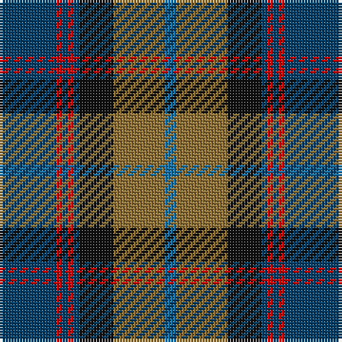

In pattern [BGKBRBRB](/stripes/bgkbrbrb/).

This was sourced from register-of-tartans.  It is a [8 stripe tartan](/stripes/stripes8/).

Original link https://www.tartanregister.gov.uk/tartanDetails.aspx?ref=97

## Attestations

This cloth appears in 2 source records; the oldest owns this page.

- 01/01/2001 — Antique 2000 (register-of-tartans, [record](https://www.tartanregister.gov.uk/tartanDetails.aspx?ref=97))
- 2001 — Antique 2000 (Fashion) (tartans-authority, [record](http://www.tartansauthority.com/tartan-ferret/display/4087/))

## Register references

External register numbers recorded for this tartan.

- Scottish Register of Tartans: [97](https://www.tartanregister.gov.uk/tartanDetails.aspx?ref=97)
- Scottish Tartans Authority (ITI): 4087

## Thread count
DB/20 R2 DB2 R2 DB2 K12 LT18 B/4

## Palette
Each colour and its ΔE from the base-6 reference it is a variant of.

| Colour | Shade | Base | ΔE (OKLab) |
|---|---|---|---|
| B | <code style="background-color:#1870A4;">#1870A4</code> `#1870A4` | B <code style="background-color:#2A418A;">#2A418A</code> | 0.13 |
| DB | <code style="background-color:#003C64;">#003C64</code> `#003C64` | B <code style="background-color:#2A418A;">#2A418A</code> | 0.08 |
| K | <code style="background-color:#101010;">#101010</code> `#101010` | K <code style="background-color:#000000;">#000000</code> | 0.17 |
| LT | <code style="background-color:#8C7038;">#8C7038</code> `#8C7038` | G <code style="background-color:#006100;">#006100</code> | 0.18 |
| R | <code style="background-color:#C80000;">#C80000</code> `#C80000` | R <code style="background-color:#CC0000;">#CC0000</code> | 0.01 |

# Sample pattern

## Nearest tartans

The nearest existing variants by ΔTartan distance.

1. [Scotch House 2000 Original](/setts/s8/db22r3db2r3db2k17g18lo4~x2/) — ΔT 0.60
1. [Skene](/setts/s7/db24k4r3k4dg24k4r4~x2/) — ΔT 0.64
1. [Dunbartonshire](/setts/s9/g11k2g1r4db1r4db13t2db1~x4/) — ΔT 0.70
1. [Curry (Personal)](/setts/s8/r3g2r6g20k15g3db18w2~x2/) — ΔT 0.79
1. [Bailies of Bennachie (Corporate)](/setts/s7/g27r2g4r15db26k2db6~x2/) — ΔT 0.79
1. [Mantle (Personal)](/setts/s8/r3g2r3g18k14w2db16g3~x2/) — ΔT 0.81
1. [Stewart of Appin Htg (Clan)](/setts/s10/g8r3g3r5g26dy7t3db28r3db6~x2/) — ΔT 0.81
1. [MacLeod Small Clan Tartan Tartan Number: 15833. Earliest known date: See products available Copyright © Blair Urquhart, Comrie, 2015](/setts/s7/r1k1g7k5db10k1ly1~x2/) — ΔT 0.83
1. [Scottish Chamber Orchestra](/setts/s9/lb3db20k3db2k5db2k3y15r2~x2/) — ΔT 0.87
1. [Scottish Chamber Orchestra, The](/setts/s9/lt3dt20k3dt2k5dt2k3y15r2~x2/) — ΔT 0.89

## Neighbour map

Every grey dot is one of 14299 variants placed by the first two principal components of the ΔTartan feature space (44% of its variance). Red is this tartan; blue dots are its nearest — click one to open its page.

<svg viewBox="0 0 640 380" role="img" style="max-width:100%;height:auto;border:1px solid #e0e0e0;border-radius:4px;display:block" xmlns="http://www.w3.org/2000/svg"><image href="/nn/cloud.v1.png" width="640" height="380"/><a href="/setts/s8/db22r3db2r3db2k17g18lo4~x2/"><circle cx="188.4" cy="189.3" r="4" fill="#3465a4"><title>Scotch House 2000 Original</title></circle></a><a href="/setts/s7/db24k4r3k4dg24k4r4~x2/"><circle cx="200.9" cy="207.8" r="4" fill="#3465a4"><title>Skene</title></circle></a><a href="/setts/s9/g11k2g1r4db1r4db13t2db1~x4/"><circle cx="228.4" cy="177.6" r="4" fill="#3465a4"><title>Dunbartonshire</title></circle></a><a href="/setts/s8/r3g2r6g20k15g3db18w2~x2/"><circle cx="163.6" cy="187.8" r="4" fill="#3465a4"><title>Curry (Personal)</title></circle></a><a href="/setts/s7/g27r2g4r15db26k2db6~x2/"><circle cx="240.9" cy="194.9" r="4" fill="#3465a4"><title>Bailies of Bennachie (Corporate)</title></circle></a><a href="/setts/s8/r3g2r3g18k14w2db16g3~x2/"><circle cx="174.6" cy="195.8" r="4" fill="#3465a4"><title>Mantle (Personal)</title></circle></a><a href="/setts/s10/g8r3g3r5g26dy7t3db28r3db6~x2/"><circle cx="221.8" cy="182.6" r="4" fill="#3465a4"><title>Stewart of Appin Htg (Clan)</title></circle></a><a href="/setts/s7/r1k1g7k5db10k1ly1~x2/"><circle cx="196.3" cy="194.4" r="4" fill="#3465a4"><title>MacLeod Small Clan Tartan Tartan Number: 15833. Earliest known date: See products available Copyright © Blair Urquhart, Comrie, 2015</title></circle></a><a href="/setts/s9/lb3db20k3db2k5db2k3y15r2~x2/"><circle cx="226.6" cy="176.9" r="4" fill="#3465a4"><title>Scottish Chamber Orchestra</title></circle></a><a href="/setts/s9/lt3dt20k3dt2k5dt2k3y15r2~x2/"><circle cx="221.5" cy="177.9" r="4" fill="#3465a4"><title>Scottish Chamber Orchestra, The</title></circle></a><circle cx="204.1" cy="189.4" r="5" fill="#c00000"/></svg>

ID: /setts/s8/dt10r1dt1r1dt1k6y9b2~x2/
