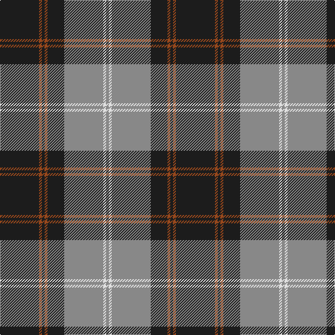

**Bands:** [RWRBRBRB](/stripes/rwrbrbrb/) · **Stripes:** [O W O DT O DT O DT](/stripes/stripes8/) O W O DT O DT O DT

This was sourced from register-of-tartans.  It is a [8 band tartan](/bands/bands8/).

Original link https://www.tartanregister.gov.uk/tartanDetails.aspx?ref=773

## Attestations

This cloth appears in 2 source records; the oldest owns this page.

- 01/01/1984 — Corrie (register-of-tartans, [record](https://www.tartanregister.gov.uk/tartanDetails.aspx?ref=773))
- 1984 — Corrie (Fashion) (tartans-authority, [record](http://www.tartansauthority.com/tartan-ferret/display/6875/))

## Register references

External register numbers recorded for this tartan.

- Scottish Register of Tartans: [773](https://www.tartanregister.gov.uk/tartanDetails.aspx?ref=773)
- Scottish Tartans Authority (ITI): 6875

## Thread count
K/56 T4 K4 T4 K24 N56 LN4 N/4

## Palette
Each colour and its ΔE from the base-6 reference it is a variant of.

| Colour | Shade | Base | ΔE (OKLab) |
|---|---|---|---|
| K | <code style="background-color:#1C1C1C;">#1C1C1C</code> `#1C1C1C` | B <code style="background-color:#2A418A;">#2A418A</code> | 0.21 |
| LN | <code style="background-color:#E0E0E0;">#E0E0E0</code> `#E0E0E0` | W <code style="background-color:#F7F7F7;">#F7F7F7</code> | 0.07 |
| N | <code style="background-color:#888888;">#888888</code> `#888888` | R <code style="background-color:#CC0000;">#CC0000</code> | 0.24 |
| T | <code style="background-color:#98481C;">#98481C</code> `#98481C` | R <code style="background-color:#CC0000;">#CC0000</code> | 0.11 |

# Sample pattern

## Nearest tartans

The nearest existing variants by ΔTartan distance.

1. [Dunfermline Athletic (2008) (Corp)](/setts/s7/k11w1k1w1k4o8r1~x8/) — ΔT 1.03
1. [Korner-Macpherson (Personal)](/setts/s7/y5r3y35k28y4k11y2~x2/) — ΔT 1.08
1. [West Point](/setts/s8/k13o1k1o1k4o10ly1o1~x6/) — ΔT 1.09
1. [Coalfields Regeneration Trust, The](/setts/s7/k2r1ly1y8k15y2dp1~x4/) — ΔT 1.10
1. [Ewbank](/setts/s9/r3b14ly2k2b14k36ly2k2ly2~x2/) — ΔT 1.11
1. [Perkins (2015)](/setts/s7/k3t10lo5t29k10r6k2~x2/) — ΔT 1.16
1. [Universal Scientific Indust (Corp.)](/setts/s9/k38t2m24w2k16m6t2k3t5~x2/) — ΔT 1.16
1. [Phantom (Corporate)](/setts/s7/w3dr10k38o11dr6k2w3~x2/) — ΔT 1.17
1. [Home (Clan)](/setts/s8/k36r3k3r3k9b36g3b2~x2/) — ΔT 1.17
1. [Coalfields Regeneration Trust, The](/setts/s7/k2r1ly1g8k15g2dp1~x2/) — ΔT 1.20

## Neighbour map

Every grey dot is one of 14299 variants placed by the first two principal components of the ΔTartan feature space (44% of its variance). Red is this tartan; blue dots are its nearest — click one to open its page.

<svg viewBox="0 0 640 380" role="img" style="max-width:100%;height:auto;border:1px solid #e0e0e0;border-radius:4px;display:block" xmlns="http://www.w3.org/2000/svg"><image href="/nn/cloud.v1.png" width="640" height="380"/><a href="/setts/s7/k11w1k1w1k4o8r1~x8/"><circle cx="311.8" cy="182.6" r="4" fill="#3465a4"><title>Dunfermline Athletic (2008) (Corp)</title></circle></a><a href="/setts/s7/y5r3y35k28y4k11y2~x2/"><circle cx="347.6" cy="187.8" r="4" fill="#3465a4"><title>Korner-Macpherson (Personal)</title></circle></a><a href="/setts/s8/k13o1k1o1k4o10ly1o1~x6/"><circle cx="351.6" cy="182.5" r="4" fill="#3465a4"><title>West Point</title></circle></a><a href="/setts/s7/k2r1ly1y8k15y2dp1~x4/"><circle cx="310.7" cy="149.4" r="4" fill="#3465a4"><title>Coalfields Regeneration Trust, The</title></circle></a><a href="/setts/s9/r3b14ly2k2b14k36ly2k2ly2~x2/"><circle cx="308.8" cy="143.1" r="4" fill="#3465a4"><title>Ewbank</title></circle></a><a href="/setts/s7/k3t10lo5t29k10r6k2~x2/"><circle cx="333.7" cy="182.5" r="4" fill="#3465a4"><title>Perkins (2015)</title></circle></a><a href="/setts/s9/k38t2m24w2k16m6t2k3t5~x2/"><circle cx="339.6" cy="150.1" r="4" fill="#3465a4"><title>Universal Scientific Indust (Corp.)</title></circle></a><a href="/setts/s7/w3dr10k38o11dr6k2w3~x2/"><circle cx="314.8" cy="156.8" r="4" fill="#3465a4"><title>Phantom (Corporate)</title></circle></a><a href="/setts/s8/k36r3k3r3k9b36g3b2~x2/"><circle cx="318.7" cy="160.7" r="4" fill="#3465a4"><title>Home (Clan)</title></circle></a><a href="/setts/s7/k2r1ly1g8k15g2dp1~x2/"><circle cx="320.3" cy="157.4" r="4" fill="#3465a4"><title>Coalfields Regeneration Trust, The</title></circle></a><circle cx="325.7" cy="166.1" r="5" fill="#c00000"/></svg>

ID: /setts/s8/dt14o1dt1o1dt6o14w1o1~x4/
