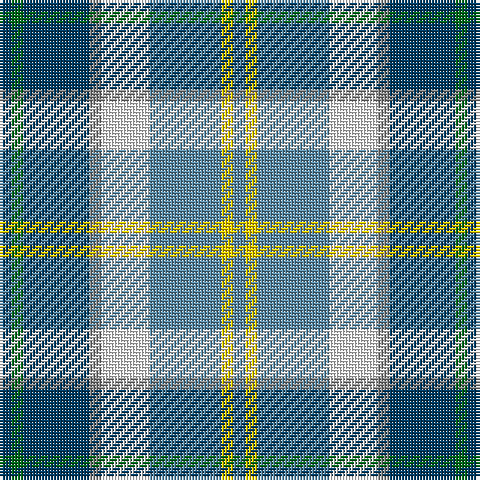

This page is one **sett** — a single exact thread-count. It belongs to the [tartan](/tartans/db2g2db11n2w8b12y2b2/)
(the same proportion at any scale), whose colour order is pattern [BGBRWBYB](/stripes/bgbrwbyb/).

Sourced from tartans-authority.  It is a [8 stripe tartan](/stripes/stripes8/).

Original link http://www.tartansauthority.com/tartan-ferret/display/8812/

## Thread count
DB/4 G4 DB22 N4 W16 B24 Y4 B/4

## Palette
Each colour and the base-6 reference it is a variant of.

| Colour | Shade | Base |
|---|---|---|
| B | <code style="background-color:#5C8CA8;">#5C8CA8</code> `oklch(61.7% 0.067 235.0)` <small>#5C8CA8</small> | B <code style="background-color:#2A418A;">#2A418A</code> |
| DB | <code style="background-color:#003C64;">#003C64</code> `oklch(34.5% 0.089 246.0)` <small>#003C64</small> | B <code style="background-color:#2A418A;">#2A418A</code> |
| G | <code style="background-color:#006818;">#006818</code> `oklch(45.0% 0.142 145.0)` <small>#006818</small> | G <code style="background-color:#006100;">#006100</code> |
| N | <code style="background-color:#888888;">#888888</code> `oklch(62.7% 0.000 89.9)` <small>#888888</small> | R <code style="background-color:#CC0000;">#CC0000</code> |
| W | <code style="background-color:#FCFCFC;">#FCFCFC</code> `oklch(99.1% 0.000 89.9)` <small>#FCFCFC</small> | W <code style="background-color:#F7F7F7;">#F7F7F7</code> |
| Y | <code style="background-color:#FCCC00;">#FCCC00</code> `oklch(86.2% 0.176 91.5)` <small>#FCCC00</small> | Y <code style="background-color:#F2BF00;">#F2BF00</code> |

# Sample pattern

## Nearest tartans

The nearest existing variants by ΔTartan distance, with this tartan at the top so the swatches line up against it.

ΔTartan

Tartan

Sett

—

<a href="/ttd/edit/#slug=dt2g2dt11o2w8t12ly2t2~x2">Elora (District)</a> <a class="nn-out" href="/setts/s8/dt2g2dt11o2w8t12ly2t2~x2/" title="open its dictionary page">↗</a>

0.88

<a href="/ttd/edit/#slug=w30lb4dt6m4dt6g6dt12g13lt4~x2">Sound of Iona</a> <a class="nn-out" href="/setts/s9/w30lb4dt6m4dt6g6dt12g13lt4~x2/" title="open its dictionary page">↗</a>

0.96

<a href="/ttd/edit/#slug=w30t4db6dp4db6g6db12g13lb4~x2">Sound of Iona</a> <a class="nn-out" href="/setts/s9/w30t4db6dp4db6g6db12g13lb4~x2/" title="open its dictionary page">↗</a>

0.96

<a href="/ttd/edit/#slug=r4dy2b15ly2k14w14k2w4~x2">Culloden Blue, Stirling</a> <a class="nn-out" href="/setts/s8/r4dy2b15ly2k14w14k2w4~x2/" title="open its dictionary page">↗</a>

1.02

<a href="/ttd/edit/#slug=db1t9w3ly3db9ly1g1r1~x4">Curd (2013)</a> <a class="nn-out" href="/setts/s8/db1t9w3ly3db9ly1g1r1~x4/" title="open its dictionary page">↗</a>

1.03

<a href="/ttd/edit/#slug=ly3lb6lg20dt5g3dt15ly3dt3lg3~x2">WestJet</a> <a class="nn-out" href="/setts/s9/ly3lb6lg20dt5g3dt15ly3dt3lg3~x2/" title="open its dictionary page">↗</a>

1.05

<a href="/ttd/edit/#slug=r4dy2t15ly2k14w14k2w4~x2">Culloden - 2000 (Fashion)</a> <a class="nn-out" href="/setts/s8/r4dy2t15ly2k14w14k2w4~x2/" title="open its dictionary page">↗</a>

1.08

<a href="/ttd/edit/#slug=k3ly3db20g25lb18w3~x2">Porteous (Clan)</a> <a class="nn-out" href="/setts/s6/k3ly3db20g25lb18w3~x2/" title="open its dictionary page">↗</a>

1.14

<a href="/ttd/edit/#slug=db12r2db2r2db2g10w12o3~x2">Idaho, Centennial</a> <a class="nn-out" href="/setts/s8/db12r2db2r2db2g10w12o3~x2/" title="open its dictionary page">↗</a>

1.20

<a href="/ttd/edit/#slug=b4ly2b16db15g16w3g3w4~x2">Business Air</a> <a class="nn-out" href="/setts/s8/b4ly2b16db15g16w3g3w4~x2/" title="open its dictionary page">↗</a>

1.28

<a href="/ttd/edit/#slug=g25r9b3ly7w3dp11">Montessori School of Denver</a> <a class="nn-out" href="/setts/s6/g25r9b3ly7w3dp11/" title="open its dictionary page">↗</a>

## Neighbour map

Every grey dot is one of 14299 variants placed by the first two principal components of the ΔTartan feature space (44% of its variance). Red is this tartan; blue dots are its nearest — click one to open its page.

<svg viewBox="0 0 640 380" role="img" style="max-width:100%;height:auto;border:1px solid #e0e0e0;border-radius:4px;display:block" xmlns="http://www.w3.org/2000/svg"><image href="/nn/cloud.v1.png" width="640" height="380"/><a href="/setts/s9/w30lb4dt6m4dt6g6dt12g13lt4~x2/"><circle cx="82.3" cy="146.0" r="4" fill="#3465a4"><title>Sound of Iona</title></circle></a><a href="/setts/s9/w30t4db6dp4db6g6db12g13lb4~x2/"><circle cx="77.4" cy="142.8" r="4" fill="#3465a4"><title>Sound of Iona</title></circle></a><a href="/setts/s8/r4dy2b15ly2k14w14k2w4~x2/"><circle cx="63.7" cy="152.2" r="4" fill="#3465a4"><title>Culloden Blue, Stirling</title></circle></a><a href="/setts/s8/db1t9w3ly3db9ly1g1r1~x4/"><circle cx="109.3" cy="143.5" r="4" fill="#3465a4"><title>Curd (2013)</title></circle></a><a href="/setts/s9/ly3lb6lg20dt5g3dt15ly3dt3lg3~x2/"><circle cx="122.5" cy="167.5" r="4" fill="#3465a4"><title>WestJet</title></circle></a><a href="/setts/s8/r4dy2t15ly2k14w14k2w4~x2/"><circle cx="59.7" cy="148.9" r="4" fill="#3465a4"><title>Culloden - 2000 (Fashion)</title></circle></a><a href="/setts/s6/k3ly3db20g25lb18w3~x2/"><circle cx="99.1" cy="179.0" r="4" fill="#3465a4"><title>Porteous (Clan)</title></circle></a><a href="/setts/s8/db12r2db2r2db2g10w12o3~x2/"><circle cx="106.2" cy="185.5" r="4" fill="#3465a4"><title>Idaho, Centennial</title></circle></a><a href="/setts/s8/b4ly2b16db15g16w3g3w4~x2/"><circle cx="95.4" cy="181.6" r="4" fill="#3465a4"><title>Business Air</title></circle></a><a href="/setts/s6/g25r9b3ly7w3dp11/"><circle cx="127.0" cy="167.9" r="4" fill="#3465a4"><title>Montessori School of Denver</title></circle></a><circle cx="82.4" cy="170.1" r="5" fill="#c00000"/></svg>

ID: /setts/s8/dt2g2dt11o2w8t12ly2t2~x2/
