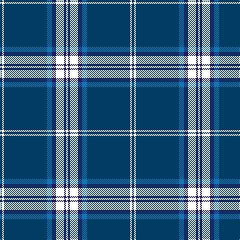

This page is one **sett** — a single exact thread-count. It belongs to the [tartan](/tartans/w2db2yy8db4b5dba43w2dba2/)
(the same proportion at any scale), whose colour order is pattern [BWBBBKBW](/stripes/bwbbbkbw/).

Sourced from register-of-tartans.  It is a [8 stripe tartan](/stripes/stripes8/).

Original link https://www.tartanregister.gov.uk/tartanDetails.aspx?ref=1181

## Register references

External register numbers recorded for this tartan.

- Scottish Register of Tartans: [1181](https://www.tartanregister.gov.uk/tartanDetails.aspx?ref=1181)
- Scottish Tartans Authority (ITI): 4534
- Scottish Tartans World Register: 2751

## Thread count
W/4 DB4 YY16 DB8 B10 DBa86 W4 DBa/4

## Palette
Each colour and the base-6 reference it is a variant of.

| Colour | Shade | Base |
|---|---|---|
| B | <code style="background-color:#1474B4;">#1474B4</code> `oklch(54.0% 0.129 245.1)` <small>#1474B4</small> | B <code style="background-color:#2A418A;">#2A418A</code> |
| DB | <code style="background-color:#202060;">#202060</code> `oklch(28.9% 0.111 276.9)` <small>#202060</small> | B <code style="background-color:#2A418A;">#2A418A</code> |
| DBa | <code style="background-color:#003C64;">#003C64</code> `oklch(34.5% 0.089 246.0)` <small>#003C64</small> | B <code style="background-color:#2A418A;">#2A418A</code> |
| W | <code style="background-color:#FCFCFC;">#FCFCFC</code> `oklch(99.1% 0.000 89.9)` <small>#FCFCFC</small> | W <code style="background-color:#F7F7F7;">#F7F7F7</code> |

# Sample pattern

## Nearest tartans

The nearest existing variants by ΔTartan distance, with this tartan at the top so the swatches line up against it.

ΔTartan

Tartan

Sett

—

<a href="/ttd/edit/#slug=dt2w2dt43b5db4k8db2w2~x2">Fife Flyers</a> <a class="nn-out" href="/setts/s8/dt2w2dt43b5db4k8db2w2~x2/" title="open its dictionary page">↗</a>

0.99

<a href="/ttd/edit/#slug=lr5k6w2dg7w2dt44w2~x2">Leblant-Macqueron (Personal)</a> <a class="nn-out" href="/setts/s7/lr5k6w2dg7w2dt44w2~x2/" title="open its dictionary page">↗</a>

1.00

<a href="/ttd/edit/#slug=db50ly4db3ly4db8k2db12w5~x2">Indiana #2</a> <a class="nn-out" href="/setts/s8/db50ly4db3ly4db8k2db12w5~x2/" title="open its dictionary page">↗</a>

1.00

<a href="/ttd/edit/#slug=db21n2w1n2db1r2db1o6~x4">Blue Rust</a> <a class="nn-out" href="/setts/s8/db21n2w1n2db1r2db1o6~x4/" title="open its dictionary page">↗</a>

1.05

<a href="/ttd/edit/#slug=db20dy1db1dy1dg8k1w3~x2">Chestico</a> <a class="nn-out" href="/setts/s7/db20dy1db1dy1dg8k1w3~x2/" title="open its dictionary page">↗</a>

1.08

<a href="/ttd/edit/#slug=dt2w2dt43b5db4ly8db2w2~x2">Fife Flyers (Corporate)</a> <a class="nn-out" href="/setts/s8/dt2w2dt43b5db4ly8db2w2~x2/" title="open its dictionary page">↗</a>

1.11

<a href="/ttd/edit/#slug=db20o1db1o1dg8k1w3~x2">Chestico</a> <a class="nn-out" href="/setts/s7/db20o1db1o1dg8k1w3~x2/" title="open its dictionary page">↗</a>

1.15

<a href="/ttd/edit/#slug=db21n2lr1n2db1r2db1o6~x4">Blue Rust (Corporate)</a> <a class="nn-out" href="/setts/s8/db21n2lr1n2db1r2db1o6~x4/" title="open its dictionary page">↗</a>

1.18

<a href="/ttd/edit/#slug=r1db2dt1db3dt19db3ly1db2ly1~x4">Pagus Wasia</a> <a class="nn-out" href="/setts/s9/r1db2dt1db3dt19db3ly1db2ly1~x4/" title="open its dictionary page">↗</a>

1.30

<a href="/ttd/edit/#slug=db47g14dr5o2r3g7~x2">Round Table of Britain and Ireland, RtbI.</a> <a class="nn-out" href="/setts/s6/db47g14dr5o2r3g7~x2/" title="open its dictionary page">↗</a>

1.31

<a href="/ttd/edit/#slug=lb3k6lb2k6db2k2db32k2n1~x2">Nocken (Personal)</a> <a class="nn-out" href="/setts/s9/lb3k6lb2k6db2k2db32k2n1~x2/" title="open its dictionary page">↗</a>

## Neighbour map

Every grey dot is one of 14299 variants placed by the first two principal components of the ΔTartan feature space (44% of its variance). Red is this tartan; blue dots are its nearest — click one to open its page.

<svg viewBox="0 0 640 380" role="img" style="max-width:100%;height:auto;border:1px solid #e0e0e0;border-radius:4px;display:block" xmlns="http://www.w3.org/2000/svg"><image href="/nn/cloud.v1.png" width="640" height="380"/><a href="/setts/s7/lr5k6w2dg7w2dt44w2~x2/"><circle cx="364.5" cy="123.4" r="4" fill="#3465a4"><title>Leblant-Macqueron (Personal)</title></circle></a><a href="/setts/s8/db50ly4db3ly4db8k2db12w5~x2/"><circle cx="412.6" cy="123.7" r="4" fill="#3465a4"><title>Indiana #2</title></circle></a><a href="/setts/s8/db21n2w1n2db1r2db1o6~x4/"><circle cx="383.4" cy="133.4" r="4" fill="#3465a4"><title>Blue Rust</title></circle></a><a href="/setts/s7/db20dy1db1dy1dg8k1w3~x2/"><circle cx="353.2" cy="144.6" r="4" fill="#3465a4"><title>Chestico</title></circle></a><a href="/setts/s8/dt2w2dt43b5db4ly8db2w2~x2/"><circle cx="378.4" cy="114.0" r="4" fill="#3465a4"><title>Fife Flyers (Corporate)</title></circle></a><a href="/setts/s7/db20o1db1o1dg8k1w3~x2/"><circle cx="331.9" cy="138.3" r="4" fill="#3465a4"><title>Chestico</title></circle></a><a href="/setts/s8/db21n2lr1n2db1r2db1o6~x4/"><circle cx="396.2" cy="140.0" r="4" fill="#3465a4"><title>Blue Rust (Corporate)</title></circle></a><a href="/setts/s9/r1db2dt1db3dt19db3ly1db2ly1~x4/"><circle cx="375.5" cy="141.3" r="4" fill="#3465a4"><title>Pagus Wasia</title></circle></a><a href="/setts/s6/db47g14dr5o2r3g7~x2/"><circle cx="360.0" cy="155.0" r="4" fill="#3465a4"><title>Round Table of Britain and Ireland, RtbI.</title></circle></a><a href="/setts/s9/lb3k6lb2k6db2k2db32k2n1~x2/"><circle cx="407.1" cy="120.3" r="4" fill="#3465a4"><title>Nocken (Personal)</title></circle></a><circle cx="396.0" cy="128.6" r="5" fill="#c00000"/></svg>

ID: /setts/s8/dt2w2dt43b5db4k8db2w2~x2/
