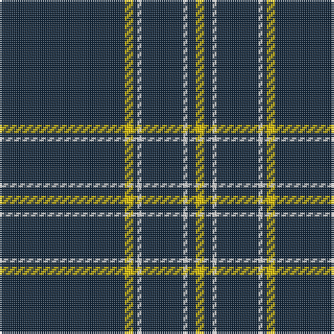

**Bands:** [YBWBWBYB](/stripes/ybwbwbyb/) · **Stripes:** [LY DT W DT W DT LY DT](/stripes/stripes8/) LY DT W DT W DT LY DT

This was sourced from tartans-authority.  It is a [8 band tartan](/bands/bands8/).

Original link http://www.tartansauthority.com/tartan-ferret/display/3981/

## Thread count
DN/60 Y4 DN2 LN2 DN20 LN2 DN4 Y/4

## Palette
Each colour and its ΔE from the base-6 reference it is a variant of.

| Colour | Shade | Base | ΔE (OKLab) |
|---|---|---|---|
| DN | <code style="background-color:#14283C;">#14283C</code> `#14283C` | B <code style="background-color:#2A418A;">#2A418A</code> | 0.15 |
| LN | <code style="background-color:#E0E0E0;">#E0E0E0</code> `#E0E0E0` | W <code style="background-color:#F7F7F7;">#F7F7F7</code> | 0.07 |
| Y | <code style="background-color:#E8C000;">#E8C000</code> `#E8C000` | Y <code style="background-color:#F2BF00;">#F2BF00</code> | 0.02 |

# Sample pattern

## Nearest tartans

The nearest existing variants by ΔTartan distance.

1. [London Fog Black (Fashion)](/setts/s8/k198lb9k17t13lb9k4lb13k4/) — ΔT 1.46
1. [Auld Bernensis](/setts/s8/k62r3k3lo3k3r3k9lr5~x2/) — ΔT 1.72
1. [London Fog Black](/setts/s6/k10lr2w5lr4k50b2~x2/) — ΔT 1.72
1. [St. Mirren Football Club (Sports)](/setts/s9/k7w2k21r2k34w5k3w2k7~x2/) — ΔT 1.73
1. [Auld Bernensis](/setts/s8/k62r3k3lo3k3r3k9o5~x2/) — ΔT 1.86
1. [Merola (2016)](/setts/s6/k36ly5k1ly1lr5k12~x2/) — ΔT 1.86
1. [Alpha Chi Sigma Fraternity](/setts/s10/dt35ly1dt3ly1dt3ly1dt20r6w1r5~x2/) — ΔT 1.88
1. [Volkswagen Black Trim (Fashion)](/setts/s8/k20w1k1w3k1r1k1w1~x4/) — ΔT 1.90
1. [Black Country (District)](/setts/s8/k21r1k1ly1k1r1k3w3~x6/) — ΔT 1.94
1. [Magdalene (Commemorative)](/setts/s9/ly2k4ly1k4r5k50o1k2r1~x2/) — ΔT 1.97

## Neighbour map

Every grey dot is one of 14299 variants placed by the first two principal components of the ΔTartan feature space (44% of its variance). Red is this tartan; blue dots are its nearest — click one to open its page.

<svg viewBox="0 0 640 380" role="img" style="max-width:100%;height:auto;border:1px solid #e0e0e0;border-radius:4px;display:block" xmlns="http://www.w3.org/2000/svg"><image href="/nn/cloud.v1.png" width="640" height="380"/><a href="/setts/s8/k198lb9k17t13lb9k4lb13k4/"><circle cx="610.8" cy="116.0" r="4" fill="#3465a4"><title>London Fog Black (Fashion)</title></circle></a><a href="/setts/s8/k62r3k3lo3k3r3k9lr5~x2/"><circle cx="578.8" cy="141.7" r="4" fill="#3465a4"><title>Auld Bernensis</title></circle></a><a href="/setts/s6/k10lr2w5lr4k50b2~x2/"><circle cx="539.5" cy="152.5" r="4" fill="#3465a4"><title>London Fog Black</title></circle></a><a href="/setts/s9/k7w2k21r2k34w5k3w2k7~x2/"><circle cx="559.9" cy="180.5" r="4" fill="#3465a4"><title>St. Mirren Football Club (Sports)</title></circle></a><a href="/setts/s8/k62r3k3lo3k3r3k9o5~x2/"><circle cx="599.2" cy="152.4" r="4" fill="#3465a4"><title>Auld Bernensis</title></circle></a><a href="/setts/s6/k36ly5k1ly1lr5k12~x2/"><circle cx="552.1" cy="161.6" r="4" fill="#3465a4"><title>Merola (2016)</title></circle></a><a href="/setts/s10/dt35ly1dt3ly1dt3ly1dt20r6w1r5~x2/"><circle cx="559.6" cy="131.5" r="4" fill="#3465a4"><title>Alpha Chi Sigma Fraternity</title></circle></a><a href="/setts/s8/k20w1k1w3k1r1k1w1~x4/"><circle cx="526.3" cy="141.9" r="4" fill="#3465a4"><title>Volkswagen Black Trim (Fashion)</title></circle></a><a href="/setts/s8/k21r1k1ly1k1r1k3w3~x6/"><circle cx="528.7" cy="133.7" r="4" fill="#3465a4"><title>Black Country (District)</title></circle></a><a href="/setts/s9/ly2k4ly1k4r5k50o1k2r1~x2/"><circle cx="626.0" cy="105.3" r="4" fill="#3465a4"><title>Magdalene (Commemorative)</title></circle></a><circle cx="626.0" cy="152.2" r="5" fill="#c00000"/></svg>

ID: /setts/s8/dt30ly2dt1w1dt10w1dt2ly2~x2/
