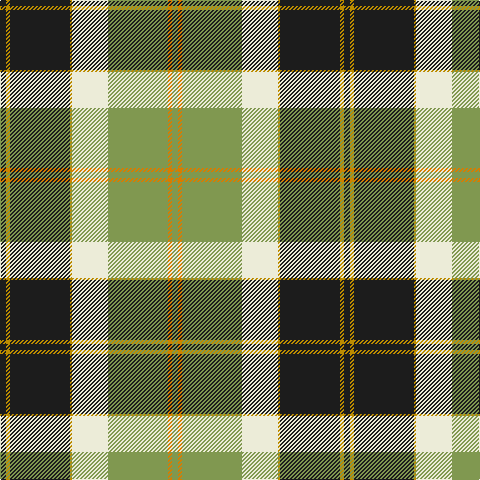

In pattern [BYBYWYYY](/stripes/bybywyyy/).

This was sourced from register-of-tartans.  It is a [8 stripe tartan](/stripes/stripes8/).

Original link https://www.tartanregister.gov.uk/tartanDetails.aspx?ref=4873

## Register references

External register numbers recorded for this tartan.

- Scottish Register of Tartans: [4873](https://www.tartanregister.gov.uk/tartanDetails.aspx?ref=4873)
- Scottish Tartans Authority (ITI): 3656

## Thread count
K/6 DY4 K60 DY2 LY36 LG60 O4 LG/6

## Palette
Each colour and the base-6 reference it is a variant of.

| Colour | Shade | Base |
|---|---|---|
| DY | <code style="background-color:#BC8C00;">#BC8C00</code> `oklch(66.8% 0.137 84.1)` <small>#BC8C00</small> | Y <code style="background-color:#F2BF00;">#F2BF00</code> |
| K | <code style="background-color:#1C1C1C;">#1C1C1C</code> `oklch(22.6% 0.000 89.9)` <small>#1C1C1C</small> | B <code style="background-color:#2A418A;">#2A418A</code> |
| LG | <code style="background-color:#809850;">#809850</code> `oklch(64.4% 0.102 124.3)` <small>#809850</small> | Y <code style="background-color:#F2BF00;">#F2BF00</code> |
| LY | <code style="background-color:#ECECD8;">#ECECD8</code> `oklch(93.8% 0.026 106.9)` <small>#ECECD8</small> | W <code style="background-color:#F7F7F7;">#F7F7F7</code> |
| O | <code style="background-color:#D87C00;">#D87C00</code> `oklch(67.3% 0.155 61.8)` <small>#D87C00</small> | Y <code style="background-color:#F2BF00;">#F2BF00</code> |
| R | <code style="background-color:#980044;">#980044</code> `oklch(43.7% 0.175 5.3)` <small>#980044</small> | R <code style="background-color:#CC0000;">#CC0000</code> |

# Sample pattern

## Nearest tartans

The nearest existing variants by ΔTartan distance, with this tartan at the top so the swatches line up against it.

ΔTartan

Tartan

Sett

—

<a href="/ttd/edit/#slug=dt3lo2dt30lo1w18lg30lo2lg3~x2">Bannockbane Green</a> <a class="nn-out" href="/setts/s8/dt3lo2dt30lo1w18lg30lo2lg3~x2/" title="open its dictionary page">↗</a>

0.88

<a href="/ttd/edit/#slug=r6g2w21ly2k8ly2g32w1k3~x2">Fiander, Julian (Personal)</a> <a class="nn-out" href="/setts/s9/r6g2w21ly2k8ly2g32w1k3~x2/" title="open its dictionary page">↗</a>

1.08

<a href="/ttd/edit/#slug=k9n2lo2k2lb18lo2k2lb1k19lo33r2~x2">Pride of Scotland Gold</a> <a class="nn-out" href="/setts/s11/k9n2lo2k2lb18lo2k2lb1k19lo33r2~x2/" title="open its dictionary page">↗</a>

1.12

<a href="/ttd/edit/#slug=r8lo44k32w2o52k7o7w3">Golden Wedding (Fashion)</a> <a class="nn-out" href="/setts/s8/r8lo44k32w2o52k7o7w3/" title="open its dictionary page">↗</a>

1.14

<a href="/ttd/edit/#slug=r6dg2w21dg2lo2k8lo2dg32w1k3~x2">Fiander, Julian (Personal)</a> <a class="nn-out" href="/setts/s10/r6dg2w21dg2lo2k8lo2dg32w1k3~x2/" title="open its dictionary page">↗</a>

1.15

<a href="/ttd/edit/#slug=g22r2g4r2g4r18w24r1lo3~x2">Prince Edward Island, Dress</a> <a class="nn-out" href="/setts/s9/g22r2g4r2g4r18w24r1lo3~x2/" title="open its dictionary page">↗</a>

1.24

<a href="/ttd/edit/#slug=dg4dr14dg14o6dr1w30dg2dr1~x2">British Columbia #2</a> <a class="nn-out" href="/setts/s8/dg4dr14dg14o6dr1w30dg2dr1~x2/" title="open its dictionary page">↗</a>

1.24

<a href="/ttd/edit/#slug=dg4do10dg10o6do1w26dg2do1~x4">Dogwood</a> <a class="nn-out" href="/setts/s8/dg4do10dg10o6do1w26dg2do1~x4/" title="open its dictionary page">↗</a>

1.26

<a href="/ttd/edit/#slug=lo3dy12do14r4do1w26do2dy1~x2">Turnberry</a> <a class="nn-out" href="/setts/s8/lo3dy12do14r4do1w26do2dy1~x2/" title="open its dictionary page">↗</a>

1.30

<a href="/ttd/edit/#slug=lg31k18dg13r3dg13k1ly3~x2">Big Sur MacLaren (Personal)</a> <a class="nn-out" href="/setts/s7/lg31k18dg13r3dg13k1ly3~x2/" title="open its dictionary page">↗</a>

1.31

<a href="/ttd/edit/#slug=k3g2k21w11g1y21g2y3~x2">Dalveen (Fashion)</a> <a class="nn-out" href="/setts/s8/k3g2k21w11g1y21g2y3~x2/" title="open its dictionary page">↗</a>

## Neighbour map

Every grey dot is one of 14299 variants placed by the first two principal components of the ΔTartan feature space (44% of its variance). Red is this tartan; blue dots are its nearest — click one to open its page.

<svg viewBox="0 0 640 380" role="img" style="max-width:100%;height:auto;border:1px solid #e0e0e0;border-radius:4px;display:block" xmlns="http://www.w3.org/2000/svg"><image href="/nn/cloud.v1.png" width="640" height="380"/><a href="/setts/s9/r6g2w21ly2k8ly2g32w1k3~x2/"><circle cx="217.2" cy="86.6" r="4" fill="#3465a4"><title>Fiander, Julian (Personal)</title></circle></a><a href="/setts/s11/k9n2lo2k2lb18lo2k2lb1k19lo33r2~x2/"><circle cx="227.4" cy="80.6" r="4" fill="#3465a4"><title>Pride of Scotland Gold</title></circle></a><a href="/setts/s8/r8lo44k32w2o52k7o7w3/"><circle cx="208.4" cy="123.7" r="4" fill="#3465a4"><title>Golden Wedding (Fashion)</title></circle></a><a href="/setts/s10/r6dg2w21dg2lo2k8lo2dg32w1k3~x2/"><circle cx="228.6" cy="80.3" r="4" fill="#3465a4"><title>Fiander, Julian (Personal)</title></circle></a><a href="/setts/s9/g22r2g4r2g4r18w24r1lo3~x2/"><circle cx="214.3" cy="126.9" r="4" fill="#3465a4"><title>Prince Edward Island, Dress</title></circle></a><a href="/setts/s8/dg4dr14dg14o6dr1w30dg2dr1~x2/"><circle cx="215.5" cy="111.0" r="4" fill="#3465a4"><title>British Columbia #2</title></circle></a><a href="/setts/s8/dg4do10dg10o6do1w26dg2do1~x4/"><circle cx="217.7" cy="118.1" r="4" fill="#3465a4"><title>Dogwood</title></circle></a><a href="/setts/s8/lo3dy12do14r4do1w26do2dy1~x2/"><circle cx="196.8" cy="97.5" r="4" fill="#3465a4"><title>Turnberry</title></circle></a><a href="/setts/s7/lg31k18dg13r3dg13k1ly3~x2/"><circle cx="198.4" cy="139.6" r="4" fill="#3465a4"><title>Big Sur MacLaren (Personal)</title></circle></a><a href="/setts/s8/k3g2k21w11g1y21g2y3~x2/"><circle cx="198.4" cy="130.7" r="4" fill="#3465a4"><title>Dalveen (Fashion)</title></circle></a><circle cx="203.1" cy="104.8" r="5" fill="#c00000"/></svg>

ID: /setts/s8/dt3lo2dt30lo1w18lg30lo2lg3~x2/
