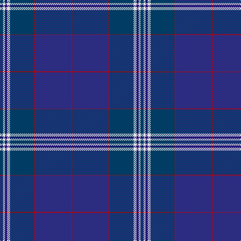

**Bands:** [RBRBWBWB](/stripes/rbrbwbwb/) · **Stripes:** [R DB R DT W DB W DT](/stripes/stripes8/) R DB R DT W DB W DT

This was sourced from register-of-tartans.  It is a [8 band tartan](/bands/bands8/).

Original link https://www.tartanregister.gov.uk/tartanDetails.aspx?ref=3446

## Also known as

This cloth is also recorded under:

- Raith Rovers Football Club

## Attestations

This cloth appears in 2 source records; the oldest owns this page.

- 01/01/1995 — Raith Rovers Football Club (register-of-tartans, [record](https://www.tartanregister.gov.uk/tartanDetails.aspx?ref=3446))
- May 2002 — Raith Rovers (Sports) (tartans-authority, [record](http://www.tartansauthority.com/tartan-ferret/display/2424/))

## Register references

External register numbers recorded for this tartan.

- Scottish Register of Tartans: [3446](https://www.tartanregister.gov.uk/tartanDetails.aspx?ref=3446)
- Scottish Tartans Authority (ITI): 2424
- Scottish Tartans World Register: 2424

## Thread count
DBa/6 LN4 DBb4 LN6 DBa48 R2 DB72 R/2

## Palette
Each colour and its ΔE from the base-6 reference it is a variant of.

| Colour | Shade | Base | ΔE (OKLab) |
|---|---|---|---|
| DB | <code style="background-color:#2C2C80;">#2C2C80</code> `#2C2C80` | B <code style="background-color:#2A418A;">#2A418A</code> | 0.06 |
| DBa | <code style="background-color:#003C64;">#003C64</code> `#003C64` | B <code style="background-color:#2A418A;">#2A418A</code> | 0.08 |
| DBb | <code style="background-color:#1C0070;">#1C0070</code> `#1C0070` | B <code style="background-color:#2A418A;">#2A418A</code> | 0.14 |
| LN | <code style="background-color:#E0E0E0;">#E0E0E0</code> `#E0E0E0` | W <code style="background-color:#F7F7F7;">#F7F7F7</code> | 0.07 |
| R | <code style="background-color:#C80000;">#C80000</code> `#C80000` | R <code style="background-color:#CC0000;">#CC0000</code> | 0.01 |

# Sample pattern

## Nearest tartans

The nearest existing variants by ΔTartan distance.

1. [RAAF #2](/setts/s9/db66w1dt10w1dt10w1dt12r2t24~x2/) — ΔT 0.84
1. [Muir Homes](/setts/s11/db66k20db7y4db5y4db5y4db7k2lr6/) — ΔT 1.56
1. [Royal Highland Yacht Club (Corporate](/setts/s11/db26db3db1m2db1db3db3db12g14db2w2~x2/) — ΔT 1.57
1. [Scottish Canals (Corporate)](/setts/s7/g2db1db29db2g9db26ly2~x2/) — ΔT 1.66
1. [Schiehallion (Corporate)](/setts/s11/b14db4g2db2g3db2b17db31b1db1w2~x2/) — ΔT 1.68
1. [Pride of Fife](/setts/s10/db2w2dp16lg2dp2r5db37dp6lg2db2~x2/) — ΔT 1.70
1. [Pagus Wasia District Tartan Tartan Number: 10962. Earliest known date: 2012 Pagus (shire) Wasia (wetland) is a rural district in Belgium. The tartan was created by the founding members of the new Pagus Wasia Pipes & Drums, based on the colours of the District Coat of Arms. The district is associated with the Belgian surname, Waas. Registration was authorised by Marc Van de Vijver, Mayor of the city of Beveren. See products available Copyright © Blair Urquhart, Comrie, 2015](/setts/s9/r1db2n1dt3n19db3ly1db2ly1~x4/) — ΔT 1.71
1. [Incorporation of Weavers (Glasgow)](/setts/s9/db3o3db36db7k3db6g5k1ly3~x2/) — ΔT 1.74
1. [Kirkcaldy Tartan Army (Corporate)](/setts/s12/dt36r3dt1r2dt3r6db1r2db35w1db1lo2~x2/) — ΔT 1.76
1. [Buckie](/setts/s9/o4k2dg2ly1dg8k20db50r2db2~x2/) — ΔT 1.79

## Neighbour map

Every grey dot is one of 14299 variants placed by the first two principal components of the ΔTartan feature space (44% of its variance). Red is this tartan; blue dots are its nearest — click one to open its page.

<svg viewBox="0 0 640 380" role="img" style="max-width:100%;height:auto;border:1px solid #e0e0e0;border-radius:4px;display:block" xmlns="http://www.w3.org/2000/svg"><image href="/nn/cloud.v1.png" width="640" height="380"/><a href="/setts/s9/db66w1dt10w1dt10w1dt12r2t24~x2/"><circle cx="395.8" cy="126.4" r="4" fill="#3465a4"><title>RAAF #2</title></circle></a><a href="/setts/s11/db66k20db7y4db5y4db5y4db7k2lr6/"><circle cx="350.8" cy="120.5" r="4" fill="#3465a4"><title>Muir Homes</title></circle></a><a href="/setts/s11/db26db3db1m2db1db3db3db12g14db2w2~x2/"><circle cx="315.7" cy="142.0" r="4" fill="#3465a4"><title>Royal Highland Yacht Club (Corporate</title></circle></a><a href="/setts/s7/g2db1db29db2g9db26ly2~x2/"><circle cx="359.1" cy="199.0" r="4" fill="#3465a4"><title>Scottish Canals (Corporate)</title></circle></a><a href="/setts/s11/b14db4g2db2g3db2b17db31b1db1w2~x2/"><circle cx="356.0" cy="128.7" r="4" fill="#3465a4"><title>Schiehallion (Corporate)</title></circle></a><a href="/setts/s10/db2w2dp16lg2dp2r5db37dp6lg2db2~x2/"><circle cx="373.2" cy="150.2" r="4" fill="#3465a4"><title>Pride of Fife</title></circle></a><a href="/setts/s9/r1db2n1dt3n19db3ly1db2ly1~x4/"><circle cx="398.0" cy="145.7" r="4" fill="#3465a4"><title>Pagus Wasia District Tartan Tartan Number: 10962. Earliest known date: 2012 Pagus (shire) Wasia (wetland) is a rural district in Belgium. The tartan was created by the founding members of the new Pagus Wasia Pipes &amp; Drums, based on the colours of the District Coat of Arms. The district is associated with the Belgian surname, Waas. Registration was authorised by Marc Van de Vijver, Mayor of the city of Beveren. See products available Copyright © Blair Urquhart, Comrie, 2015</title></circle></a><a href="/setts/s9/db3o3db36db7k3db6g5k1ly3~x2/"><circle cx="364.7" cy="110.3" r="4" fill="#3465a4"><title>Incorporation of Weavers (Glasgow)</title></circle></a><a href="/setts/s12/dt36r3dt1r2dt3r6db1r2db35w1db1lo2~x2/"><circle cx="355.9" cy="111.3" r="4" fill="#3465a4"><title>Kirkcaldy Tartan Army (Corporate)</title></circle></a><a href="/setts/s9/o4k2dg2ly1dg8k20db50r2db2~x2/"><circle cx="400.3" cy="99.8" r="4" fill="#3465a4"><title>Buckie</title></circle></a><circle cx="383.0" cy="142.6" r="5" fill="#c00000"/></svg>

ID: /setts/s8/dt3w2db2w3dt24r1db36r1~x2/
