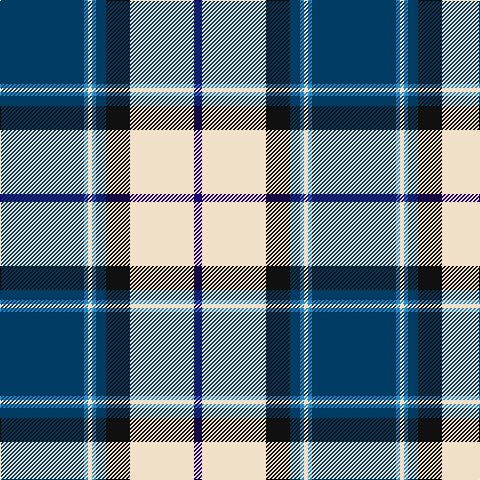

In pattern [BBWBBKWB](/stripes/bbwbbkwb/).

This was sourced from tartans-authority.  It is a [8 stripe tartan](/stripes/stripes8/).

Original link http://www.tartansauthority.com/tartan-ferret/display/7593/

## Also known as

This cloth is also recorded under:

- Comrie, Navy Blue

## Attestations

This cloth appears in 2 source records; the oldest owns this page.

- March 2008 — Comrie, Navy Blue (Dance) (tartans-authority, [record](http://www.tartansauthority.com/tartan-ferret/display/7593/))
- undated — Comrie Navy Blue (register-of-tartans, [record](https://www.tartanregister.gov.uk/tartanDetails.aspx?ref=5617))

## Register references

External register numbers recorded for this tartan.

- Scottish Register of Tartans: [5617](https://www.tartanregister.gov.uk/tartanDetails.aspx?ref=5617)
- Scottish Tartans Authority (ITI): 7593

## Thread count
DBa/84 B4 W4 B4 DBa10 K24 W64 DB/8

## Palette
Each colour and its ΔE from the base-6 reference it is a variant of.

| Colour | Shade | Base | ΔE (OKLab) |
|---|---|---|---|
| B | <code style="background-color:#2888C4;">#2888C4</code> `#2888C4` | B <code style="background-color:#2A418A;">#2A418A</code> | 0.21 |
| DB | <code style="background-color:#1C0070;">#1C0070</code> `#1C0070` | B <code style="background-color:#2A418A;">#2A418A</code> | 0.14 |
| DBa | <code style="background-color:#003C64;">#003C64</code> `#003C64` | B <code style="background-color:#2A418A;">#2A418A</code> | 0.08 |
| K | <code style="background-color:#101010;">#101010</code> `#101010` | K <code style="background-color:#000000;">#000000</code> | 0.17 |
| W | <code style="background-color:#F0E0C8;">#F0E0C8</code> `#F0E0C8` | W <code style="background-color:#F7F7F7;">#F7F7F7</code> | 0.07 |

# Sample pattern

## Nearest tartans

The nearest existing variants by ΔTartan distance.

1. [Sinclair dress](/setts/s7/db2r1db16k5g2w11g1~x4/) — ΔT 0.73
1. [Sinclair Dress (Dance)](/setts/s7/db4r2db31k10g4w21g2~x2/) — ΔT 0.97
1. [Longniddry Blue (Dance)](/setts/s8/dt42lb2lb2lb2dt5dt12lb32dt4~x2/) — ΔT 1.10
1. [MacRaes of America](/setts/s8/w8db4ly2db36t48db2t4r5~x2/) — ΔT 1.10
1. [Liddell (New York) (Name)](/setts/s11/w2k1t22r1t3r1t8k22ly2k3ly2~x2/) — ΔT 1.10
1. [Solberg-Bell](/setts/s6/ly8k2dt20t4w1k2~x4/) — ΔT 1.10
1. [Sandelin (Personal)](/setts/s8/w10db2w1db35g10lo3g10r4~x2/) — ΔT 1.11
1. [Herriot New Zealand](/setts/s6/w15ly2k5lb3b40k10/) — ΔT 1.16
1. [(1) Stewart, modern](/setts/s9/g44db2g4db2g6k16m40db2ly11/) — ΔT 1.17
1. [Ar Lenn Vor](/setts/s11/dt15ly30w30k20w20k15w10ly4dt94w4r10/) — ΔT 1.19

## Neighbour map

Every grey dot is one of 14299 variants placed by the first two principal components of the ΔTartan feature space (44% of its variance). Red is this tartan; blue dots are its nearest — click one to open its page.

<svg viewBox="0 0 640 380" role="img" style="max-width:100%;height:auto;border:1px solid #e0e0e0;border-radius:4px;display:block" xmlns="http://www.w3.org/2000/svg"><image href="/nn/cloud.v1.png" width="640" height="380"/><a href="/setts/s7/db2r1db16k5g2w11g1~x4/"><circle cx="210.0" cy="139.2" r="4" fill="#3465a4"><title>Sinclair dress</title></circle></a><a href="/setts/s7/db4r2db31k10g4w21g2~x2/"><circle cx="213.9" cy="143.1" r="4" fill="#3465a4"><title>Sinclair Dress (Dance)</title></circle></a><a href="/setts/s8/dt42lb2lb2lb2dt5dt12lb32dt4~x2/"><circle cx="287.3" cy="139.3" r="4" fill="#3465a4"><title>Longniddry Blue (Dance)</title></circle></a><a href="/setts/s8/w8db4ly2db36t48db2t4r5~x2/"><circle cx="284.0" cy="120.4" r="4" fill="#3465a4"><title>MacRaes of America</title></circle></a><a href="/setts/s11/w2k1t22r1t3r1t8k22ly2k3ly2~x2/"><circle cx="270.6" cy="105.5" r="4" fill="#3465a4"><title>Liddell (New York) (Name)</title></circle></a><a href="/setts/s6/ly8k2dt20t4w1k2~x4/"><circle cx="267.0" cy="141.0" r="4" fill="#3465a4"><title>Solberg-Bell</title></circle></a><a href="/setts/s8/w10db2w1db35g10lo3g10r4~x2/"><circle cx="273.8" cy="112.5" r="4" fill="#3465a4"><title>Sandelin (Personal)</title></circle></a><a href="/setts/s6/w15ly2k5lb3b40k10/"><circle cx="252.3" cy="138.4" r="4" fill="#3465a4"><title>Herriot New Zealand</title></circle></a><a href="/setts/s9/g44db2g4db2g6k16m40db2ly11/"><circle cx="215.3" cy="112.8" r="4" fill="#3465a4"><title>(1) Stewart, modern</title></circle></a><a href="/setts/s11/dt15ly30w30k20w20k15w10ly4dt94w4r10/"><circle cx="183.8" cy="95.7" r="4" fill="#3465a4"><title>Ar Lenn Vor</title></circle></a><circle cx="230.7" cy="115.3" r="5" fill="#c00000"/></svg>

ID: /setts/s8/dt42t2w2t2dt5k12w32db4~x2/
