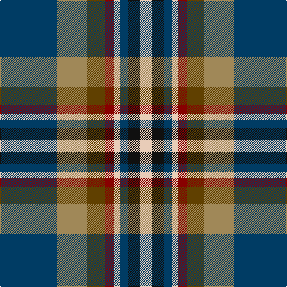

This page is one **sett** — a single exact thread-count. It belongs to the [tartan](/tartans/db48lt25t15dr7lr5db7k10lr10/)
(the same proportion at any scale), whose colour order is pattern [BYGRWBKW](/stripes/bygrwbkw/).

Sourced from tartans-authority.  It is a [8 stripe tartan](/stripes/stripes8/).

Original link http://www.tartansauthority.com/tartan-ferret/display/8658/

## Thread count
DB/96 LT50 T30 DR14 LR10 DB14 K20 LR/20

## Palette
Each colour and the base-6 reference it is a variant of.

| Colour | Shade | Base |
|---|---|---|
| DB | <code style="background-color:#003C64;">#003C64</code> `oklch(34.5% 0.089 246.0)` <small>#003C64</small> | B <code style="background-color:#2A418A;">#2A418A</code> |
| DR | <code style="background-color:#880000;">#880000</code> `oklch(39.4% 0.162 29.2)` <small>#880000</small> | R <code style="background-color:#CC0000;">#CC0000</code> |
| K | <code style="background-color:#101010;">#101010</code> `oklch(17.3% 0.000 89.9)` <small>#101010</small> | K <code style="background-color:#000000;">#000000</code> |
| LR | <code style="background-color:#E8CCB8;">#E8CCB8</code> `oklch(86.3% 0.042 57.7)` <small>#E8CCB8</small> | W <code style="background-color:#F7F7F7;">#F7F7F7</code> |
| LT | <code style="background-color:#A08858;">#A08858</code> `oklch(63.7% 0.071 84.0)` <small>#A08858</small> | Y <code style="background-color:#F2BF00;">#F2BF00</code> |
| T | <code style="background-color:#604000;">#604000</code> `oklch(39.8% 0.083 76.8)` <small>#604000</small> | G <code style="background-color:#006100;">#006100</code> |

# Sample pattern

## Nearest tartans

The nearest existing variants by ΔTartan distance, with this tartan at the top so the swatches line up against it.

ΔTartan

Tartan

Sett

—

<a href="/ttd/edit/#slug=dt48lo25dy15r7lb5dt7k10lb10~x2">State Seal of Utah (Fashion)</a> <a class="nn-out" href="/setts/s8/dt48lo25dy15r7lb5dt7k10lb10~x2/" title="open its dictionary page">↗</a>

0.85

<a href="/ttd/edit/#slug=r5w1db10g10w1ly1g2t2w1~x2">Mary, Queen of Scots</a> <a class="nn-out" href="/setts/s9/r5w1db10g10w1ly1g2t2w1~x2/" title="open its dictionary page">↗</a>

0.88

<a href="/ttd/edit/#slug=r2ly2db9dy1dg9r1w1~x2">Unidentified (ex Tony Murray)</a> <a class="nn-out" href="/setts/s7/r2ly2db9dy1dg9r1w1~x2/" title="open its dictionary page">↗</a>

0.90

<a href="/ttd/edit/#slug=r2k1lo2g3lo4g3db12k1lb2~x4">Federated Women's Institutes of</a> <a class="nn-out" href="/setts/s9/r2k1lo2g3lo4g3db12k1lb2~x4/" title="open its dictionary page">↗</a>

0.94

<a href="/ttd/edit/#slug=w1db6g1db1g1db1g4m5lo1~x4">McLion</a> <a class="nn-out" href="/setts/s9/w1db6g1db1g1db1g4m5lo1~x4/" title="open its dictionary page">↗</a>

0.95

<a href="/ttd/edit/#slug=m4db2t7db20k7g10ly4~x2">Renfrewshire District Tartan Tartan Number: 2560. Earliest known date: 1998 Designed for anyone residing in the County of Renfrewshire See products available Copyright © Blair Urquhart, Comrie, 2015</a> <a class="nn-out" href="/setts/s7/m4db2t7db20k7g10ly4~x2/" title="open its dictionary page">↗</a>

0.95

<a href="/ttd/edit/#slug=ly4g22r3k17r3db37w3~x2">Souza Nery (Personal)</a> <a class="nn-out" href="/setts/s7/ly4g22r3k17r3db37w3~x2/" title="open its dictionary page">↗</a>

0.95

<a href="/ttd/edit/#slug=k3r3g21r8r3r4k3db26w3~x2">Dunedin</a> <a class="nn-out" href="/setts/s9/k3r3g21r8r3r4k3db26w3~x2/" title="open its dictionary page">↗</a>

0.96

<a href="/ttd/edit/#slug=db2r1db10w1dy4g8ly1g2~x4">Ayrshire District Tartan Tartan Number: 436. Earliest known date: 1988 Dr Phil Smith, a Fellow of the Scottish Tartans Society, designed the Ayrshire district tartan at the suggestion of the Clan Boyd and Clan Cunningham Societies. In his book, 'District Tartans' (1992) co-authored with Dr G Teall, he says, the colours &quot;..reflect the gold of the rising sun, the green of the land and brown of the coast, the blue of the sea and the red of the setting sun. The Ayrshire tartan is intended for those with connections in the districts of Kyle, Cunninghame and Inverclyde.&quot; See products available Copyright © Blair Urquhart, Comrie, 2015</a> <a class="nn-out" href="/setts/s8/db2r1db10w1dy4g8ly1g2~x4/" title="open its dictionary page">↗</a>

0.98

<a href="/ttd/edit/#slug=r16ly2dy7ly2b24k2g2~x2">Traill Clan/Family Weavers Tartan Tartan Number: 3093. Earliest known date: 2002 The Traill tartan is for anyone tracing their ancestry to the Scottish 'Traills' - Traill of Blebo and descendants in Orkney and elsewhere. Blue is poor. See products available Copyright © Blair Urquhart, Comrie, 2015</a> <a class="nn-out" href="/setts/s7/r16ly2dy7ly2b24k2g2~x2/" title="open its dictionary page">↗</a>

0.98

<a href="/ttd/edit/#slug=t15k10dt30o11w3lg5~x2">McHale, Barry</a> <a class="nn-out" href="/setts/s6/t15k10dt30o11w3lg5~x2/" title="open its dictionary page">↗</a>

## Neighbour map

Every grey dot is one of 14299 variants placed by the first two principal components of the ΔTartan feature space (44% of its variance). Red is this tartan; blue dots are its nearest — click one to open its page.

<svg viewBox="0 0 640 380" role="img" style="max-width:100%;height:auto;border:1px solid #e0e0e0;border-radius:4px;display:block" xmlns="http://www.w3.org/2000/svg"><image href="/nn/cloud.v1.png" width="640" height="380"/><a href="/setts/s9/r5w1db10g10w1ly1g2t2w1~x2/"><circle cx="136.3" cy="142.8" r="4" fill="#3465a4"><title>Mary, Queen of Scots</title></circle></a><a href="/setts/s7/r2ly2db9dy1dg9r1w1~x2/"><circle cx="148.6" cy="162.0" r="4" fill="#3465a4"><title>Unidentified (ex Tony Murray)</title></circle></a><a href="/setts/s9/r2k1lo2g3lo4g3db12k1lb2~x4/"><circle cx="142.0" cy="137.0" r="4" fill="#3465a4"><title>Federated Women's Institutes of</title></circle></a><a href="/setts/s9/w1db6g1db1g1db1g4m5lo1~x4/"><circle cx="120.7" cy="177.2" r="4" fill="#3465a4"><title>McLion</title></circle></a><a href="/setts/s7/m4db2t7db20k7g10ly4~x2/"><circle cx="139.2" cy="183.8" r="4" fill="#3465a4"><title>Renfrewshire District Tartan Tartan Number: 2560. Earliest known date: 1998 Designed for anyone residing in the County of Renfrewshire See products available Copyright © Blair Urquhart, Comrie, 2015</title></circle></a><a href="/setts/s7/ly4g22r3k17r3db37w3~x2/"><circle cx="176.3" cy="155.4" r="4" fill="#3465a4"><title>Souza Nery (Personal)</title></circle></a><a href="/setts/s9/k3r3g21r8r3r4k3db26w3~x2/"><circle cx="128.7" cy="146.9" r="4" fill="#3465a4"><title>Dunedin</title></circle></a><a href="/setts/s8/db2r1db10w1dy4g8ly1g2~x4/"><circle cx="191.2" cy="172.9" r="4" fill="#3465a4"><title>Ayrshire District Tartan Tartan Number: 436. Earliest known date: 1988 Dr Phil Smith, a Fellow of the Scottish Tartans Society, designed the Ayrshire district tartan at the suggestion of the Clan Boyd and Clan Cunningham Societies. In his book, 'District Tartans' (1992) co-authored with Dr G Teall, he says, the colours &quot;..reflect the gold of the rising sun, the green of the land and brown of the coast, the blue of the sea and the red of the setting sun. The Ayrshire tartan is intended for those with connections in the districts of Kyle, Cunninghame and Inverclyde.&quot; See products available Copyright © Blair Urquhart, Comrie, 2015</title></circle></a><a href="/setts/s7/r16ly2dy7ly2b24k2g2~x2/"><circle cx="212.2" cy="152.3" r="4" fill="#3465a4"><title>Traill Clan/Family Weavers Tartan Tartan Number: 3093. Earliest known date: 2002 The Traill tartan is for anyone tracing their ancestry to the Scottish 'Traills' - Traill of Blebo and descendants in Orkney and elsewhere. Blue is poor. See products available Copyright © Blair Urquhart, Comrie, 2015</title></circle></a><a href="/setts/s6/t15k10dt30o11w3lg5~x2/"><circle cx="154.6" cy="192.7" r="4" fill="#3465a4"><title>McHale, Barry</title></circle></a><circle cx="157.9" cy="163.0" r="5" fill="#c00000"/></svg>

ID: /setts/s8/dt48lo25dy15r7lb5dt7k10lb10~x2/
