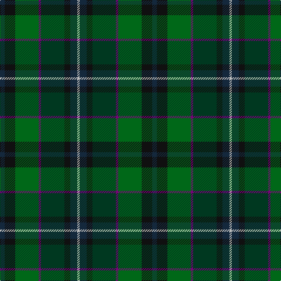

In pattern [BKGBGKBW](/stripes/bkgbgkbw/).

This was sourced from register-of-tartans.  It is a [8 stripe tartan](/stripes/stripes8/).

Original link https://www.tartanregister.gov.uk/tartanDetails.aspx?ref=2114

## Attestations

This cloth appears in 2 source records; the oldest owns this page.

- 01/01/2003 — Linden (register-of-tartans, [record](https://www.tartanregister.gov.uk/tartanDetails.aspx?ref=2114))
- Jan 2003 — Linden (Name) (tartans-authority, [record](http://www.tartansauthority.com/tartan-ferret/display/5772/))

## Register references

External register numbers recorded for this tartan.

- Scottish Register of Tartans: [2114](https://www.tartanregister.gov.uk/tartanDetails.aspx?ref=2114)
- Scottish Tartans Authority (ITI): 5772

## Thread count
DN/8 K18 G40 P4 DG40 K10 DN12 N/4

## Palette
Each colour and the base-6 reference it is a variant of.

| Colour | Shade | Base |
|---|---|---|
| DG | <code style="background-color:#003820;">#003820</code> `oklch(30.0% 0.070 158.3)` <small>#003820</small> | G <code style="background-color:#006100;">#006100</code> |
| DN | <code style="background-color:#14283C;">#14283C</code> `oklch(27.1% 0.046 249.9)` <small>#14283C</small> | B <code style="background-color:#2A418A;">#2A418A</code> |
| G | <code style="background-color:#006818;">#006818</code> `oklch(45.0% 0.142 145.0)` <small>#006818</small> | G <code style="background-color:#006100;">#006100</code> |
| K | <code style="background-color:#101010;">#101010</code> `oklch(17.3% 0.000 89.9)` <small>#101010</small> | K <code style="background-color:#000000;">#000000</code> |
| N | <code style="background-color:#C0C0C0;">#C0C0C0</code> `oklch(80.8% 0.000 89.9)` <small>#C0C0C0</small> | W <code style="background-color:#F7F7F7;">#F7F7F7</code> |
| P | <code style="background-color:#780078;">#780078</code> `oklch(40.2% 0.185 328.4)` <small>#780078</small> | B <code style="background-color:#2A418A;">#2A418A</code> |

# Sample pattern

## Nearest tartans

The nearest existing variants by ΔTartan distance.

1. [Westbrook (2013)](/setts/s9/dg15y3dr2y3dg8b12db20r2db4~x2/) — ΔT 1.27
1. [McCarter (2016)](/setts/s8/o4k2dy15k2dg15db15k2r1~x2/) — ΔT 1.28
1. [Copar a'Beannichte (Personal)](/setts/s9/g20g6dg15dt5dg2dt15o4dt10r2~x2/) — ΔT 1.30
1. [Haughfoot (Commemorative)](/setts/s6/r4k15t4dt15dg24y4~x2/) — ΔT 1.45
1. [Glens of Corbie (Corporate)](/setts/s9/k3g30y20o6y3o3y3dt20r2~x2/) — ΔT 1.45
1. [Unidentified Waistcoat](/setts/s7/db4db4dg16dg16db4db4ly1~x4/) — ΔT 1.46
1. [McHeadley Society](/setts/s13/r2dg18g2dg2g2dg2g12db3k13dg10k2g12ly2~x2/) — ΔT 1.50
1. [Waterford, County (District)](/setts/s6/dg24lo2y16db7do16r5~x2/) — ΔT 1.50
1. [Carinthian National](/setts/s11/w3dt16do15dg18do3r3do3dg18do15dt16ly3~x2/) — ΔT 1.51
1. [Trades House](/setts/s9/r2y2n9k10g12k1y1k1ly1~x4/) — ΔT 1.51

## Neighbour map

Every grey dot is one of 14299 variants placed by the first two principal components of the ΔTartan feature space (44% of its variance). Red is this tartan; blue dots are its nearest — click one to open its page.

<svg viewBox="0 0 640 380" role="img" style="max-width:100%;height:auto;border:1px solid #e0e0e0;border-radius:4px;display:block" xmlns="http://www.w3.org/2000/svg"><image href="/nn/cloud.v1.png" width="640" height="380"/><a href="/setts/s9/dg15y3dr2y3dg8b12db20r2db4~x2/"><circle cx="175.9" cy="195.7" r="4" fill="#3465a4"><title>Westbrook (2013)</title></circle></a><a href="/setts/s8/o4k2dy15k2dg15db15k2r1~x2/"><circle cx="172.9" cy="179.6" r="4" fill="#3465a4"><title>McCarter (2016)</title></circle></a><a href="/setts/s9/g20g6dg15dt5dg2dt15o4dt10r2~x2/"><circle cx="192.0" cy="219.5" r="4" fill="#3465a4"><title>Copar a'Beannichte (Personal)</title></circle></a><a href="/setts/s6/r4k15t4dt15dg24y4~x2/"><circle cx="157.6" cy="244.8" r="4" fill="#3465a4"><title>Haughfoot (Commemorative)</title></circle></a><a href="/setts/s9/k3g30y20o6y3o3y3dt20r2~x2/"><circle cx="214.4" cy="178.5" r="4" fill="#3465a4"><title>Glens of Corbie (Corporate)</title></circle></a><a href="/setts/s7/db4db4dg16dg16db4db4ly1~x4/"><circle cx="233.3" cy="223.3" r="4" fill="#3465a4"><title>Unidentified Waistcoat</title></circle></a><a href="/setts/s13/r2dg18g2dg2g2dg2g12db3k13dg10k2g12ly2~x2/"><circle cx="203.7" cy="187.7" r="4" fill="#3465a4"><title>McHeadley Society</title></circle></a><a href="/setts/s6/dg24lo2y16db7do16r5~x2/"><circle cx="181.6" cy="222.8" r="4" fill="#3465a4"><title>Waterford, County (District)</title></circle></a><a href="/setts/s11/w3dt16do15dg18do3r3do3dg18do15dt16ly3~x2/"><circle cx="149.6" cy="225.9" r="4" fill="#3465a4"><title>Carinthian National</title></circle></a><a href="/setts/s9/r2y2n9k10g12k1y1k1ly1~x4/"><circle cx="154.5" cy="161.5" r="4" fill="#3465a4"><title>Trades House</title></circle></a><circle cx="159.2" cy="208.7" r="5" fill="#c00000"/></svg>

ID: /setts/s8/dt4k9g20dp2dg20k5dt6lb2~x2/
