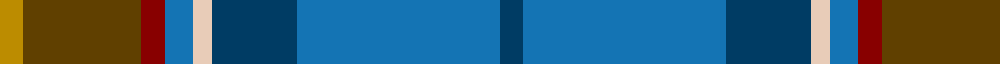
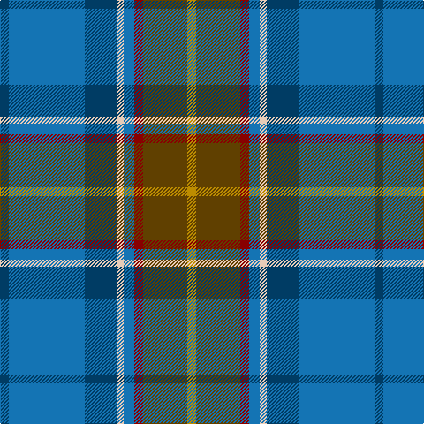

This page is one **sett** — a single exact thread-count. It belongs to the [tartan](/tartans/dt5b43dt18lb4b6r5dy25lo5/)
(the same proportion at any scale), whose colour order is pattern [BBBWBRGY](/stripes/bbbwbrgy/).

Sourced from tartans-authority.  It is a [8 stripe tartan](/stripes/stripes8/).

Original link http://www.tartansauthority.com/tartan-ferret/display/8629/

## Register references

External register numbers recorded for this tartan.

- Scottish Register of Tartans: [8629](https://www.tartanregister.gov.uk/tartanDetails?ref=8629)
- Scottish Tartans Authority (ITI): 8629

## Thread count
DY/10 T50 DR10 B12 LR8 DB36 B86 DB/10

## Palette

Palette: <strong>Tartan Register</strong>
<table><thead><tr><th>Colour</th><th>Threads</th><th>Shade</th><th>Base</th><th>OKLCh</th></tr></thead><tbody><tr><td>DY/</td><td style="text-align:right;font-variant-numeric:tabular-nums">10</td><td><code style="background-color:#BC8C00;">#BC8C00</code> <small style="color:#888">#BC8C00</small></td><td>Y <code style="background-color:#F2BF00;">#F2BF00</code></td><td><small style="color:#888">oklch(66.8% 0.137 84.1)</small></td></tr><tr><td>T</td><td style="text-align:right;font-variant-numeric:tabular-nums">50</td><td><code style="background-color:#604000;">#604000</code> <small style="color:#888">#604000</small></td><td>G <code style="background-color:#006100;">#006100</code></td><td><small style="color:#888">oklch(39.8% 0.083 76.8)</small></td></tr><tr><td>DR</td><td style="text-align:right;font-variant-numeric:tabular-nums">10</td><td><code style="background-color:#880000;">#880000</code> <small style="color:#888">#880000</small></td><td>R <code style="background-color:#CC0000;">#CC0000</code></td><td><small style="color:#888">oklch(39.4% 0.162 29.2)</small></td></tr><tr><td>B</td><td style="text-align:right;font-variant-numeric:tabular-nums">12</td><td><code style="background-color:#1474B4;">#1474B4</code> <small style="color:#888">#1474B4</small></td><td>B <code style="background-color:#2A418A;">#2A418A</code></td><td><small style="color:#888">oklch(54.0% 0.129 245.1)</small></td></tr><tr><td>LR</td><td style="text-align:right;font-variant-numeric:tabular-nums">8</td><td><code style="background-color:#E8CCB8;">#E8CCB8</code> <small style="color:#888">#E8CCB8</small></td><td>W <code style="background-color:#F7F7F7;">#F7F7F7</code></td><td><small style="color:#888">oklch(86.3% 0.042 57.7)</small></td></tr><tr><td>DB</td><td style="text-align:right;font-variant-numeric:tabular-nums">36</td><td><code style="background-color:#003C64;">#003C64</code> <small style="color:#888">#003C64</small></td><td>B <code style="background-color:#2A418A;">#2A418A</code></td><td><small style="color:#888">oklch(34.5% 0.089 246.0)</small></td></tr><tr><td>B</td><td style="text-align:right;font-variant-numeric:tabular-nums">86</td><td><code style="background-color:#1474B4;">#1474B4</code> <small style="color:#888">#1474B4</small></td><td>B <code style="background-color:#2A418A;">#2A418A</code></td><td><small style="color:#888">oklch(54.0% 0.129 245.1)</small></td></tr><tr><td>DB/</td><td style="text-align:right;font-variant-numeric:tabular-nums">10</td><td><code style="background-color:#003C64;">#003C64</code> <small style="color:#888">#003C64</small></td><td>B <code style="background-color:#2A418A;">#2A418A</code></td><td><small style="color:#888">oklch(34.5% 0.089 246.0)</small></td></tr></tbody></table>

# Sample pattern

## Nearest tartans

The nearest existing variants by ΔTartan distance, with this tartan at the top so the swatches line up against it.

ΔTartan

Tartan

Sett

—

<a href="/ttd/edit/#slug=dt5b43dt18lb4b6r5dy25lo5~x2">State Seal of Iowa (Fashion)</a> <a class="nn-out" href="/setts/s8/dt5b43dt18lb4b6r5dy25lo5~x2/" title="open its dictionary page">↗</a>

0.82

<a href="/ttd/edit/#slug=dg10w2dt3g2m14dti26dg2dti6~x2">Spirit of Fife (Corporate)</a> <a class="nn-out" href="/setts/s8/dg10w2dt3g2m14dti26dg2dti6~x2/" title="open its dictionary page">↗</a>

1.06

<a href="/ttd/edit/#slug=dg3lo2m10dg10b20dg12r3b10w2~x2">Patel (2013)</a> <a class="nn-out" href="/setts/s9/dg3lo2m10dg10b20dg12r3b10w2~x2/" title="open its dictionary page">↗</a>

1.11

<a href="/ttd/edit/#slug=db17w2db2r2db2do12dg16lo3~x4">Blairmore House</a> <a class="nn-out" href="/setts/s8/db17w2db2r2db2do12dg16lo3~x4/" title="open its dictionary page">↗</a>

1.12

<a href="/ttd/edit/#slug=g37dp5g5dp12b10db5b5db40dy4db4lo4~x2">State Seal of North Dakota (Fashion)</a> <a class="nn-out" href="/setts/s11/g37dp5g5dp12b10db5b5db40dy4db4lo4~x2/" title="open its dictionary page">↗</a>

1.17

<a href="/ttd/edit/#slug=db2r1db10w1dy4g8ly1g2~x4">Ayrshire District Tartan Tartan Number: 436. Earliest known date: 1988 Dr Phil Smith, a Fellow of the Scottish Tartans Society, designed the Ayrshire district tartan at the suggestion of the Clan Boyd and Clan Cunningham Societies. In his book, 'District Tartans' (1992) co-authored with Dr G Teall, he says, the colours &quot;..reflect the gold of the rising sun, the green of the land and brown of the coast, the blue of the sea and the red of the setting sun. The Ayrshire tartan is intended for those with connections in the districts of Kyle, Cunninghame and Inverclyde.&quot; See products available Copyright © Blair Urquhart, Comrie, 2015</a> <a class="nn-out" href="/setts/s8/db2r1db10w1dy4g8ly1g2~x4/" title="open its dictionary page">↗</a>

1.18

<a href="/ttd/edit/#slug=r4do27lo6n19b38lb4~x2">State Seal of Michigan (Fashion)</a> <a class="nn-out" href="/setts/s6/r4do27lo6n19b38lb4~x2/" title="open its dictionary page">↗</a>

1.18

<a href="/ttd/edit/#slug=db4dy5g19dp5dy5k5dy5db36ly3~x2">Suzugamine (Corporate)</a> <a class="nn-out" href="/setts/s9/db4dy5g19dp5dy5k5dy5db36ly3~x2/" title="open its dictionary page">↗</a>

1.19

<a href="/ttd/edit/#slug=db17lb2db2r2db2do12dg16lo3~x4">Blairmore House (Corporate)</a> <a class="nn-out" href="/setts/s8/db17lb2db2r2db2do12dg16lo3~x4/" title="open its dictionary page">↗</a>

1.21

<a href="/ttd/edit/#slug=r3w2y7n25k8y15dg2~x2">Allman-Jones (Personal)</a> <a class="nn-out" href="/setts/s7/r3w2y7n25k8y15dg2~x2/" title="open its dictionary page">↗</a>

1.21

<a href="/ttd/edit/#slug=o3db1o11w1k5n14lo3~x4">Glen Lyon (Fashion)</a> <a class="nn-out" href="/setts/s7/o3db1o11w1k5n14lo3~x4/" title="open its dictionary page">↗</a>

## Neighbour map

Every grey dot is one of 14359 variants placed by the first two principal components of the ΔTartan feature space (44% of its variance). Red is this tartan; blue dots are its nearest — click one to open its page.

<svg viewBox="0 0 640 380" role="img" style="max-width:100%;height:auto;border:1px solid #e0e0e0;border-radius:4px;display:block" xmlns="http://www.w3.org/2000/svg"><image href="/nn/cloud.v1.png" width="640" height="380"/><a href="/setts/s8/dg10w2dt3g2m14dti26dg2dti6~x2/"><circle cx="252.2" cy="168.3" r="4" fill="#3465a4"><title>Spirit of Fife (Corporate)</title></circle></a><a href="/setts/s9/dg3lo2m10dg10b20dg12r3b10w2~x2/"><circle cx="185.6" cy="190.5" r="4" fill="#3465a4"><title>Patel (2013)</title></circle></a><a href="/setts/s8/db17w2db2r2db2do12dg16lo3~x4/"><circle cx="176.9" cy="190.5" r="4" fill="#3465a4"><title>Blairmore House</title></circle></a><a href="/setts/s11/g37dp5g5dp12b10db5b5db40dy4db4lo4~x2/"><circle cx="194.8" cy="162.7" r="4" fill="#3465a4"><title>State Seal of North Dakota (Fashion)</title></circle></a><a href="/setts/s8/db2r1db10w1dy4g8ly1g2~x4/"><circle cx="190.9" cy="173.7" r="4" fill="#3465a4"><title>Ayrshire District Tartan Tartan Number: 436. Earliest known date: 1988 Dr Phil Smith, a Fellow of the Scottish Tartans Society, designed the Ayrshire district tartan at the suggestion of the Clan Boyd and Clan Cunningham Societies. In his book, 'District Tartans' (1992) co-authored with Dr G Teall, he says, the colours &quot;..reflect the gold of the rising sun, the green of the land and brown of the coast, the blue of the sea and the red of the setting sun. The Ayrshire tartan is intended for those with connections in the districts of Kyle, Cunninghame and Inverclyde.&quot; See products available Copyright © Blair Urquhart, Comrie, 2015</title></circle></a><a href="/setts/s6/r4do27lo6n19b38lb4~x2/"><circle cx="173.6" cy="196.3" r="4" fill="#3465a4"><title>State Seal of Michigan (Fashion)</title></circle></a><a href="/setts/s9/db4dy5g19dp5dy5k5dy5db36ly3~x2/"><circle cx="224.2" cy="156.8" r="4" fill="#3465a4"><title>Suzugamine (Corporate)</title></circle></a><a href="/setts/s8/db17lb2db2r2db2do12dg16lo3~x4/"><circle cx="193.7" cy="199.3" r="4" fill="#3465a4"><title>Blairmore House (Corporate)</title></circle></a><a href="/setts/s7/r3w2y7n25k8y15dg2~x2/"><circle cx="213.8" cy="174.8" r="4" fill="#3465a4"><title>Allman-Jones (Personal)</title></circle></a><a href="/setts/s7/o3db1o11w1k5n14lo3~x4/"><circle cx="181.2" cy="164.8" r="4" fill="#3465a4"><title>Glen Lyon (Fashion)</title></circle></a><circle cx="219.5" cy="176.8" r="5" fill="#c00000"/></svg>

ID: /setts/s8/dt5b43dt18lb4b6r5dy25lo5~x2/
