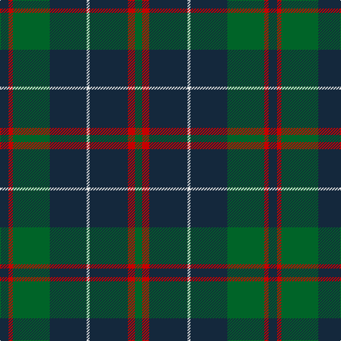

This page is one **sett** — a single exact thread-count. It belongs to the [tartan](/tartans/dn6r3g26dn26ln2dn27r5g5/)
(the same proportion at any scale), whose colour order is pattern [BRGBWBRG](/stripes/brgbwbrg/).

Sourced from tartans-authority.  It is a [8 stripe tartan](/stripes/stripes8/).

Original link http://www.tartansauthority.com/tartan-ferret/display/514/

## Also known as

This cloth is also recorded under:

- MacHardy Black

2 attestations — the source records this cloth was collapsed from (oldest owns this page)

<ul>
<li>pre 1860 — MacHardy (Clan) (tartans-authority, <a href="http://www.tartansauthority.com/tartan-ferret/display/514/">record</a>)</li>
<li>01/01/1973 — MacHardy Black (register-of-tartans, <a href="https://www.tartanregister.gov.uk/tartanDetails.aspx?ref=2468">record</a>)</li>
</ul>

## Register references

External register numbers recorded for this tartan.

- Scottish Register of Tartans: [2468](https://www.tartanregister.gov.uk/tartanDetails.aspx?ref=2468)
- Scottish Tartans Authority (ITI): 514
- Scottish Tartans World Register: 514

## Thread count
DN/12 R6 G52 DN52 LN4 DN54 R10 G/10

## Palette
Each colour and the base-6 reference it is a variant of.

| Colour | Shade | Base |
|---|---|---|
| DN | <code style="background-color:#14283C;">#14283C</code> `oklch(27.1% 0.046 249.9)` <small>#14283C</small> | B <code style="background-color:#2A418A;">#2A418A</code> |
| G | <code style="background-color:#006428;">#006428</code> `oklch(43.9% 0.124 149.0)` <small>#006428</small> | G <code style="background-color:#006100;">#006100</code> |
| LN | <code style="background-color:#E0E0E0;">#E0E0E0</code> `oklch(90.7% 0.000 89.9)` <small>#E0E0E0</small> | W <code style="background-color:#F7F7F7;">#F7F7F7</code> |
| R | <code style="background-color:#C80000;">#C80000</code> `oklch(52.3% 0.215 29.2)` <small>#C80000</small> | R <code style="background-color:#CC0000;">#CC0000</code> |

# Sample pattern

## Nearest tartans

The nearest existing variants by ΔTartan distance, with this tartan at the top so the swatches line up against it.

ΔTartan

Tartan

Sett

—

<a href="/ttd/edit/#slug=dt6r3g26dt26w2dt27r5g5~x2">MacHardy (Clan)</a> <a class="nn-out" href="/setts/s8/dt6r3g26dt26w2dt27r5g5~x2/" title="open its dictionary page">↗</a>

1.02

<a href="/ttd/edit/#slug=dg4db12r3db12dg32w4~x2">MacIntyre</a> <a class="nn-out" href="/setts/s6/dg4db12r3db12dg32w4~x2/" title="open its dictionary page">↗</a>

1.04

<a href="/ttd/edit/#slug=ly2dg12db6r3dg12r4db1~x2">MacKintosh Hunting</a> <a class="nn-out" href="/setts/s7/ly2dg12db6r3dg12r4db1~x2/" title="open its dictionary page">↗</a>

1.08

<a href="/ttd/edit/#slug=dg40r3dg4r3dg12db32ly4r3~x2">U.S. Marine Corps (Military?)</a> <a class="nn-out" href="/setts/s8/dg40r3dg4r3dg12db32ly4r3~x2/" title="open its dictionary page">↗</a>

1.11

<a href="/ttd/edit/#slug=k32b2k6b2k13n30w2~x2">Mountain Rescue Association Honor Guard</a> <a class="nn-out" href="/setts/s7/k32b2k6b2k13n30w2~x2/" title="open its dictionary page">↗</a>

1.12

<a href="/ttd/edit/#slug=dg4db12r3db12dg32lr4~x2">MacIntyre LC</a> <a class="nn-out" href="/setts/s6/dg4db12r3db12dg32lr4~x2/" title="open its dictionary page">↗</a>

1.12

<a href="/ttd/edit/#slug=dg4db12r3db12dg32lr4">MacIntyre LC</a> <a class="nn-out" href="/setts/s6/dg4db12r3db12dg32lr4/" title="open its dictionary page">↗</a>

1.15

<a href="/ttd/edit/#slug=r1dg16k8dg4k4ly1~x2">Forbes #6</a> <a class="nn-out" href="/setts/s6/r1dg16k8dg4k4ly1~x2/" title="open its dictionary page">↗</a>

1.18

<a href="/ttd/edit/#slug=dg2k3ly1k3dg2db8dg16k1~x4">Harley (Leslie), Robert</a> <a class="nn-out" href="/setts/s8/dg2k3ly1k3dg2db8dg16k1~x4/" title="open its dictionary page">↗</a>

1.19

<a href="/ttd/edit/#slug=r4dt4k2dt31k10ly3dt5k11dt6k3~x2">MacArthur Fox Green (Personal)</a> <a class="nn-out" href="/setts/s10/r4dt4k2dt31k10ly3dt5k11dt6k3~x2/" title="open its dictionary page">↗</a>

1.19

<a href="/ttd/edit/#slug=y6lb1n18k6n4k4n8k1n8k2y5~x2">Bute Heather, Grey</a> <a class="nn-out" href="/setts/s11/y6lb1n18k6n4k4n8k1n8k2y5~x2/" title="open its dictionary page">↗</a>

## Neighbour map

Every grey dot is one of 14299 variants placed by the first two principal components of the ΔTartan feature space (44% of its variance). Red is this tartan; blue dots are its nearest — click one to open its page.

<svg viewBox="0 0 640 380" role="img" style="max-width:100%;height:auto;border:1px solid #e0e0e0;border-radius:4px;display:block" xmlns="http://www.w3.org/2000/svg"><image href="/nn/cloud.v1.png" width="640" height="380"/><a href="/setts/s6/dg4db12r3db12dg32w4~x2/"><circle cx="323.4" cy="225.9" r="4" fill="#3465a4"><title>MacIntyre</title></circle></a><a href="/setts/s7/ly2dg12db6r3dg12r4db1~x2/"><circle cx="334.5" cy="226.4" r="4" fill="#3465a4"><title>MacKintosh Hunting</title></circle></a><a href="/setts/s8/dg40r3dg4r3dg12db32ly4r3~x2/"><circle cx="342.6" cy="188.7" r="4" fill="#3465a4"><title>U.S. Marine Corps (Military?)</title></circle></a><a href="/setts/s7/k32b2k6b2k13n30w2~x2/"><circle cx="377.2" cy="202.6" r="4" fill="#3465a4"><title>Mountain Rescue Association Honor Guard</title></circle></a><a href="/setts/s6/dg4db12r3db12dg32lr4~x2/"><circle cx="322.2" cy="228.7" r="4" fill="#3465a4"><title>MacIntyre LC</title></circle></a><a href="/setts/s6/dg4db12r3db12dg32lr4/"><circle cx="322.2" cy="228.7" r="4" fill="#3465a4"><title>MacIntyre LC</title></circle></a><a href="/setts/s6/r1dg16k8dg4k4ly1~x2/"><circle cx="388.7" cy="221.9" r="4" fill="#3465a4"><title>Forbes #6</title></circle></a><a href="/setts/s8/dg2k3ly1k3dg2db8dg16k1~x4/"><circle cx="346.2" cy="196.2" r="4" fill="#3465a4"><title>Harley (Leslie), Robert</title></circle></a><a href="/setts/s10/r4dt4k2dt31k10ly3dt5k11dt6k3~x2/"><circle cx="375.9" cy="189.9" r="4" fill="#3465a4"><title>MacArthur Fox Green (Personal)</title></circle></a><a href="/setts/s11/y6lb1n18k6n4k4n8k1n8k2y5~x2/"><circle cx="373.0" cy="196.5" r="4" fill="#3465a4"><title>Bute Heather, Grey</title></circle></a><circle cx="365.5" cy="216.1" r="5" fill="#c00000"/></svg>

ID: /setts/s8/dt6r3g26dt26w2dt27r5g5~x2/
