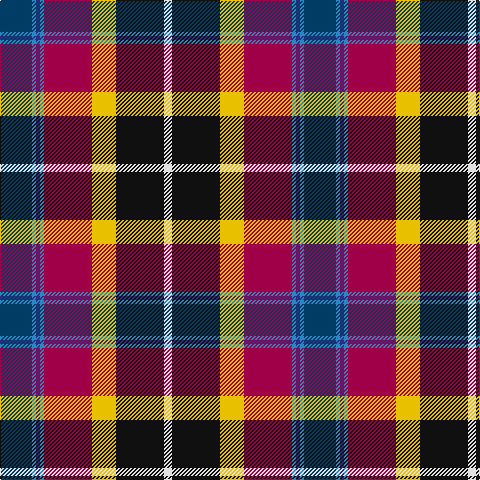

In pattern [BBBBRYKW](/stripes/bbbbrykw/).

This was sourced from register-of-tartans.  It is a [8 stripe tartan](/stripes/stripes8/).

Original link https://www.tartanregister.gov.uk/tartanDetails.aspx?ref=2847

## Attestations

This cloth appears in 2 source records; the oldest owns this page.

- 01/01/2003 — Maryland (register-of-tartans, [record](https://www.tartanregister.gov.uk/tartanDetails.aspx?ref=2847))
- 2003 — Maryland (Commemorative) (tartans-authority, [record](http://www.tartansauthority.com/tartan-ferret/display/5920/))

## Register references

External register numbers recorded for this tartan.

- Scottish Register of Tartans: [2847](https://www.tartanregister.gov.uk/tartanDetails.aspx?ref=2847)
- Scottish Tartans Authority (ITI): 5920

## Thread count
DBa/32 B4 DB4 B4 R48 Y24 K48 LN/8

## Palette
Each colour and the base-6 reference it is a variant of.

| Colour | Shade | Base |
|---|---|---|
| B | <code style="background-color:#2888C4;">#2888C4</code> `oklch(60.1% 0.125 241.5)` <small>#2888C4</small> | B <code style="background-color:#2A418A;">#2A418A</code> |
| DB | <code style="background-color:#2C2C80;">#2C2C80</code> `oklch(35.0% 0.138 276.6)` <small>#2C2C80</small> | B <code style="background-color:#2A418A;">#2A418A</code> |
| DBa | <code style="background-color:#003C64;">#003C64</code> `oklch(34.5% 0.089 246.0)` <small>#003C64</small> | B <code style="background-color:#2A418A;">#2A418A</code> |
| K | <code style="background-color:#101010;">#101010</code> `oklch(17.3% 0.000 89.9)` <small>#101010</small> | K <code style="background-color:#000000;">#000000</code> |
| LN | <code style="background-color:#E0E0E0;">#E0E0E0</code> `oklch(90.7% 0.000 89.9)` <small>#E0E0E0</small> | W <code style="background-color:#F7F7F7;">#F7F7F7</code> |
| R | <code style="background-color:#A00048;">#A00048</code> `oklch(45.4% 0.182 5.3)` <small>#A00048</small> | R <code style="background-color:#CC0000;">#CC0000</code> |
| Y | <code style="background-color:#E8C000;">#E8C000</code> `oklch(81.9% 0.168 93.7)` <small>#E8C000</small> | Y <code style="background-color:#F2BF00;">#F2BF00</code> |

# Sample pattern

## Nearest tartans

The nearest existing variants by ΔTartan distance, with this tartan at the top so the swatches line up against it.

ΔTartan

Tartan

Sett

—

<a href="/ttd/edit/#slug=dt8t1db1t1m12ly6k12w2~x4">Maryland</a> <a class="nn-out" href="/setts/s8/dt8t1db1t1m12ly6k12w2~x4/" title="open its dictionary page">↗</a>

0.78

<a href="/ttd/edit/#slug=lp33r7db9dp7g12r3k29~x2">Hatcher (Personal)</a> <a class="nn-out" href="/setts/s7/lp33r7db9dp7g12r3k29~x2/" title="open its dictionary page">↗</a>

0.85

<a href="/ttd/edit/#slug=k2t6k1db7dg13w1k11r14ly2~x2">Teall of Teallach</a> <a class="nn-out" href="/setts/s9/k2t6k1db7dg13w1k11r14ly2~x2/" title="open its dictionary page">↗</a>

0.94

<a href="/ttd/edit/#slug=db4k1w2k3ly1y12o1k12o12r4~x2">Campbell, hunting</a> <a class="nn-out" href="/setts/s10/db4k1w2k3ly1y12o1k12o12r4~x2/" title="open its dictionary page">↗</a>

0.95

<a href="/ttd/edit/#slug=r4dy12k12dy1o12ly1k3w2k1b4~x2">Campbell Hunting</a> <a class="nn-out" href="/setts/s10/r4dy12k12dy1o12ly1k3w2k1b4~x2/" title="open its dictionary page">↗</a>

0.95

<a href="/ttd/edit/#slug=k2t6k1db7g13w1k11r14ly2~x2">Teall of Teallach (Personal)</a> <a class="nn-out" href="/setts/s9/k2t6k1db7g13w1k11r14ly2~x2/" title="open its dictionary page">↗</a>

1.02

<a href="/ttd/edit/#slug=r5lb1dt10w2k10y10k1ly3~x4">Culloden 1746 - Original</a> <a class="nn-out" href="/setts/s8/r5lb1dt10w2k10y10k1ly3~x4/" title="open its dictionary page">↗</a>

1.08

<a href="/ttd/edit/#slug=r5t2dp14w2k13lo13k2ly3~x2">Culloden</a> <a class="nn-out" href="/setts/s8/r5t2dp14w2k13lo13k2ly3~x2/" title="open its dictionary page">↗</a>

1.10

<a href="/ttd/edit/#slug=r5t2dp14w2k13y13k2ly3~x2">Culloden, Gold</a> <a class="nn-out" href="/setts/s8/r5t2dp14w2k13y13k2ly3~x2/" title="open its dictionary page">↗</a>

1.11

<a href="/ttd/edit/#slug=lp33r7dt9b7lg12r3k29~x2">Hatcher (Texas) (Personal)</a> <a class="nn-out" href="/setts/s7/lp33r7dt9b7lg12r3k29~x2/" title="open its dictionary page">↗</a>

1.15

<a href="/ttd/edit/#slug=t3p10w3k3g19r14t3k2ly3~x2">Wilson's, No 110</a> <a class="nn-out" href="/setts/s9/t3p10w3k3g19r14t3k2ly3~x2/" title="open its dictionary page">↗</a>

## Neighbour map

Every grey dot is one of 14299 variants placed by the first two principal components of the ΔTartan feature space (44% of its variance). Red is this tartan; blue dots are its nearest — click one to open its page.

<svg viewBox="0 0 640 380" role="img" style="max-width:100%;height:auto;border:1px solid #e0e0e0;border-radius:4px;display:block" xmlns="http://www.w3.org/2000/svg"><image href="/nn/cloud.v1.png" width="640" height="380"/><a href="/setts/s7/lp33r7db9dp7g12r3k29~x2/"><circle cx="80.5" cy="141.6" r="4" fill="#3465a4"><title>Hatcher (Personal)</title></circle></a><a href="/setts/s9/k2t6k1db7dg13w1k11r14ly2~x2/"><circle cx="62.2" cy="128.7" r="4" fill="#3465a4"><title>Teall of Teallach</title></circle></a><a href="/setts/s10/db4k1w2k3ly1y12o1k12o12r4~x2/"><circle cx="76.9" cy="115.9" r="4" fill="#3465a4"><title>Campbell, hunting</title></circle></a><a href="/setts/s10/r4dy12k12dy1o12ly1k3w2k1b4~x2/"><circle cx="89.3" cy="122.2" r="4" fill="#3465a4"><title>Campbell Hunting</title></circle></a><a href="/setts/s9/k2t6k1db7g13w1k11r14ly2~x2/"><circle cx="61.2" cy="128.7" r="4" fill="#3465a4"><title>Teall of Teallach (Personal)</title></circle></a><a href="/setts/s8/r5lb1dt10w2k10y10k1ly3~x4/"><circle cx="44.4" cy="147.7" r="4" fill="#3465a4"><title>Culloden 1746 - Original</title></circle></a><a href="/setts/s8/r5t2dp14w2k13lo13k2ly3~x2/"><circle cx="43.5" cy="144.5" r="4" fill="#3465a4"><title>Culloden</title></circle></a><a href="/setts/s8/r5t2dp14w2k13y13k2ly3~x2/"><circle cx="35.5" cy="144.5" r="4" fill="#3465a4"><title>Culloden, Gold</title></circle></a><a href="/setts/s7/lp33r7dt9b7lg12r3k29~x2/"><circle cx="58.5" cy="127.9" r="4" fill="#3465a4"><title>Hatcher (Texas) (Personal)</title></circle></a><a href="/setts/s9/t3p10w3k3g19r14t3k2ly3~x2/"><circle cx="66.6" cy="123.3" r="4" fill="#3465a4"><title>Wilson's, No 110</title></circle></a><circle cx="68.6" cy="125.4" r="5" fill="#c00000"/></svg>

ID: /setts/s8/dt8t1db1t1m12ly6k12w2~x4/
