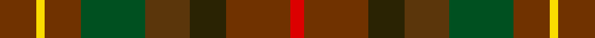
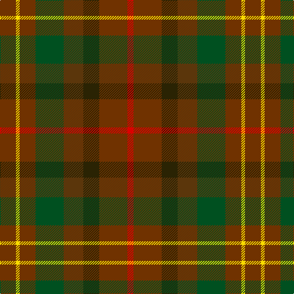

In pattern [GYGGGGGR](/stripes/gygggggr/).

This was sourced from register-of-tartans.  It is a [8 stripe tartan](/stripes/stripes8/).

Original link https://www.tartanregister.gov.uk/tartanDetails.aspx?ref=4241

## Register references

External register numbers recorded for this tartan.

- Scottish Register of Tartans: [4241](https://www.tartanregister.gov.uk/tartanDetails.aspx?ref=4241)
- Scottish Tartans World Register: 1664

## Thread count
T/26 Y6 T26 G46 Ta32 K26 T46 R/10

## Palette
Each colour and the base-6 reference it is a variant of.

| Colour | Shade | Base |
|---|---|---|
| G | <code style="background-color:#005020;">#005020</code> `oklch(37.7% 0.105 149.6)` <small>#005020</small> | G <code style="background-color:#006100;">#006100</code> |
| K | <code style="background-color:#2A2303;">#2A2303</code> `oklch(25.7% 0.049 96.8)` <small>#2A2303</small> | G <code style="background-color:#006100;">#006100</code> |
| R | <code style="background-color:#DC0000;">#DC0000</code> `oklch(56.2% 0.230 29.2)` <small>#DC0000</small> | R <code style="background-color:#CC0000;">#CC0000</code> |
| T | <code style="background-color:#703200;">#703200</code> `oklch(39.5% 0.103 50.8)` <small>#703200</small> | G <code style="background-color:#006100;">#006100</code> |
| Ta | <code style="background-color:#5B360B;">#5B360B</code> `oklch(37.0% 0.076 64.4)` <small>#5B360B</small> | G <code style="background-color:#006100;">#006100</code> |
| Y | <code style="background-color:#FADC00;">#FADC00</code> `oklch(89.2% 0.185 99.2)` <small>#FADC00</small> | Y <code style="background-color:#F2BF00;">#F2BF00</code> |

# Sample pattern

## Nearest tartans

The nearest existing variants by ΔTartan distance, with this tartan at the top so the swatches line up against it.

ΔTartan

Tartan

Sett

—

<a href="/ttd/edit/#slug=dy13ly3dy13dg23dy16dy13dy23r5~x2">Unidentified #40</a> <a class="nn-out" href="/setts/s8/dy13ly3dy13dg23dy16dy13dy23r5~x2/" title="open its dictionary page">↗</a>

1.27

<a href="/ttd/edit/#slug=dr20lo4dr20g35do20dy16dr28r8">Leighton (Personal)</a> <a class="nn-out" href="/setts/s8/dr20lo4dr20g35do20dy16dr28r8/" title="open its dictionary page">↗</a>

1.28

<a href="/ttd/edit/#slug=dr5lo1dr5g9do5dy4dr7r2~x4">Leighton (Personal)</a> <a class="nn-out" href="/setts/s8/dr5lo1dr5g9do5dy4dr7r2~x4/" title="open its dictionary page">↗</a>

1.51

<a href="/ttd/edit/#slug=r11dg1r3y7dg7dy5o3~x4">Caledonian Maple (Fashion)</a> <a class="nn-out" href="/setts/s7/r11dg1r3y7dg7dy5o3~x4/" title="open its dictionary page">↗</a>

1.81

<a href="/ttd/edit/#slug=r15g3r3g19dy6y6o6g19r3g3r15y13~x2">Maple Leaf (District)</a> <a class="nn-out" href="/setts/s12/r15g3r3g19dy6y6o6g19r3g3r15y13~x2/" title="open its dictionary page">↗</a>

1.89

<a href="/ttd/edit/#slug=o13ly3o13g23dy16dr13o23r5~x2">Unidentified 2</a> <a class="nn-out" href="/setts/s8/o13ly3o13g23dy16dr13o23r5~x2/" title="open its dictionary page">↗</a>

1.96

<a href="/ttd/edit/#slug=dr12dy1dg12dy12ly2dy12dg12dy1dr12t2~x2">United Distillers Corporate Tartan Tartan Number: 2098. Earliest known date: 1989 An expression of evocative Scottish colours to reflect the corporate image of quality and style. (weft) lb4 b24 lb2 dg24 g24 r4 See products available Copyright © Blair Urquhart, Comrie, 2015</a> <a class="nn-out" href="/setts/s10/dr12dy1dg12dy12ly2dy12dg12dy1dr12t2~x2/" title="open its dictionary page">↗</a>

2.00

<a href="/ttd/edit/#slug=dr9o9n9r1db1o9db1r1~x4">Jardine, of Castlemilk</a> <a class="nn-out" href="/setts/s8/dr9o9n9r1db1o9db1r1~x4/" title="open its dictionary page">↗</a>

2.00

<a href="/ttd/edit/#slug=k3r22dg5dg10do10dg2~x2">Rowardennan</a> <a class="nn-out" href="/setts/s6/k3r22dg5dg10do10dg2~x2/" title="open its dictionary page">↗</a>

2.07

<a href="/ttd/edit/#slug=r4n19g10o10y15ly2~x2">Isle of Rona (District)</a> <a class="nn-out" href="/setts/s6/r4n19g10o10y15ly2~x2/" title="open its dictionary page">↗</a>

2.07

<a href="/ttd/edit/#slug=r2dy15dg12dy2dt12dy2dg12dy15o2~x4">Amazing Union (Personal)</a> <a class="nn-out" href="/setts/s9/r2dy15dg12dy2dt12dy2dg12dy15o2~x4/" title="open its dictionary page">↗</a>

## Neighbour map

Every grey dot is one of 14299 variants placed by the first two principal components of the ΔTartan feature space (44% of its variance). Red is this tartan; blue dots are its nearest — click one to open its page.

<svg viewBox="0 0 640 380" role="img" style="max-width:100%;height:auto;border:1px solid #e0e0e0;border-radius:4px;display:block" xmlns="http://www.w3.org/2000/svg"><image href="/nn/cloud.v1.png" width="640" height="380"/><a href="/setts/s8/dr20lo4dr20g35do20dy16dr28r8/"><circle cx="222.0" cy="242.9" r="4" fill="#3465a4"><title>Leighton (Personal)</title></circle></a><a href="/setts/s8/dr5lo1dr5g9do5dy4dr7r2~x4/"><circle cx="222.0" cy="240.5" r="4" fill="#3465a4"><title>Leighton (Personal)</title></circle></a><a href="/setts/s7/r11dg1r3y7dg7dy5o3~x4/"><circle cx="241.5" cy="250.5" r="4" fill="#3465a4"><title>Caledonian Maple (Fashion)</title></circle></a><a href="/setts/s12/r15g3r3g19dy6y6o6g19r3g3r15y13~x2/"><circle cx="228.4" cy="238.4" r="4" fill="#3465a4"><title>Maple Leaf (District)</title></circle></a><a href="/setts/s8/o13ly3o13g23dy16dr13o23r5~x2/"><circle cx="184.7" cy="232.3" r="4" fill="#3465a4"><title>Unidentified 2</title></circle></a><a href="/setts/s10/dr12dy1dg12dy12ly2dy12dg12dy1dr12t2~x2/"><circle cx="234.0" cy="226.3" r="4" fill="#3465a4"><title>United Distillers Corporate Tartan Tartan Number: 2098. Earliest known date: 1989 An expression of evocative Scottish colours to reflect the corporate image of quality and style. (weft) lb4 b24 lb2 dg24 g24 r4 See products available Copyright © Blair Urquhart, Comrie, 2015</title></circle></a><a href="/setts/s8/dr9o9n9r1db1o9db1r1~x4/"><circle cx="291.8" cy="233.7" r="4" fill="#3465a4"><title>Jardine, of Castlemilk</title></circle></a><a href="/setts/s6/k3r22dg5dg10do10dg2~x2/"><circle cx="297.1" cy="247.1" r="4" fill="#3465a4"><title>Rowardennan</title></circle></a><a href="/setts/s6/r4n19g10o10y15ly2~x2/"><circle cx="191.3" cy="252.9" r="4" fill="#3465a4"><title>Isle of Rona (District)</title></circle></a><a href="/setts/s9/r2dy15dg12dy2dt12dy2dg12dy15o2~x4/"><circle cx="270.9" cy="242.5" r="4" fill="#3465a4"><title>Amazing Union (Personal)</title></circle></a><circle cx="228.7" cy="259.3" r="5" fill="#c00000"/></svg>

ID: /setts/s8/dy13ly3dy13dg23dy16dy13dy23r5~x2/
