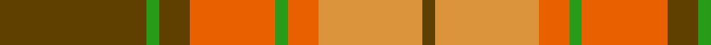

**Bands:** [GYRGRGGG](/stripes/gyrgrggg/) · **Stripes:** [DY LO O G O DY G DY](/stripes/stripes8/) DY LO O G O DY G DY

This was sourced from register-of-tartans.  It is a [8 band tartan](/bands/bands8/).

Original link https://www.tartanregister.gov.uk/tartanDetails.aspx?ref=2157

## Also known as

This cloth is also recorded under:

- Loch Rannoch #2

## Attestations

This cloth appears in 2 source records; the oldest owns this page.

- 01/01/1975 — Loch Rannoch #2 (register-of-tartans, [record](https://www.tartanregister.gov.uk/tartanDetails.aspx?ref=2157))
- 1975 — Loch Rannoch (District) (tartans-authority, [record](http://www.tartansauthority.com/tartan-ferret/display/1735/))

## Register references

External register numbers recorded for this tartan.

- Scottish Register of Tartans: [2157](https://www.tartanregister.gov.uk/tartanDetails.aspx?ref=2157)
- Scottish Tartans Authority (ITI): 1735
- Scottish Tartans World Register: 1735

## Thread count
T/48 G4 T10 Oa28 G4 Oa10 O34 T/4

## Palette
Each colour and its ΔE from the base-6 reference it is a variant of.

| Colour | Shade | Base | ΔE (OKLab) |
|---|---|---|---|
| G | <code style="background-color:#289C18;">#289C18</code> `#289C18` | G <code style="background-color:#006100;">#006100</code> | 0.19 |
| O | <code style="background-color:#DC943C;">#DC943C</code> `#DC943C` | Y <code style="background-color:#F2BF00;">#F2BF00</code> | 0.12 |
| Oa | <code style="background-color:#E86000;">#E86000</code> `#E86000` | R <code style="background-color:#CC0000;">#CC0000</code> | 0.14 |
| T | <code style="background-color:#604000;">#604000</code> `#604000` | G <code style="background-color:#006100;">#006100</code> | 0.14 |

# Sample pattern

## Nearest tartans

The nearest existing variants by ΔTartan distance.

1. [Lennox](/setts/s7/r2r1r10r2g10lr1g2~x4/) — ΔT 1.05
1. [Moray of Abercairney](/setts/s6/r8r1g4r1g1t2~x2/) — ΔT 1.12
1. [Lennox](/setts/s7/r2r1r10r2g10w1g2~x2/) — ΔT 1.15
1. [Scott, hunting](/setts/s8/r3o14g8r2g2w2g2r1~x2/) — ΔT 1.22
1. [MacNab 5](/setts/s7/g6r2r2g4r2r12k1~x2/) — ΔT 1.24
1. [MacNab 6](/setts/s7/g28r7m7g14m7r48k4~x2/) — ΔT 1.28
1. [Alister Grant 'Mohr', the Laird's Champion](/setts/s7/y30k4ly10k4o5ly5o15~x2/) — ΔT 1.30
1. [MacDonald of Kingsburgh](/setts/s9/r3g3lo2r18w2g21lo2g2lo3~x2/) — ΔT 1.30
1. [Burnett](/setts/s8/r4g14ly3g14r4g3r29y4~x2/) — ΔT 1.31
1. [Scrymgeour](/setts/s7/r15k1y2db3r2k1y15~x6/) — ΔT 1.34

## Neighbour map

Every grey dot is one of 14299 variants placed by the first two principal components of the ΔTartan feature space (44% of its variance). Red is this tartan; blue dots are its nearest — click one to open its page.

<svg viewBox="0 0 640 380" role="img" style="max-width:100%;height:auto;border:1px solid #e0e0e0;border-radius:4px;display:block" xmlns="http://www.w3.org/2000/svg"><image href="/nn/cloud.v1.png" width="640" height="380"/><a href="/setts/s7/r2r1r10r2g10lr1g2~x4/"><circle cx="285.0" cy="198.1" r="4" fill="#3465a4"><title>Lennox</title></circle></a><a href="/setts/s6/r8r1g4r1g1t2~x2/"><circle cx="278.1" cy="214.5" r="4" fill="#3465a4"><title>Moray of Abercairney</title></circle></a><a href="/setts/s7/r2r1r10r2g10w1g2~x2/"><circle cx="270.0" cy="191.3" r="4" fill="#3465a4"><title>Lennox</title></circle></a><a href="/setts/s8/r3o14g8r2g2w2g2r1~x2/"><circle cx="262.2" cy="178.4" r="4" fill="#3465a4"><title>Scott, hunting</title></circle></a><a href="/setts/s7/g6r2r2g4r2r12k1~x2/"><circle cx="288.0" cy="190.4" r="4" fill="#3465a4"><title>MacNab 5</title></circle></a><a href="/setts/s7/g28r7m7g14m7r48k4~x2/"><circle cx="289.3" cy="186.9" r="4" fill="#3465a4"><title>MacNab 6</title></circle></a><a href="/setts/s7/y30k4ly10k4o5ly5o15~x2/"><circle cx="214.0" cy="210.1" r="4" fill="#3465a4"><title>Alister Grant 'Mohr', the Laird's Champion</title></circle></a><a href="/setts/s9/r3g3lo2r18w2g21lo2g2lo3~x2/"><circle cx="296.6" cy="168.2" r="4" fill="#3465a4"><title>MacDonald of Kingsburgh</title></circle></a><a href="/setts/s8/r4g14ly3g14r4g3r29y4~x2/"><circle cx="308.6" cy="193.9" r="4" fill="#3465a4"><title>Burnett</title></circle></a><a href="/setts/s7/r15k1y2db3r2k1y15~x6/"><circle cx="305.7" cy="166.4" r="4" fill="#3465a4"><title>Scrymgeour</title></circle></a><circle cx="268.8" cy="188.2" r="5" fill="#c00000"/></svg>

ID: /setts/s8/dy24g2dy5o14g2o5lo17dy2~x2/
