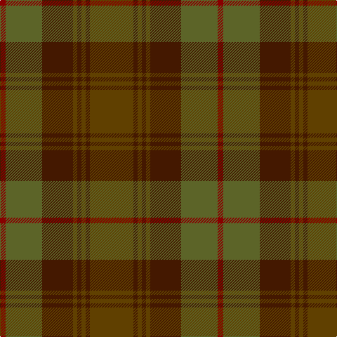

**Bands:** [GBGBGBGR](/stripes/gbgbgbgr/) · **Stripes:** [DY DO DY DO DY DO Y R](/stripes/stripes8/) DY DO DY DO DY DO Y R

This was sourced from tartans-authority.  It is a [8 band tartan](/bands/bands8/).

Original link http://www.tartansauthority.com/tartan-ferret/display/3945/

## Thread count
DRa/8 G52 DR44 T6 DR6 T6 DR6 T/62

## Palette
Each colour and its ΔE from the base-6 reference it is a variant of.

| Colour | Shade | Base | ΔE (OKLab) |
|---|---|---|---|
| DR | <code style="background-color:#441800;">#441800</code> `#441800` | B <code style="background-color:#2A418A;">#2A418A</code> | 0.23 |
| DRa | <code style="background-color:#880000;">#880000</code> `#880000` | R <code style="background-color:#CC0000;">#CC0000</code> | 0.15 |
| G | <code style="background-color:#5C6428;">#5C6428</code> `#5C6428` | G <code style="background-color:#006100;">#006100</code> | 0.10 |
| T | <code style="background-color:#604000;">#604000</code> `#604000` | G <code style="background-color:#006100;">#006100</code> | 0.14 |

# Sample pattern

## Nearest tartans

The nearest existing variants by ΔTartan distance.

1. [Devarr](/setts/s14/do22y26r4y26do22dy3do3dy3do3dy31do3dy3do3dy3~x2/) — ΔT 1.36
1. [Redwoods](/setts/s9/y4r18dy2r2dy5k2dy15r1y4~x2/) — ΔT 1.41
1. [Earle's Flame (Fashion)](/setts/s8/do10y24r3y3r24dg3y6do6~x2/) — ΔT 1.53
1. [MacNaughton Htg](/setts/s9/dg1r1dg22dy21dg12r11dg22r1dg1~x2/) — ΔT 1.67
1. [Brown Heather (Fashion)](/setts/s6/do1dy6do6dy1n6dy1~x8/) — ΔT 1.78
1. [John Telfar Dunbar Hunting](/setts/s7/dg5k2dg28k10dy26db4dg4~x2/) — ΔT 1.84
1. [Tyneside Scottish (Green)](/setts/s13/dy11y1dy1y1dy1y8g8y1g8y8dy8y1dy1~x4/) — ΔT 1.86
1. [Jardine](/setts/s8/n9o9y9r1y1o9y1r1~x4/) — ΔT 1.90
1. [Chindecella Ruadh (Kemete Heil)](/setts/s8/dr9do4dr4do4dr24dy19do19dy4~x2/) — ΔT 1.93
1. [Calais (Fashion)](/setts/s7/dg11n4dg6dy11n1k1dy4~x4/) — ΔT 1.95

## Neighbour map

Every grey dot is one of 14313 variants placed by the first two principal components of the ΔTartan feature space (44% of its variance). Red is this tartan; blue dots are its nearest — click one to open its page.

<svg viewBox="0 0 640 380" role="img" style="max-width:100%;height:auto;border:1px solid #e0e0e0;border-radius:4px;display:block" xmlns="http://www.w3.org/2000/svg"><image href="/nn/cloud.v1.png" width="640" height="380"/><a href="/setts/s14/do22y26r4y26do22dy3do3dy3do3dy31do3dy3do3dy3~x2/"><circle cx="330.1" cy="231.9" r="4" fill="#3465a4"><title>Devarr</title></circle></a><a href="/setts/s9/y4r18dy2r2dy5k2dy15r1y4~x2/"><circle cx="412.3" cy="233.1" r="4" fill="#3465a4"><title>Redwoods</title></circle></a><a href="/setts/s8/do10y24r3y3r24dg3y6do6~x2/"><circle cx="341.8" cy="261.3" r="4" fill="#3465a4"><title>Earle's Flame (Fashion)</title></circle></a><a href="/setts/s9/dg1r1dg22dy21dg12r11dg22r1dg1~x2/"><circle cx="401.9" cy="242.2" r="4" fill="#3465a4"><title>MacNaughton Htg</title></circle></a><a href="/setts/s6/do1dy6do6dy1n6dy1~x8/"><circle cx="365.3" cy="340.3" r="4" fill="#3465a4"><title>Brown Heather (Fashion)</title></circle></a><a href="/setts/s7/dg5k2dg28k10dy26db4dg4~x2/"><circle cx="392.1" cy="268.8" r="4" fill="#3465a4"><title>John Telfar Dunbar Hunting</title></circle></a><a href="/setts/s13/dy11y1dy1y1dy1y8g8y1g8y8dy8y1dy1~x4/"><circle cx="355.4" cy="261.4" r="4" fill="#3465a4"><title>Tyneside Scottish (Green)</title></circle></a><a href="/setts/s8/n9o9y9r1y1o9y1r1~x4/"><circle cx="357.3" cy="265.6" r="4" fill="#3465a4"><title>Jardine</title></circle></a><a href="/setts/s8/dr9do4dr4do4dr24dy19do19dy4~x2/"><circle cx="388.6" cy="334.4" r="4" fill="#3465a4"><title>Chindecella Ruadh (Kemete Heil)</title></circle></a><a href="/setts/s7/dg11n4dg6dy11n1k1dy4~x4/"><circle cx="369.6" cy="292.2" r="4" fill="#3465a4"><title>Calais (Fashion)</title></circle></a><circle cx="364.4" cy="265.6" r="5" fill="#c00000"/></svg>

ID: /setts/s8/dy31do3dy3do3dy3do22y26r4~x2/
