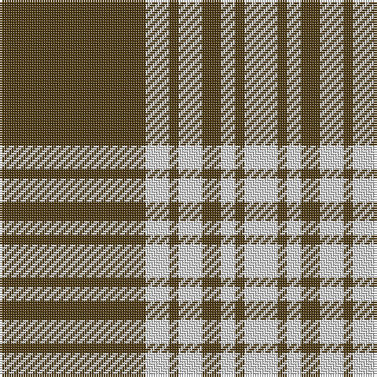

**Bands:** [GWGWGWGW](/stripes/gwgwgwgw/) · **Stripes:** [DY W DY W DY W DY W](/stripes/stripes8/) DY W DY W DY W DY W

This was sourced from register-of-tartans.  It is a [8 band tartan](/bands/bands8/).

Original link https://www.tartanregister.gov.uk/tartanDetails.aspx?ref=2926

## Attestations

This cloth appears in 2 source records; the oldest owns this page.

- undated — Menzies Brown & White (register-of-tartans, [record](https://www.tartanregister.gov.uk/tartanDetails.aspx?ref=2926))
- undated — Menzies Brown & White Trade Tartan Tartan Number: 1752. Earliest known date: 1984 Nothing See products available Copyright © Blair Urquhart, Comrie, 2015 (house-of-tartan, [record](http://www.house-of-tartan.scotland.net/house/TartanViewjs.asp?colr=Def&tnam=1752))

## Register references

External register numbers recorded for this tartan.

- Scottish Register of Tartans: [2926](https://www.tartanregister.gov.uk/tartanDetails.aspx?ref=2926)
- Scottish Tartans World Register: 1752

## Thread count
T/62 LN10 T4 LN10 T8 LN6 T4 LN/14

## Palette
Each colour and its ΔE from the base-6 reference it is a variant of.

| Colour | Shade | Base | ΔE (OKLab) |
|---|---|---|---|
| LN | <code style="background-color:#E0E0E0;">#E0E0E0</code> `#E0E0E0` | W <code style="background-color:#F7F7F7;">#F7F7F7</code> | 0.07 |
| T | <code style="background-color:#503C14;">#503C14</code> `#503C14` | G <code style="background-color:#006100;">#006100</code> | 0.14 |

# Sample pattern

## Nearest tartans

The nearest existing variants by ΔTartan distance.

1. [Menzies, Brown & White](/setts/s8/o31w5o2w5o4w3o2w7~x2/) — ΔT 1.41
1. [Monoch Airline](/setts/s6/lo4k6lo1k1lo16k2~x2/) — ΔT 1.53
1. [Yellow Pencil](/setts/s8/dy48ly9dy6ly9dy12ly4dy2ly16~x2/) — ΔT 1.56
1. [Prince of Wales (Fashion)](/setts/s10/dg3r6dg2r1dg2r1dg16w1dg2w3~x4/) — ΔT 1.60
1. [Coca Cola (Corporate)](/setts/s5/w15dy15w15dy80r6/) — ΔT 1.62
1. [Coca Cola](/setts/s5/w7dy7w7dy40r3~x2/) — ΔT 1.66
1. [Loch Tummel](/setts/s5/dy38w9dy3k9w3~x2/) — ΔT 1.69
1. [Schranz-Gritte](/setts/s10/lo3k2lo4k5lo24k5lo4k2lo3k2~x2/) — ΔT 1.72
1. [Gretna Football Club (Corporate)](/setts/s7/w36k8w36k95w4k4r6/) — ΔT 1.74
1. [Northern Kentucky University](/setts/s7/w5k3ly6k5w3k30ly2~x2/) — ΔT 1.76

## Neighbour map

Every grey dot is one of 14299 variants placed by the first two principal components of the ΔTartan feature space (44% of its variance). Red is this tartan; blue dots are its nearest — click one to open its page.

<svg viewBox="0 0 640 380" role="img" style="max-width:100%;height:auto;border:1px solid #e0e0e0;border-radius:4px;display:block" xmlns="http://www.w3.org/2000/svg"><image href="/nn/cloud.v1.png" width="640" height="380"/><a href="/setts/s8/o31w5o2w5o4w3o2w7~x2/"><circle cx="452.7" cy="177.1" r="4" fill="#3465a4"><title>Menzies, Brown &amp; White</title></circle></a><a href="/setts/s6/lo4k6lo1k1lo16k2~x2/"><circle cx="446.7" cy="190.3" r="4" fill="#3465a4"><title>Monoch Airline</title></circle></a><a href="/setts/s8/dy48ly9dy6ly9dy12ly4dy2ly16~x2/"><circle cx="438.3" cy="169.9" r="4" fill="#3465a4"><title>Yellow Pencil</title></circle></a><a href="/setts/s10/dg3r6dg2r1dg2r1dg16w1dg2w3~x4/"><circle cx="417.2" cy="166.5" r="4" fill="#3465a4"><title>Prince of Wales (Fashion)</title></circle></a><a href="/setts/s5/w15dy15w15dy80r6/"><circle cx="445.4" cy="197.5" r="4" fill="#3465a4"><title>Coca Cola (Corporate)</title></circle></a><a href="/setts/s5/w7dy7w7dy40r3~x2/"><circle cx="455.5" cy="196.4" r="4" fill="#3465a4"><title>Coca Cola</title></circle></a><a href="/setts/s5/dy38w9dy3k9w3~x2/"><circle cx="382.7" cy="192.8" r="4" fill="#3465a4"><title>Loch Tummel</title></circle></a><a href="/setts/s10/lo3k2lo4k5lo24k5lo4k2lo3k2~x2/"><circle cx="447.0" cy="171.4" r="4" fill="#3465a4"><title>Schranz-Gritte</title></circle></a><a href="/setts/s7/w36k8w36k95w4k4r6/"><circle cx="346.4" cy="144.0" r="4" fill="#3465a4"><title>Gretna Football Club (Corporate)</title></circle></a><a href="/setts/s7/w5k3ly6k5w3k30ly2~x2/"><circle cx="405.4" cy="167.7" r="4" fill="#3465a4"><title>Northern Kentucky University</title></circle></a><circle cx="425.5" cy="170.6" r="5" fill="#c00000"/></svg>

ID: /setts/s8/dy31w5dy2w5dy4w3dy2w7~x2/
