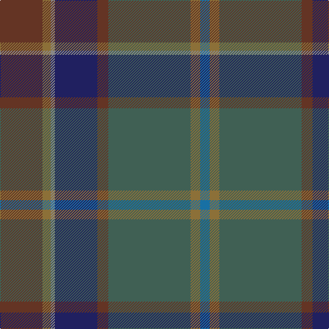

In pattern [BGGGBRGG](/stripes/bgggbrgg/).

This was sourced from tartans-authority.  It is a [8 stripe tartan](/stripes/stripes8/).

Original link http://www.tartansauthority.com/tartan-ferret/display/11075/

## Thread count
T/62 LT12 N6 DB62 T16 Na120 LT14 B/14

## Palette
Each colour and the base-6 reference it is a variant of.

| Colour | Shade | Base |
|---|---|---|
| B | <code style="background-color:#1870A4;">#1870A4</code> `oklch(52.2% 0.113 241.2)` <small>#1870A4</small> | B <code style="background-color:#2A418A;">#2A418A</code> |
| DB | <code style="background-color:#202060;">#202060</code> `oklch(28.9% 0.111 276.9)` <small>#202060</small> | B <code style="background-color:#2A418A;">#2A418A</code> |
| LT | <code style="background-color:#8C7038;">#8C7038</code> `oklch(56.0% 0.082 83.0)` <small>#8C7038</small> | G <code style="background-color:#006100;">#006100</code> |
| N | <code style="background-color:#888888;">#888888</code> `oklch(62.7% 0.000 89.9)` <small>#888888</small> | R <code style="background-color:#CC0000;">#CC0000</code> |
| Na | <code style="background-color:#406054;">#406054</code> `oklch(46.0% 0.042 169.0)` <small>#406054</small> | G <code style="background-color:#006100;">#006100</code> |
| T | <code style="background-color:#643424;">#643424</code> `oklch(38.3% 0.074 39.1)` <small>#643424</small> | G <code style="background-color:#006100;">#006100</code> |

# Sample pattern

## Nearest tartans

The nearest existing variants by ΔTartan distance, with this tartan at the top so the swatches line up against it.

ΔTartan

Tartan

Sett

—

<a href="/ttd/edit/#slug=dy31y6o3db31dy8y60y7b7~x2">Little-Dowse Wedding</a> <a class="nn-out" href="/setts/s8/dy31y6o3db31dy8y60y7b7~x2/" title="open its dictionary page">↗</a>

1.01

<a href="/ttd/edit/#slug=do31lo6lr3db36do8dg60lo7t7~x2">Little-Dowse Wedding</a> <a class="nn-out" href="/setts/s8/do31lo6lr3db36do8dg60lo7t7~x2/" title="open its dictionary page">↗</a>

1.18

<a href="/ttd/edit/#slug=o7dg20y2dg4k5db4k2db20k3w1~x2">McMeeken</a> <a class="nn-out" href="/setts/s10/o7dg20y2dg4k5db4k2db20k3w1~x2/" title="open its dictionary page">↗</a>

1.51

<a href="/ttd/edit/#slug=dp10k2dg10dp30dg30dg55k4r8">Batten of Argyll (Baddenach)</a> <a class="nn-out" href="/setts/s8/dp10k2dg10dp30dg30dg55k4r8/" title="open its dictionary page">↗</a>

1.55

<a href="/ttd/edit/#slug=n8k2o26lo1o6k3dg10lg1k3n22lg1~x2">Faulkner (Personal)</a> <a class="nn-out" href="/setts/s11/n8k2o26lo1o6k3dg10lg1k3n22lg1~x2/" title="open its dictionary page">↗</a>

1.62

<a href="/ttd/edit/#slug=o5r8dp13dg21dg34dg55o3">Lunting Papi (Personal)</a> <a class="nn-out" href="/setts/s7/o5r8dp13dg21dg34dg55o3/" title="open its dictionary page">↗</a>

1.63

<a href="/ttd/edit/#slug=n3dg10n2dt25do3lr4do3dg10dt3n2lr3n1~x2">Bowhunter</a> <a class="nn-out" href="/setts/s12/n3dg10n2dt25do3lr4do3dg10dt3n2lr3n1~x2/" title="open its dictionary page">↗</a>

1.63

<a href="/ttd/edit/#slug=dy20dp2dy2dp2dy3dp8dg9g8y8dg1lr2~x2">Isle of Skye District Tartan Tartan Number: 2155. Earliest known date: 1993 The tartan was instigated and registered by Mrs Rosemary Nicolson Samios in 1992, an Australian of Skye descent, now living in Skye. It was selected through a worldwide competition won by Angus MacLeod from Lewis. Angus, a weaver by trade, produced the first commercial quantities in the traditional kilt weight in 1993 at Lochcarron Weavers in North Strome. The colours of the tartan depict those of the island, often called the 'Misty Isle'. Worn by the Torphican and Bathgate pipe band. (A patented design No. 0600930) See products available Copyright © Blair Urquhart, Comrie, 2015</a> <a class="nn-out" href="/setts/s11/dy20dp2dy2dp2dy3dp8dg9g8y8dg1lr2~x2/" title="open its dictionary page">↗</a>

1.64

<a href="/ttd/edit/#slug=db9k2db4k2dr6o3dy2db2dr11dy23t1k8~x2">Kelvin Family (Personal)</a> <a class="nn-out" href="/setts/s12/db9k2db4k2dr6o3dy2db2dr11dy23t1k8~x2/" title="open its dictionary page">↗</a>

1.65

<a href="/ttd/edit/#slug=r1dy2dt12dy8db16lo1~x2">Bobby Jones (Personal)</a> <a class="nn-out" href="/setts/s6/r1dy2dt12dy8db16lo1~x2/" title="open its dictionary page">↗</a>

1.66

<a href="/ttd/edit/#slug=db2r1dg26ly1k18db26y1r1db2~x2">Robb Hunting (Personal)</a> <a class="nn-out" href="/setts/s9/db2r1dg26ly1k18db26y1r1db2~x2/" title="open its dictionary page">↗</a>

## Neighbour map

Every grey dot is one of 14299 variants placed by the first two principal components of the ΔTartan feature space (44% of its variance). Red is this tartan; blue dots are its nearest — click one to open its page.

<svg viewBox="0 0 640 380" role="img" style="max-width:100%;height:auto;border:1px solid #e0e0e0;border-radius:4px;display:block" xmlns="http://www.w3.org/2000/svg"><image href="/nn/cloud.v1.png" width="640" height="380"/><a href="/setts/s8/do31lo6lr3db36do8dg60lo7t7~x2/"><circle cx="254.0" cy="176.9" r="4" fill="#3465a4"><title>Little-Dowse Wedding</title></circle></a><a href="/setts/s10/o7dg20y2dg4k5db4k2db20k3w1~x2/"><circle cx="253.0" cy="169.8" r="4" fill="#3465a4"><title>McMeeken</title></circle></a><a href="/setts/s8/dp10k2dg10dp30dg30dg55k4r8/"><circle cx="255.9" cy="168.0" r="4" fill="#3465a4"><title>Batten of Argyll (Baddenach)</title></circle></a><a href="/setts/s11/n8k2o26lo1o6k3dg10lg1k3n22lg1~x2/"><circle cx="310.5" cy="149.7" r="4" fill="#3465a4"><title>Faulkner (Personal)</title></circle></a><a href="/setts/s7/o5r8dp13dg21dg34dg55o3/"><circle cx="283.4" cy="218.0" r="4" fill="#3465a4"><title>Lunting Papi (Personal)</title></circle></a><a href="/setts/s12/n3dg10n2dt25do3lr4do3dg10dt3n2lr3n1~x2/"><circle cx="252.1" cy="132.9" r="4" fill="#3465a4"><title>Bowhunter</title></circle></a><a href="/setts/s11/dy20dp2dy2dp2dy3dp8dg9g8y8dg1lr2~x2/"><circle cx="227.8" cy="154.9" r="4" fill="#3465a4"><title>Isle of Skye District Tartan Tartan Number: 2155. Earliest known date: 1993 The tartan was instigated and registered by Mrs Rosemary Nicolson Samios in 1992, an Australian of Skye descent, now living in Skye. It was selected through a worldwide competition won by Angus MacLeod from Lewis. Angus, a weaver by trade, produced the first commercial quantities in the traditional kilt weight in 1993 at Lochcarron Weavers in North Strome. The colours of the tartan depict those of the island, often called the 'Misty Isle'. Worn by the Torphican and Bathgate pipe band. (A patented design No. 0600930) See products available Copyright © Blair Urquhart, Comrie, 2015</title></circle></a><a href="/setts/s12/db9k2db4k2dr6o3dy2db2dr11dy23t1k8~x2/"><circle cx="242.7" cy="150.0" r="4" fill="#3465a4"><title>Kelvin Family (Personal)</title></circle></a><a href="/setts/s6/r1dy2dt12dy8db16lo1~x2/"><circle cx="306.0" cy="229.1" r="4" fill="#3465a4"><title>Bobby Jones (Personal)</title></circle></a><a href="/setts/s9/db2r1dg26ly1k18db26y1r1db2~x2/"><circle cx="310.8" cy="160.6" r="4" fill="#3465a4"><title>Robb Hunting (Personal)</title></circle></a><circle cx="285.7" cy="185.5" r="5" fill="#c00000"/></svg>

ID: /setts/s8/dy31y6o3db31dy8y60y7b7~x2/
