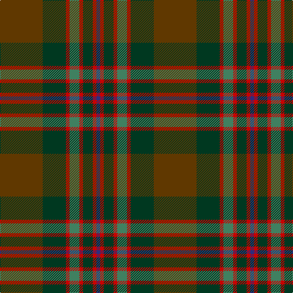

In pattern [BRGRGRGG](/stripes/brgrgrgg/).

This was sourced from tartans-authority.  It is a [8 stripe tartan](/stripes/stripes8/).

Original link http://www.tartansauthority.com/tartan-ferret/display/11022/

## Thread count
T/70 DG38 R6 G16 R6 DG16 R6 DB/6

## Palette
Each colour and its ΔE from the base-6 reference it is a variant of.

| Colour | Shade | Base | ΔE (OKLab) |
|---|---|---|---|
| DB | <code style="background-color:#2C2C80;">#2C2C80</code> `#2C2C80` | B <code style="background-color:#2A418A;">#2A418A</code> | 0.06 |
| DG | <code style="background-color:#003820;">#003820</code> `#003820` | G <code style="background-color:#006100;">#006100</code> | 0.15 |
| G | <code style="background-color:#408060;">#408060</code> `#408060` | G <code style="background-color:#006100;">#006100</code> | 0.14 |
| R | <code style="background-color:#C80000;">#C80000</code> `#C80000` | R <code style="background-color:#CC0000;">#CC0000</code> | 0.01 |
| T | <code style="background-color:#603800;">#603800</code> `#603800` | G <code style="background-color:#006100;">#006100</code> | 0.16 |

# Sample pattern

## Nearest tartans

The nearest existing variants by ΔTartan distance.

1. [John Muir Way](/setts/s8/dy35dg19r3y8r3dg8r3t3~x2/) — ΔT 0.37
1. [Scottish Crofting Foundation](/setts/s9/do6lg3do18dy2do2dy10y28r2y4~x2/) — ΔT 0.56
1. [State Seal of Minnesota (Fashion)](/setts/s8/r4g46r10db10dy33db5dy4lo3~x2/) — ΔT 0.82
1. [Cozumel](/setts/s9/dy7k1dg1r1k1r7dg15k1lo1~x4/) — ΔT 0.94
1. [Methven](/setts/s11/r2dg3dy18r2dy2r21y6dg2y2dg24lo2~x2/) — ΔT 1.10
1. [Bennett, John Paul (Personal)](/setts/s7/r4n38k4n6k41dg62y4/) — ΔT 1.11
1. [Pubcrawlers (Corporate)](/setts/s7/g3dy4g2dy22n5r16ly3~x2/) — ΔT 1.14
1. [New South Wales Waratah](/setts/s10/y12db2r2db2dt26dg2y3dg3y24r4~x2/) — ΔT 1.27
1. [Brave for Men (Fashion)](/setts/s8/k5dy5k5dy34n33k6n5o2/) — ΔT 1.28
1. [Lochaber (Ingles Buchan)](/setts/s10/do6o4n22r4k22do22k2r5k2do6~x2/) — ΔT 1.32

## Neighbour map

Every grey dot is one of 14299 variants placed by the first two principal components of the ΔTartan feature space (44% of its variance). Red is this tartan; blue dots are its nearest — click one to open its page.

<svg viewBox="0 0 640 380" role="img" style="max-width:100%;height:auto;border:1px solid #e0e0e0;border-radius:4px;display:block" xmlns="http://www.w3.org/2000/svg"><image href="/nn/cloud.v1.png" width="640" height="380"/><a href="/setts/s8/dy35dg19r3y8r3dg8r3t3~x2/"><circle cx="302.0" cy="206.0" r="4" fill="#3465a4"><title>John Muir Way</title></circle></a><a href="/setts/s9/do6lg3do18dy2do2dy10y28r2y4~x2/"><circle cx="309.8" cy="194.3" r="4" fill="#3465a4"><title>Scottish Crofting Foundation</title></circle></a><a href="/setts/s8/r4g46r10db10dy33db5dy4lo3~x2/"><circle cx="289.3" cy="195.0" r="4" fill="#3465a4"><title>State Seal of Minnesota (Fashion)</title></circle></a><a href="/setts/s9/dy7k1dg1r1k1r7dg15k1lo1~x4/"><circle cx="309.4" cy="174.3" r="4" fill="#3465a4"><title>Cozumel</title></circle></a><a href="/setts/s11/r2dg3dy18r2dy2r21y6dg2y2dg24lo2~x2/"><circle cx="251.5" cy="179.7" r="4" fill="#3465a4"><title>Methven</title></circle></a><a href="/setts/s7/r4n38k4n6k41dg62y4/"><circle cx="291.5" cy="211.6" r="4" fill="#3465a4"><title>Bennett, John Paul (Personal)</title></circle></a><a href="/setts/s7/g3dy4g2dy22n5r16ly3~x2/"><circle cx="317.1" cy="215.4" r="4" fill="#3465a4"><title>Pubcrawlers (Corporate)</title></circle></a><a href="/setts/s10/y12db2r2db2dt26dg2y3dg3y24r4~x2/"><circle cx="323.7" cy="184.3" r="4" fill="#3465a4"><title>New South Wales Waratah</title></circle></a><a href="/setts/s8/k5dy5k5dy34n33k6n5o2/"><circle cx="356.4" cy="215.8" r="4" fill="#3465a4"><title>Brave for Men (Fashion)</title></circle></a><a href="/setts/s10/do6o4n22r4k22do22k2r5k2do6~x2/"><circle cx="236.1" cy="206.2" r="4" fill="#3465a4"><title>Lochaber (Ingles Buchan)</title></circle></a><circle cx="300.4" cy="205.5" r="5" fill="#c00000"/></svg>

ID: /setts/s8/dy35dg19r3g8r3dg8r3db3~x2/
