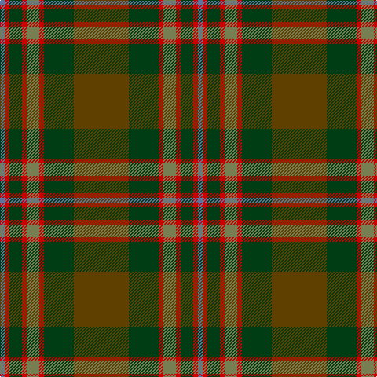

This page is one **sett** — a single exact thread-count. It belongs to the [tartan](/tartans/t35dg19r3g8r3dg8r3b3/)
(the same proportion at any scale), whose colour order is pattern [BRGRGRGG](/stripes/brgrgrgg/).

Sourced from register-of-tartans.  It is a [8 stripe tartan](/stripes/stripes8/).

Original link https://www.tartanregister.gov.uk/tartanDetails.aspx?ref=11022

## Register references

External register numbers recorded for this tartan.

- Scottish Register of Tartans: [11022](https://www.tartanregister.gov.uk/tartanDetails.aspx?ref=11022)

## Thread count
T/70 DG38 R6 G16 R6 DG16 R6 B/6

## Palette
Each colour and the base-6 reference it is a variant of.

| Colour | Shade | Base |
|---|---|---|
| B | <code style="background-color:#5F749C;">#5F749C</code> `oklch(55.8% 0.067 262.9)` <small>#5F749C</small> | B <code style="background-color:#2A418A;">#2A418A</code> |
| DG | <code style="background-color:#003C14;">#003C14</code> `oklch(31.1% 0.089 148.5)` <small>#003C14</small> | G <code style="background-color:#006100;">#006100</code> |
| G | <code style="background-color:#767E52;">#767E52</code> `oklch(57.5% 0.064 116.8)` <small>#767E52</small> | G <code style="background-color:#006100;">#006100</code> |
| R | <code style="background-color:#C80000;">#C80000</code> `oklch(52.3% 0.215 29.2)` <small>#C80000</small> | R <code style="background-color:#CC0000;">#CC0000</code> |
| T | <code style="background-color:#604000;">#604000</code> `oklch(39.8% 0.083 76.8)` <small>#604000</small> | G <code style="background-color:#006100;">#006100</code> |

# Sample pattern

## Nearest tartans

The nearest existing variants by ΔTartan distance, with this tartan at the top so the swatches line up against it.

ΔTartan

Tartan

Sett

—

<a href="/ttd/edit/#slug=dy35dg19r3y8r3dg8r3t3~x2">John Muir Way</a> <a class="nn-out" href="/setts/s8/dy35dg19r3y8r3dg8r3t3~x2/" title="open its dictionary page">↗</a>

0.37

<a href="/ttd/edit/#slug=dy35dg19r3g8r3dg8r3db3~x2">John Muir Way</a> <a class="nn-out" href="/setts/s8/dy35dg19r3g8r3dg8r3db3~x2/" title="open its dictionary page">↗</a>

0.45

<a href="/ttd/edit/#slug=do6lg3do18dy2do2dy10y28r2y4~x2">Scottish Crofting Foundation</a> <a class="nn-out" href="/setts/s9/do6lg3do18dy2do2dy10y28r2y4~x2/" title="open its dictionary page">↗</a>

0.73

<a href="/ttd/edit/#slug=r4g46r10db10dy33db5dy4lo3~x2">State Seal of Minnesota (Fashion)</a> <a class="nn-out" href="/setts/s8/r4g46r10db10dy33db5dy4lo3~x2/" title="open its dictionary page">↗</a>

1.06

<a href="/ttd/edit/#slug=g1r7g7n2r1dg15lb1~x4">Ramsay (Green Fashion)</a> <a class="nn-out" href="/setts/s7/g1r7g7n2r1dg15lb1~x4/" title="open its dictionary page">↗</a>

1.11

<a href="/ttd/edit/#slug=g3dy4g2dy22n5r16ly3~x2">Pubcrawlers (Corporate)</a> <a class="nn-out" href="/setts/s7/g3dy4g2dy22n5r16ly3~x2/" title="open its dictionary page">↗</a>

1.11

<a href="/ttd/edit/#slug=r2dg3dy18r2dy2r21y6dg2y2dg24lo2~x2">Methven</a> <a class="nn-out" href="/setts/s11/r2dg3dy18r2dy2r21y6dg2y2dg24lo2~x2/" title="open its dictionary page">↗</a>

1.12

<a href="/ttd/edit/#slug=dy7k1dg1r1k1r7dg15k1lo1~x4">Cozumel</a> <a class="nn-out" href="/setts/s9/dy7k1dg1r1k1r7dg15k1lo1~x4/" title="open its dictionary page">↗</a>

1.29

<a href="/ttd/edit/#slug=g4r1db2r1g10y5r3y10ly1~x4">Moncton, City of</a> <a class="nn-out" href="/setts/s9/g4r1db2r1g10y5r3y10ly1~x4/" title="open its dictionary page">↗</a>

1.32

<a href="/ttd/edit/#slug=r4n38k4n6k41dg62y4">Bennett, John Paul (Personal)</a> <a class="nn-out" href="/setts/s7/r4n38k4n6k41dg62y4/" title="open its dictionary page">↗</a>

1.35

<a href="/ttd/edit/#slug=dy16r16lr3dg16o2r1o2dy6r2~x4">Henry, W. A.</a> <a class="nn-out" href="/setts/s9/dy16r16lr3dg16o2r1o2dy6r2~x4/" title="open its dictionary page">↗</a>

## Neighbour map

Every grey dot is one of 14299 variants placed by the first two principal components of the ΔTartan feature space (44% of its variance). Red is this tartan; blue dots are its nearest — click one to open its page.

<svg viewBox="0 0 640 380" role="img" style="max-width:100%;height:auto;border:1px solid #e0e0e0;border-radius:4px;display:block" xmlns="http://www.w3.org/2000/svg"><image href="/nn/cloud.v1.png" width="640" height="380"/><a href="/setts/s8/dy35dg19r3g8r3dg8r3db3~x2/"><circle cx="300.4" cy="205.5" r="4" fill="#3465a4"><title>John Muir Way</title></circle></a><a href="/setts/s9/do6lg3do18dy2do2dy10y28r2y4~x2/"><circle cx="309.8" cy="194.3" r="4" fill="#3465a4"><title>Scottish Crofting Foundation</title></circle></a><a href="/setts/s8/r4g46r10db10dy33db5dy4lo3~x2/"><circle cx="289.3" cy="195.0" r="4" fill="#3465a4"><title>State Seal of Minnesota (Fashion)</title></circle></a><a href="/setts/s7/g1r7g7n2r1dg15lb1~x4/"><circle cx="314.2" cy="212.2" r="4" fill="#3465a4"><title>Ramsay (Green Fashion)</title></circle></a><a href="/setts/s7/g3dy4g2dy22n5r16ly3~x2/"><circle cx="317.1" cy="215.4" r="4" fill="#3465a4"><title>Pubcrawlers (Corporate)</title></circle></a><a href="/setts/s11/r2dg3dy18r2dy2r21y6dg2y2dg24lo2~x2/"><circle cx="251.5" cy="179.7" r="4" fill="#3465a4"><title>Methven</title></circle></a><a href="/setts/s9/dy7k1dg1r1k1r7dg15k1lo1~x4/"><circle cx="309.4" cy="174.3" r="4" fill="#3465a4"><title>Cozumel</title></circle></a><a href="/setts/s9/g4r1db2r1g10y5r3y10ly1~x4/"><circle cx="257.0" cy="208.6" r="4" fill="#3465a4"><title>Moncton, City of</title></circle></a><a href="/setts/s7/r4n38k4n6k41dg62y4/"><circle cx="291.5" cy="211.6" r="4" fill="#3465a4"><title>Bennett, John Paul (Personal)</title></circle></a><a href="/setts/s9/dy16r16lr3dg16o2r1o2dy6r2~x4/"><circle cx="238.0" cy="182.9" r="4" fill="#3465a4"><title>Henry, W. A.</title></circle></a><circle cx="302.0" cy="206.0" r="5" fill="#c00000"/></svg>

ID: /setts/s8/dy35dg19r3y8r3dg8r3t3~x2/
