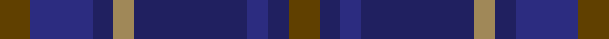
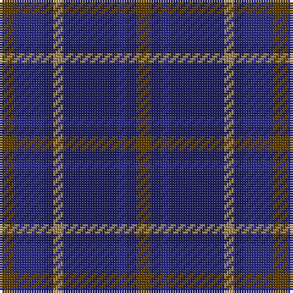

This page is one **sett** — a single exact thread-count. It belongs to the [tartan](/tartans/dy3db6db2lo2db11db2db2dy3/)
(the same proportion at any scale), whose colour order is pattern [GBBBYBBG](/stripes/gbbbybbg/).

Sourced from register-of-tartans.  It is a [8 stripe tartan](/stripes/stripes8/).

Original link https://www.tartanregister.gov.uk/tartanDetails.aspx?ref=866

## Register references

External register numbers recorded for this tartan.

- Scottish Register of Tartans: [866](https://www.tartanregister.gov.uk/tartanDetails.aspx?ref=866)
- Scottish Tartans Authority (ITI): 1725
- Scottish Tartans World Register: 1725

## Thread count
T/6 DB12 DBa4 LT4 DBa22 DB4 DBa4 T/6

## Palette

Palette: <strong>Tartan Register</strong>
<table><thead><tr><th>Colour</th><th>Threads</th><th>Shade</th><th>Base</th><th>OKLCh</th></tr></thead><tbody><tr><td>T/</td><td style="text-align:right;font-variant-numeric:tabular-nums">6</td><td><code style="background-color:#604000;">#604000</code> <small style="color:#888">#604000</small></td><td>G <code style="background-color:#006100;">#006100</code></td><td><small style="color:#888">oklch(39.8% 0.083 76.8)</small></td></tr><tr><td>DB</td><td style="text-align:right;font-variant-numeric:tabular-nums">12</td><td><code style="background-color:#2C2C80;">#2C2C80</code> <small style="color:#888">#2C2C80</small></td><td>B <code style="background-color:#2A418A;">#2A418A</code></td><td><small style="color:#888">oklch(35.0% 0.138 276.6)</small></td></tr><tr><td>DBa</td><td style="text-align:right;font-variant-numeric:tabular-nums">4</td><td><code style="background-color:#202060;">#202060</code> <small style="color:#888">#202060</small></td><td>B <code style="background-color:#2A418A;">#2A418A</code></td><td><small style="color:#888">oklch(28.9% 0.111 276.9)</small></td></tr><tr><td>LT</td><td style="text-align:right;font-variant-numeric:tabular-nums">4</td><td><code style="background-color:#A08858;">#A08858</code> <small style="color:#888">#A08858</small></td><td>Y <code style="background-color:#F2BF00;">#F2BF00</code></td><td><small style="color:#888">oklch(63.7% 0.071 84.0)</small></td></tr><tr><td>DBa</td><td style="text-align:right;font-variant-numeric:tabular-nums">22</td><td><code style="background-color:#202060;">#202060</code> <small style="color:#888">#202060</small></td><td>B <code style="background-color:#2A418A;">#2A418A</code></td><td><small style="color:#888">oklch(28.9% 0.111 276.9)</small></td></tr><tr><td>DB</td><td style="text-align:right;font-variant-numeric:tabular-nums">4</td><td><code style="background-color:#2C2C80;">#2C2C80</code> <small style="color:#888">#2C2C80</small></td><td>B <code style="background-color:#2A418A;">#2A418A</code></td><td><small style="color:#888">oklch(35.0% 0.138 276.6)</small></td></tr><tr><td>DBa</td><td style="text-align:right;font-variant-numeric:tabular-nums">4</td><td><code style="background-color:#202060;">#202060</code> <small style="color:#888">#202060</small></td><td>B <code style="background-color:#2A418A;">#2A418A</code></td><td><small style="color:#888">oklch(28.9% 0.111 276.9)</small></td></tr><tr><td>T/</td><td style="text-align:right;font-variant-numeric:tabular-nums">6</td><td><code style="background-color:#604000;">#604000</code> <small style="color:#888">#604000</small></td><td>G <code style="background-color:#006100;">#006100</code></td><td><small style="color:#888">oklch(39.8% 0.083 76.8)</small></td></tr></tbody></table>

# Sample pattern

## Nearest tartans

The nearest existing variants by ΔTartan distance, with this tartan at the top so the swatches line up against it.

ΔTartan

Tartan

Sett

—

<a href="/ttd/edit/#slug=dy3db6db2lo2db11db2db2dy3~x2">Daks (Blue)</a> <a class="nn-out" href="/setts/s8/dy3db6db2lo2db11db2db2dy3~x2/" title="open its dictionary page">↗</a>

0.55

<a href="/ttd/edit/#slug=dy5db12db4lo4db22db3db4dy5">Daks Muted blue Trade Tartan Tartan Number: 1725. Earliest known date: 1987 Submitted in 1981 as a potential Currie sett. See products available Copyright © Blair Urquhart, Comrie, 2015</a> <a class="nn-out" href="/setts/s8/dy5db12db4lo4db22db3db4dy5/" title="open its dictionary page">↗</a>

1.15

<a href="/ttd/edit/#slug=dg7db3dg7dt22db22w3db5~x2">United Colours of Scotland (Corporat</a> <a class="nn-out" href="/setts/s7/dg7db3dg7dt22db22w3db5~x2/" title="open its dictionary page">↗</a>

1.45

<a href="/ttd/edit/#slug=dg4db3dg20db9r2db2r2db18dp4~x2">New Club Centenary</a> <a class="nn-out" href="/setts/s9/dg4db3dg20db9r2db2r2db18dp4~x2/" title="open its dictionary page">↗</a>

1.56

<a href="/ttd/edit/#slug=db12t6db52dt41m12dp6m12">Great Scot (Fashion)</a> <a class="nn-out" href="/setts/s7/db12t6db52dt41m12dp6m12/" title="open its dictionary page">↗</a>

1.60

<a href="/ttd/edit/#slug=db12k2db2k2db2k10r2k10db12k3db12k10db11k2db2~x2">Mundigl Family Tartan Tartan Number: 6066. Earliest known date: 2003 We chose blue because we liked it See products available Copyright © Blair Urquhart, Comrie, 2015</a> <a class="nn-out" href="/setts/s15/db12k2db2k2db2k10r2k10db12k3db12k10db11k2db2~x2/" title="open its dictionary page">↗</a>

1.62

<a href="/ttd/edit/#slug=dt17o2dt2o2dt2k17db13k4~x2">Balmoral Hotel</a> <a class="nn-out" href="/setts/s8/dt17o2dt2o2dt2k17db13k4~x2/" title="open its dictionary page">↗</a>

1.64

<a href="/ttd/edit/#slug=db8k1db8k2dg6r1dg6k2db8lb1~x2">Dalmeny - 1965 (Fashion)</a> <a class="nn-out" href="/setts/s10/db8k1db8k2dg6r1dg6k2db8lb1~x2/" title="open its dictionary page">↗</a>

1.67

<a href="/setts/s10/t8o4db30dt30r3dt4~x2/">Hutchesons' Grammar School</a>

1.68

<a href="/setts/s12/db12t6db52dt41m12dp6m12/">Great Scot</a>

1.70

<a href="/ttd/edit/#slug=dt5k2dt2k2dt2db5k2db1o1db1k10dt3~x4">Hopkins (Wales)</a> <a class="nn-out" href="/setts/s12/dt5k2dt2k2dt2db5k2db1o1db1k10dt3~x4/" title="open its dictionary page">↗</a>

## Neighbour map

Every grey dot is one of 14299 variants placed by the first two principal components of the ΔTartan feature space (44% of its variance). Red is this tartan; blue dots are its nearest — click one to open its page.

<svg viewBox="0 0 640 380" role="img" style="max-width:100%;height:auto;border:1px solid #e0e0e0;border-radius:4px;display:block" xmlns="http://www.w3.org/2000/svg"><image href="/nn/cloud.v1.png" width="640" height="380"/><a href="/setts/s8/dy5db12db4lo4db22db3db4dy5/"><circle cx="335.3" cy="266.5" r="4" fill="#3465a4"><title>Daks Muted blue Trade Tartan Tartan Number: 1725. Earliest known date: 1987 Submitted in 1981 as a potential Currie sett. See products available Copyright © Blair Urquhart, Comrie, 2015</title></circle></a><a href="/setts/s7/dg7db3dg7dt22db22w3db5~x2/"><circle cx="289.1" cy="275.3" r="4" fill="#3465a4"><title>United Colours of Scotland (Corporat</title></circle></a><a href="/setts/s9/dg4db3dg20db9r2db2r2db18dp4~x2/"><circle cx="376.8" cy="249.8" r="4" fill="#3465a4"><title>New Club Centenary</title></circle></a><a href="/setts/s7/db12t6db52dt41m12dp6m12/"><circle cx="285.4" cy="238.5" r="4" fill="#3465a4"><title>Great Scot (Fashion)</title></circle></a><a href="/setts/s15/db12k2db2k2db2k10r2k10db12k3db12k10db11k2db2~x2/"><circle cx="256.0" cy="254.4" r="4" fill="#3465a4"><title>Mundigl Family Tartan Tartan Number: 6066. Earliest known date: 2003 We chose blue because we liked it See products available Copyright © Blair Urquhart, Comrie, 2015</title></circle></a><a href="/setts/s8/dt17o2dt2o2dt2k17db13k4~x2/"><circle cx="260.1" cy="248.1" r="4" fill="#3465a4"><title>Balmoral Hotel</title></circle></a><a href="/setts/s10/db8k1db8k2dg6r1dg6k2db8lb1~x2/"><circle cx="330.7" cy="252.1" r="4" fill="#3465a4"><title>Dalmeny - 1965 (Fashion)</title></circle></a><a href="/setts/s10/t8o4db30dt30r3dt4~x2/"><circle cx="290.0" cy="217.9" r="4" fill="#3465a4"><title>Hutchesons' Grammar School</title></circle></a><a href="/setts/s12/db12t6db52dt41m12dp6m12/"><circle cx="283.0" cy="223.2" r="4" fill="#3465a4"><title>Great Scot</title></circle></a><a href="/setts/s12/dt5k2dt2k2dt2db5k2db1o1db1k10dt3~x4/"><circle cx="331.4" cy="254.2" r="4" fill="#3465a4"><title>Hopkins (Wales)</title></circle></a><circle cx="305.2" cy="280.5" r="5" fill="#c00000"/></svg>

ID: /setts/s8/dy3db6db2lo2db11db2db2dy3~x2/
