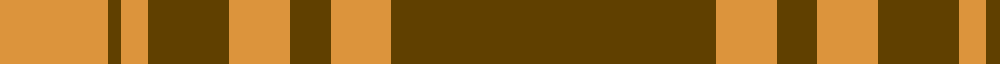
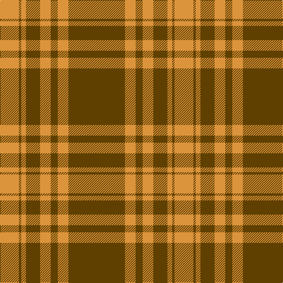

**Bands:** [GYGYGYGY](/stripes/gygygygy/) · **Stripes:** [DY LO DY LO DY LO DY LO](/stripes/stripes8/) DY LO DY LO DY LO DY LO

This was sourced from tartans-authority.  It is a [8 band tartan](/bands/bands8/).

Original link http://www.tartansauthority.com/tartan-ferret/display/10761/

## Thread count
O/32 T4 O8 T24 O18 T12 O18 T/96

## Palette
Each colour and its ΔE from the base-6 reference it is a variant of.

| Colour | Shade | Base | ΔE (OKLab) |
|---|---|---|---|
| O | <code style="background-color:#DC943C;">#DC943C</code> `#DC943C` | Y <code style="background-color:#F2BF00;">#F2BF00</code> | 0.12 |
| T | <code style="background-color:#604000;">#604000</code> `#604000` | G <code style="background-color:#006100;">#006100</code> | 0.14 |

# Sample pattern

## Nearest tartans

The nearest existing variants by ΔTartan distance.

1. [Donachie](/setts/s10/r24g2r2g40r25g2r2g2r2g20~x2/) — ΔT 1.07
1. [Livingstone](/setts/s10/g14r4g2r2g2r4g19r30g2r9~x2/) — ΔT 1.14
1. [MacQuarrie #5](/setts/s6/r16g1r1g1r4g12~x4/) — ΔT 1.24
1. [Yellow Pencil](/setts/s8/dy48ly9dy6ly9dy12ly4dy2ly16~x2/) — ΔT 1.28
1. [MacQuarrie](/setts/s6/r16dg1r1dg1r4dg12~x2/) — ΔT 1.40
1. [Erskine](/setts/s6/dg6r1dg24r28dg1r4~x2/) — ΔT 1.43
1. [Erskine (Vestiarium Scoticum)](/setts/s6/g6r1g24r28g1r4~x2/) — ΔT 1.44
1. [MacKintosh 2](/setts/s6/r48db2r3g28r4db2~x2/) — ΔT 1.45
1. [Cameron](/setts/s6/r2g6r2g6r16ly1~x2/) — ΔT 1.48
1. [Livingstone](/setts/s10/dg14r4dg2r2dg2r4dg19r30dg2r9~x2/) — ΔT 1.53

## Neighbour map

Every grey dot is one of 14313 variants placed by the first two principal components of the ΔTartan feature space (44% of its variance). Red is this tartan; blue dots are its nearest — click one to open its page.

<svg viewBox="0 0 640 380" role="img" style="max-width:100%;height:auto;border:1px solid #e0e0e0;border-radius:4px;display:block" xmlns="http://www.w3.org/2000/svg"><image href="/nn/cloud.v1.png" width="640" height="380"/><a href="/setts/s10/r24g2r2g40r25g2r2g2r2g20~x2/"><circle cx="424.9" cy="183.8" r="4" fill="#3465a4"><title>Donachie</title></circle></a><a href="/setts/s10/g14r4g2r2g2r4g19r30g2r9~x2/"><circle cx="415.5" cy="194.9" r="4" fill="#3465a4"><title>Livingstone</title></circle></a><a href="/setts/s6/r16g1r1g1r4g12~x4/"><circle cx="457.1" cy="215.3" r="4" fill="#3465a4"><title>MacQuarrie #5</title></circle></a><a href="/setts/s8/dy48ly9dy6ly9dy12ly4dy2ly16~x2/"><circle cx="438.8" cy="170.3" r="4" fill="#3465a4"><title>Yellow Pencil</title></circle></a><a href="/setts/s6/r16dg1r1dg1r4dg12~x2/"><circle cx="452.3" cy="213.1" r="4" fill="#3465a4"><title>MacQuarrie</title></circle></a><a href="/setts/s6/dg6r1dg24r28dg1r4~x2/"><circle cx="434.6" cy="195.4" r="4" fill="#3465a4"><title>Erskine</title></circle></a><a href="/setts/s6/g6r1g24r28g1r4~x2/"><circle cx="445.0" cy="199.8" r="4" fill="#3465a4"><title>Erskine (Vestiarium Scoticum)</title></circle></a><a href="/setts/s6/r48db2r3g28r4db2~x2/"><circle cx="467.4" cy="170.5" r="4" fill="#3465a4"><title>MacKintosh 2</title></circle></a><a href="/setts/s6/r2g6r2g6r16ly1~x2/"><circle cx="417.2" cy="201.0" r="4" fill="#3465a4"><title>Cameron</title></circle></a><a href="/setts/s10/dg14r4dg2r2dg2r4dg19r30dg2r9~x2/"><circle cx="409.5" cy="187.9" r="4" fill="#3465a4"><title>Livingstone</title></circle></a><circle cx="477.0" cy="189.2" r="5" fill="#c00000"/></svg>

ID: /setts/s8/dy48lo9dy6lo9dy12lo4dy2lo16~x2/
