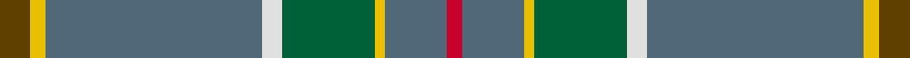
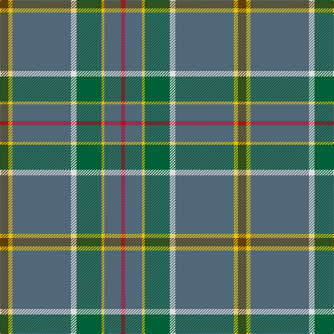

In pattern [GYBWGYBR](/stripes/gybwgybr/).

This was sourced from tartans-authority.  It is a [8 stripe tartan](/stripes/stripes8/).

Original link http://www.tartansauthority.com/tartan-ferret/display/7480/

## Also known as

This cloth is also recorded under:

- Glasgow High School

## Attestations

This cloth appears in 2 source records; the oldest owns this page.

- July 2007 — Glasgow High (School) (tartans-authority, [record](http://www.tartansauthority.com/tartan-ferret/display/7480/))
- undated — Glasgow High School (register-of-tartans, [record](https://www.tartanregister.gov.uk/tartanDetails.aspx?ref=5522))

## Register references

External register numbers recorded for this tartan.

- Scottish Register of Tartans: [5522](https://www.tartanregister.gov.uk/tartanDetails.aspx?ref=5522)
- Scottish Tartans Authority (ITI): 7480

## Thread count
T/12 Y6 N84 LN8 G36 Y4 N24 R/6

## Palette
Each colour and the base-6 reference it is a variant of.

| Colour | Shade | Base |
|---|---|---|
| G | <code style="background-color:#006038;">#006038</code> `oklch(43.0% 0.103 156.9)` <small>#006038</small> | G <code style="background-color:#006100;">#006100</code> |
| LN | <code style="background-color:#E0E0E0;">#E0E0E0</code> `oklch(90.7% 0.000 89.9)` <small>#E0E0E0</small> | W <code style="background-color:#F7F7F7;">#F7F7F7</code> |
| N | <code style="background-color:#506878;">#506878</code> `oklch(50.4% 0.038 237.7)` <small>#506878</small> | B <code style="background-color:#2A418A;">#2A418A</code> |
| R | <code style="background-color:#C8002C;">#C8002C</code> `oklch(52.6% 0.212 22.0)` <small>#C8002C</small> | R <code style="background-color:#CC0000;">#CC0000</code> |
| T | <code style="background-color:#604000;">#604000</code> `oklch(39.8% 0.083 76.8)` <small>#604000</small> | G <code style="background-color:#006100;">#006100</code> |
| Y | <code style="background-color:#E8C000;">#E8C000</code> `oklch(81.9% 0.168 93.7)` <small>#E8C000</small> | Y <code style="background-color:#F2BF00;">#F2BF00</code> |

# Sample pattern

## Nearest tartans

The nearest existing variants by ΔTartan distance.

1. [Muskoka (District)](/setts/s8/w2g5t10g20r1ly2r2ly1~x2/) — ΔT 0.92
1. [Kansai St Andrews Society (Corp)](/setts/s10/n33w2r3w2db14r3g15n20r2n3~x2/) — ΔT 1.09
1. [Canuck Place](/setts/s9/w1db2lg15db3lg26o24lg3r2lo1~x2/) — ΔT 1.32
1. [Bressuire (District)](/setts/s7/r1g4lo1g3r4n15w1~x4/) — ΔT 1.38
1. [Nickel Lodge, Centennial](/setts/s9/y18ly1y2ly1y2db6w4o1g6~x2/) — ΔT 1.41
1. [Portree, Check](/setts/s12/y38db4y8o2y4w3y4m14n7y2n4w2~x2/) — ΔT 1.42
1. [Carbon (Corporate)](/setts/s9/n68k4n18o20k3w3k10lb8lo4/) — ΔT 1.43
1. [State Seal of Arkansas (Fashion)](/setts/s10/dt49lo3dy13dt12r4dt5k7y26dt4r2~x2/) — ΔT 1.44
1. [Wagland](/setts/s7/r3db6ly2db15dg12g39w3~x2/) — ΔT 1.44
1. [Edinburgh Fire (Corporate)](/setts/s7/ly2dy4r4n21w1n1r1~x4/) — ΔT 1.45

## Neighbour map

Every grey dot is one of 14299 variants placed by the first two principal components of the ΔTartan feature space (44% of its variance). Red is this tartan; blue dots are its nearest — click one to open its page.

<svg viewBox="0 0 640 380" role="img" style="max-width:100%;height:auto;border:1px solid #e0e0e0;border-radius:4px;display:block" xmlns="http://www.w3.org/2000/svg"><image href="/nn/cloud.v1.png" width="640" height="380"/><a href="/setts/s8/w2g5t10g20r1ly2r2ly1~x2/"><circle cx="361.6" cy="152.5" r="4" fill="#3465a4"><title>Muskoka (District)</title></circle></a><a href="/setts/s10/n33w2r3w2db14r3g15n20r2n3~x2/"><circle cx="332.1" cy="155.7" r="4" fill="#3465a4"><title>Kansai St Andrews Society (Corp)</title></circle></a><a href="/setts/s9/w1db2lg15db3lg26o24lg3r2lo1~x2/"><circle cx="384.0" cy="137.7" r="4" fill="#3465a4"><title>Canuck Place</title></circle></a><a href="/setts/s7/r1g4lo1g3r4n15w1~x4/"><circle cx="332.7" cy="183.3" r="4" fill="#3465a4"><title>Bressuire (District)</title></circle></a><a href="/setts/s9/y18ly1y2ly1y2db6w4o1g6~x2/"><circle cx="286.9" cy="130.1" r="4" fill="#3465a4"><title>Nickel Lodge, Centennial</title></circle></a><a href="/setts/s12/y38db4y8o2y4w3y4m14n7y2n4w2~x2/"><circle cx="382.1" cy="126.9" r="4" fill="#3465a4"><title>Portree, Check</title></circle></a><a href="/setts/s9/n68k4n18o20k3w3k10lb8lo4/"><circle cx="363.6" cy="115.9" r="4" fill="#3465a4"><title>Carbon (Corporate)</title></circle></a><a href="/setts/s10/dt49lo3dy13dt12r4dt5k7y26dt4r2~x2/"><circle cx="359.0" cy="149.8" r="4" fill="#3465a4"><title>State Seal of Arkansas (Fashion)</title></circle></a><a href="/setts/s7/r3db6ly2db15dg12g39w3~x2/"><circle cx="281.6" cy="156.6" r="4" fill="#3465a4"><title>Wagland</title></circle></a><a href="/setts/s7/ly2dy4r4n21w1n1r1~x4/"><circle cx="408.6" cy="130.6" r="4" fill="#3465a4"><title>Edinburgh Fire (Corporate)</title></circle></a><circle cx="367.1" cy="150.6" r="5" fill="#c00000"/></svg>

ID: /setts/s8/dy6ly3n42w4dg18ly2n12r3~x2/
