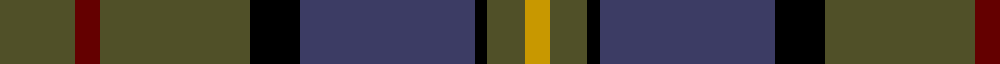
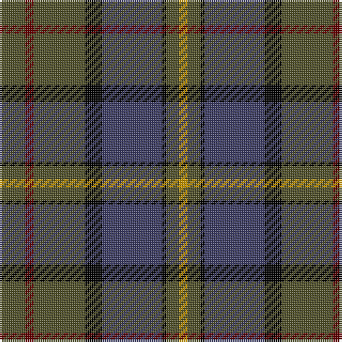

This page is one **sett** — a single exact thread-count. It belongs to the [tartan](/tartans/g6dr2g12k4n14k1g3dy2/)
(the same proportion at any scale), whose colour order is pattern [GRGKBKGY](/stripes/grgkbkgy/).

Sourced from tartans-authority.  It is a [8 stripe tartan](/stripes/stripes8/).

Original link http://www.tartansauthority.com/tartan-ferret/display/3472/

## Also known as

This cloth is also recorded under:

- Mica, Green

2 attestations — the source records this cloth was collapsed from (oldest owns this page)

<ul>
<li>pre 2002 — Mica, Green (Fashion) (tartans-authority, <a href="http://www.tartansauthority.com/tartan-ferret/display/3472/">record</a>)</li>
<li>undated — Mica Green (register-of-tartans, <a href="https://www.tartanregister.gov.uk/tartanDetails.aspx?ref=5003">record</a>)</li>
</ul>

## Register references

External register numbers recorded for this tartan.

- Scottish Register of Tartans: [5003](https://www.tartanregister.gov.uk/tartanDetails.aspx?ref=5003)
- Scottish Tartans Authority (ITI): 3472

## Thread count
G/12 DR4 G24 K8 N28 K2 G6 DY/4

## Palette
Each colour and the base-6 reference it is a variant of.

| Colour | Shade | Base |
|---|---|---|
| DR | <code style="background-color:#640000;">#640000</code> `oklch(31.6% 0.130 29.2)` <small>#640000</small> | R <code style="background-color:#CC0000;">#CC0000</code> |
| DY | <code style="background-color:#C89800;">#C89800</code> `oklch(70.6% 0.144 85.9)` <small>#C89800</small> | Y <code style="background-color:#F2BF00;">#F2BF00</code> |
| G | <code style="background-color:#505028;">#505028</code> `oklch(42.1% 0.059 108.7)` <small>#505028</small> | G <code style="background-color:#006100;">#006100</code> |
| K | <code style="background-color:#000000;">#000000</code> `oklch(0.0% 0.000 0.0)` <small>#000000</small> | K <code style="background-color:#000000;">#000000</code> |
| N | <code style="background-color:#3C3C64;">#3C3C64</code> `oklch(37.5% 0.068 282.6)` <small>#3C3C64</small> | B <code style="background-color:#2A418A;">#2A418A</code> |

# Sample pattern

## Nearest tartans

The nearest existing variants by ΔTartan distance, with this tartan at the top so the swatches line up against it.

ΔTartan

Tartan

Sett

—

<a href="/ttd/edit/#slug=dy6o2dy12k4dt14k1dy3ly2~x2">Mica, Green (Fashion)</a> <a class="nn-out" href="/setts/s8/dy6o2dy12k4dt14k1dy3ly2~x2/" title="open its dictionary page">↗</a>

0.90

<a href="/ttd/edit/#slug=lo4k28r2do22t8do3~x2">Loch Long One Design</a> <a class="nn-out" href="/setts/s6/lo4k28r2do22t8do3~x2/" title="open its dictionary page">↗</a>

0.99

<a href="/ttd/edit/#slug=y27dr2y4o15db26k2db6~x2">Bailies of Bennachie Corporate Tartan Tartan Number: 3628. Earliest known date: 2002 The Bailes of Bennachie were founded in 1973 as caretakers of the mountain in Aberdeenshire, with the aim of 'preserving the amenity of the hill'. The tartan was produced on the occasion of the 25th anniversary to help create funds to continue their task. The colours reflect the autumn shades on the hill. See products available Copyright © Blair Urquhart, Comrie, 2015</a> <a class="nn-out" href="/setts/s7/y27dr2y4o15db26k2db6~x2/" title="open its dictionary page">↗</a>

0.99

<a href="/ttd/edit/#slug=g27r2g4r15db26k2db6~x2">Bailies of Bennachie (Corporate)</a> <a class="nn-out" href="/setts/s7/g27r2g4r15db26k2db6~x2/" title="open its dictionary page">↗</a>

1.03

<a href="/ttd/edit/#slug=r3dy18dg10dy2db10dy2db10dy2dg10dy18w3~x2">Fraser Htg (Clan)</a> <a class="nn-out" href="/setts/s11/r3dy18dg10dy2db10dy2db10dy2dg10dy18w3~x2/" title="open its dictionary page">↗</a>

1.03

<a href="/ttd/edit/#slug=dr4dg27o2db25lo5dg3o3~x2">Kilkenny, County (District)</a> <a class="nn-out" href="/setts/s7/dr4dg27o2db25lo5dg3o3~x2/" title="open its dictionary page">↗</a>

1.05

<a href="/ttd/edit/#slug=dg15db20k2r4k2db20dg15k2ly2~x2">Manroth (Personal)</a> <a class="nn-out" href="/setts/s9/dg15db20k2r4k2db20dg15k2ly2~x2/" title="open its dictionary page">↗</a>

1.08

<a href="/ttd/edit/#slug=r2do22g22do3db12y2~x2">Lisbon</a> <a class="nn-out" href="/setts/s6/r2do22g22do3db12y2~x2/" title="open its dictionary page">↗</a>

1.08

<a href="/ttd/edit/#slug=dg3db12lb1k12dg13r2dg2~x2">MacPhedran/MacFadzean</a> <a class="nn-out" href="/setts/s7/dg3db12lb1k12dg13r2dg2~x2/" title="open its dictionary page">↗</a>

1.08

<a href="/ttd/edit/#slug=k12r1dg14w1dg14k14r1db8k2~x2">Abercrombie (McKinlay)</a> <a class="nn-out" href="/setts/s9/k12r1dg14w1dg14k14r1db8k2~x2/" title="open its dictionary page">↗</a>

1.12

<a href="/ttd/edit/#slug=db12k4y12ly1y12k4db8r3~x2">Art Pewter Silver</a> <a class="nn-out" href="/setts/s8/db12k4y12ly1y12k4db8r3~x2/" title="open its dictionary page">↗</a>

## Neighbour map

Every grey dot is one of 14299 variants placed by the first two principal components of the ΔTartan feature space (44% of its variance). Red is this tartan; blue dots are its nearest — click one to open its page.

<svg viewBox="0 0 640 380" role="img" style="max-width:100%;height:auto;border:1px solid #e0e0e0;border-radius:4px;display:block" xmlns="http://www.w3.org/2000/svg"><image href="/nn/cloud.v1.png" width="640" height="380"/><a href="/setts/s6/lo4k28r2do22t8do3~x2/"><circle cx="265.4" cy="201.5" r="4" fill="#3465a4"><title>Loch Long One Design</title></circle></a><a href="/setts/s7/y27dr2y4o15db26k2db6~x2/"><circle cx="261.3" cy="207.1" r="4" fill="#3465a4"><title>Bailies of Bennachie Corporate Tartan Tartan Number: 3628. Earliest known date: 2002 The Bailes of Bennachie were founded in 1973 as caretakers of the mountain in Aberdeenshire, with the aim of 'preserving the amenity of the hill'. The tartan was produced on the occasion of the 25th anniversary to help create funds to continue their task. The colours reflect the autumn shades on the hill. See products available Copyright © Blair Urquhart, Comrie, 2015</title></circle></a><a href="/setts/s7/g27r2g4r15db26k2db6~x2/"><circle cx="240.9" cy="194.9" r="4" fill="#3465a4"><title>Bailies of Bennachie (Corporate)</title></circle></a><a href="/setts/s11/r3dy18dg10dy2db10dy2db10dy2dg10dy18w3~x2/"><circle cx="231.5" cy="203.2" r="4" fill="#3465a4"><title>Fraser Htg (Clan)</title></circle></a><a href="/setts/s7/dr4dg27o2db25lo5dg3o3~x2/"><circle cx="282.8" cy="195.0" r="4" fill="#3465a4"><title>Kilkenny, County (District)</title></circle></a><a href="/setts/s9/dg15db20k2r4k2db20dg15k2ly2~x2/"><circle cx="270.6" cy="202.7" r="4" fill="#3465a4"><title>Manroth (Personal)</title></circle></a><a href="/setts/s6/r2do22g22do3db12y2~x2/"><circle cx="241.0" cy="217.9" r="4" fill="#3465a4"><title>Lisbon</title></circle></a><a href="/setts/s7/dg3db12lb1k12dg13r2dg2~x2/"><circle cx="220.5" cy="203.4" r="4" fill="#3465a4"><title>MacPhedran/MacFadzean</title></circle></a><a href="/setts/s9/k12r1dg14w1dg14k14r1db8k2~x2/"><circle cx="256.9" cy="203.9" r="4" fill="#3465a4"><title>Abercrombie (McKinlay)</title></circle></a><a href="/setts/s8/db12k4y12ly1y12k4db8r3~x2/"><circle cx="219.6" cy="215.9" r="4" fill="#3465a4"><title>Art Pewter Silver</title></circle></a><circle cx="274.6" cy="194.8" r="5" fill="#c00000"/></svg>

ID: /setts/s8/dy6o2dy12k4dt14k1dy3ly2~x2/
