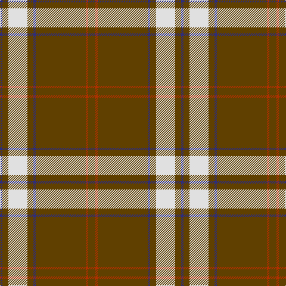

In pattern [BGWGBGRG](/stripes/bgwgbgrg/).

This was sourced from tartans-authority.  It is a [8 stripe tartan](/stripes/stripes8/).

Original link http://www.tartansauthority.com/tartan-ferret/display/3941/

## Thread count
T/12 R4 T84 DB4 T10 LN32 T10 DB/4

## Palette
Each colour and the base-6 reference it is a variant of.

| Colour | Shade | Base |
|---|---|---|
| DB | <code style="background-color:#2C2C80;">#2C2C80</code> `oklch(35.0% 0.138 276.6)` <small>#2C2C80</small> | B <code style="background-color:#2A418A;">#2A418A</code> |
| LN | <code style="background-color:#E0E0E0;">#E0E0E0</code> `oklch(90.7% 0.000 89.9)` <small>#E0E0E0</small> | W <code style="background-color:#F7F7F7;">#F7F7F7</code> |
| R | <code style="background-color:#B03000;">#B03000</code> `oklch(50.3% 0.171 36.3)` <small>#B03000</small> | R <code style="background-color:#CC0000;">#CC0000</code> |
| T | <code style="background-color:#604000;">#604000</code> `oklch(39.8% 0.083 76.8)` <small>#604000</small> | G <code style="background-color:#006100;">#006100</code> |

# Sample pattern

## Nearest tartans

The nearest existing variants by ΔTartan distance.

1. [Glenlivet Dress Reproduction](/setts/s14/w16dy5db2dy42r2dy6r2dy42db2dy5w16dy5db2dy5~x2/) — ΔT 1.14
1. [Bro-Dreger](/setts/s7/w3k5lo3r3lo32k2lo3~x2/) — ΔT 1.32
1. [Wilbers](/setts/s8/ly5k9ly2k7lo35r4lo35k4~x2/) — ΔT 1.34
1. [Lochcarron Camel](/setts/s5/o12lb1k2o1r1~x8/) — ΔT 1.44
1. [Gairloch](/setts/s8/y24y1k9y1y9y2w2db2~x2/) — ΔT 1.44
1. [Prince of Wales (Fashion)](/setts/s10/dg3r6dg2r1dg2r1dg16w1dg2w3~x4/) — ΔT 1.53
1. [Irn Bru Corporate Tartan Tartan Number: 2395. Earliest known date: Sep 1998 Irn Bru (Iron Brew) was first produced in 1901 by A.G. Barr and has been Scotland's favourite fizzy drink ever since. The colours are based on the brand label. Irn Bru was famously advertised on TV as 'being made in Scotland . . . from GIRDERS!" which was the subject of a complaint to the Advertising Standards Authority because it was 'untrue' !!! See products available Copyright © Blair Urquhart, Comrie, 2015](/setts/s8/lo49db16k2w3db2w2db3lo2~x2/) — ΔT 1.56
1. [Coca Cola](/setts/s5/w7dy7w7dy40r3~x2/) — ΔT 1.57
1. [Coca Cola (Corporate)](/setts/s5/w15dy15w15dy80r6/) — ΔT 1.60
1. [Rothesay Hunting Family Tartan Tartan Number: 984. Earliest known date: 1906 One of the 'Dress' and 'Hunting' versions of clan tartans introduced for the first time in 1906 by H. Whyte's and others, 'The Tartans of the Clans and Septs of Scotland' published by W & A. K. Johnston, Edinburgh. The book contains over 200 tartans and is the fore-runner of Johnston's annual pocket editions. See products available Copyright © Blair Urquhart, Comrie, 2015](/setts/s10/dg4r16dg4r2dg3r2dg32w2dg2w3~x2/) — ΔT 1.61

## Neighbour map

Every grey dot is one of 14299 variants placed by the first two principal components of the ΔTartan feature space (44% of its variance). Red is this tartan; blue dots are its nearest — click one to open its page.

<svg viewBox="0 0 640 380" role="img" style="max-width:100%;height:auto;border:1px solid #e0e0e0;border-radius:4px;display:block" xmlns="http://www.w3.org/2000/svg"><image href="/nn/cloud.v1.png" width="640" height="380"/><a href="/setts/s14/w16dy5db2dy42r2dy6r2dy42db2dy5w16dy5db2dy5~x2/"><circle cx="437.8" cy="114.3" r="4" fill="#3465a4"><title>Glenlivet Dress Reproduction</title></circle></a><a href="/setts/s7/w3k5lo3r3lo32k2lo3~x2/"><circle cx="469.3" cy="144.3" r="4" fill="#3465a4"><title>Bro-Dreger</title></circle></a><a href="/setts/s8/ly5k9ly2k7lo35r4lo35k4~x2/"><circle cx="399.9" cy="150.2" r="4" fill="#3465a4"><title>Wilbers</title></circle></a><a href="/setts/s5/o12lb1k2o1r1~x8/"><circle cx="467.6" cy="173.6" r="4" fill="#3465a4"><title>Lochcarron Camel</title></circle></a><a href="/setts/s8/y24y1k9y1y9y2w2db2~x2/"><circle cx="471.5" cy="147.0" r="4" fill="#3465a4"><title>Gairloch</title></circle></a><a href="/setts/s10/dg3r6dg2r1dg2r1dg16w1dg2w3~x4/"><circle cx="417.2" cy="166.5" r="4" fill="#3465a4"><title>Prince of Wales (Fashion)</title></circle></a><a href="/setts/s8/lo49db16k2w3db2w2db3lo2~x2/"><circle cx="413.9" cy="102.6" r="4" fill="#3465a4"><title>Irn Bru Corporate Tartan Tartan Number: 2395. Earliest known date: Sep 1998 Irn Bru (Iron Brew) was first produced in 1901 by A.G. Barr and has been Scotland's favourite fizzy drink ever since. The colours are based on the brand label. Irn Bru was famously advertised on TV as 'being made in Scotland . . . from GIRDERS!&quot; which was the subject of a complaint to the Advertising Standards Authority because it was 'untrue' !!! See products available Copyright © Blair Urquhart, Comrie, 2015</title></circle></a><a href="/setts/s5/w7dy7w7dy40r3~x2/"><circle cx="455.5" cy="196.4" r="4" fill="#3465a4"><title>Coca Cola</title></circle></a><a href="/setts/s5/w15dy15w15dy80r6/"><circle cx="445.4" cy="197.5" r="4" fill="#3465a4"><title>Coca Cola (Corporate)</title></circle></a><a href="/setts/s10/dg4r16dg4r2dg3r2dg32w2dg2w3~x2/"><circle cx="414.0" cy="157.8" r="4" fill="#3465a4"><title>Rothesay Hunting Family Tartan Tartan Number: 984. Earliest known date: 1906 One of the 'Dress' and 'Hunting' versions of clan tartans introduced for the first time in 1906 by H. Whyte's and others, 'The Tartans of the Clans and Septs of Scotland' published by W &amp; A. K. Johnston, Edinburgh. The book contains over 200 tartans and is the fore-runner of Johnston's annual pocket editions. See products available Copyright © Blair Urquhart, Comrie, 2015</title></circle></a><circle cx="452.7" cy="136.2" r="5" fill="#c00000"/></svg>

ID: /setts/s8/dy6r2dy42db2dy5w16dy5db2~x2/
