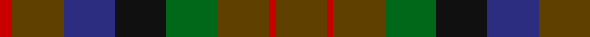
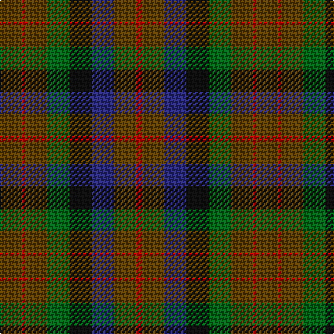

This page is one **sett** — a single exact thread-count. It belongs to the [tartan](/tartans/t8r1t8g8k8db8t8r2/)
(the same proportion at any scale), whose colour order is pattern [GRGGKBGR](/stripes/grggkbgr/).

Sourced from house-of-tartan.  It is a [8 stripe tartan](/stripes/stripes8/).

Original link http://www.house-of-tartan.scotland.net/house/TartanViewjs.asp?colr=Def&tnam=1654

## Thread count
T/16 R2 T16 G16 K16 DB16 T16 R/4

## Palette
Each colour and the base-6 reference it is a variant of.

| Colour | Shade | Base |
|---|---|---|
| DB | <code style="background-color:#2C2C80;">#2C2C80</code> `oklch(35.0% 0.138 276.6)` <small>#2C2C80</small> | B <code style="background-color:#2A418A;">#2A418A</code> |
| G | <code style="background-color:#006818;">#006818</code> `oklch(45.0% 0.142 145.0)` <small>#006818</small> | G <code style="background-color:#006100;">#006100</code> |
| K | <code style="background-color:#101010;">#101010</code> `oklch(17.3% 0.000 89.9)` <small>#101010</small> | K <code style="background-color:#000000;">#000000</code> |
| R | <code style="background-color:#C80000;">#C80000</code> `oklch(52.3% 0.215 29.2)` <small>#C80000</small> | R <code style="background-color:#CC0000;">#CC0000</code> |
| T | <code style="background-color:#604000;">#604000</code> `oklch(39.8% 0.083 76.8)` <small>#604000</small> | G <code style="background-color:#006100;">#006100</code> |

# Sample pattern

## Nearest tartans

The nearest existing variants by ΔTartan distance, with this tartan at the top so the swatches line up against it.

ΔTartan

Tartan

Sett

—

<a href="/ttd/edit/#slug=dy8r1dy8g8k8db8dy8r2~x2">MacDuff Hunting Clan Tartan Tartan Number: 1654. Earliest known date: 1906 STS records (sic) 'Sett may be quite wrong. (S.S. May 86)' See products available Copyright © Blair Urquhart, Comrie, 2015</a> <a class="nn-out" href="/setts/s8/dy8r1dy8g8k8db8dy8r2~x2/" title="open its dictionary page">↗</a>

0.87

<a href="/ttd/edit/#slug=do10r2do10g17k12db9do9r2~x2">MacDuff Hunting</a> <a class="nn-out" href="/setts/s8/do10r2do10g17k12db9do9r2~x2/" title="open its dictionary page">↗</a>

1.03

<a href="/ttd/edit/#slug=r1dy7db7k7g7dy7r1~x4">Tennant Family Tartan Tartan Number: 1653. Earliest known date: 1930 MacGregor-Hastie made few notes about his sample collection. In December 1967, Captain Tennant wrote to the Scottish Tartans Society, saying, &quot;.. and I have no objection to other Tennants wearing it (Tennant tartan) but their problem will be to get hold of it ... I don't know of any other Tennant tartan and that is why I think my father designed this one.&quot; The head of the Tennant family is Lord Glenconner, descended from John Tennant of Blairston, Ayr. (1635). See products available Copyright © Blair Urquhart, Comrie, 2015</a> <a class="nn-out" href="/setts/s7/r1dy7db7k7g7dy7r1~x4/" title="open its dictionary page">↗</a>

1.11

<a href="/ttd/edit/#slug=o16dg29n19g8n19dg29o16r4~x2">Styrian</a> <a class="nn-out" href="/setts/s8/o16dg29n19g8n19dg29o16r4~x2/" title="open its dictionary page">↗</a>

1.22

<a href="/ttd/edit/#slug=do10r3do10g14k12db12do14r4~x2">Wcwm 1310</a> <a class="nn-out" href="/setts/s8/do10r3do10g14k12db12do14r4~x2/" title="open its dictionary page">↗</a>

1.23

<a href="/ttd/edit/#slug=dy7r3dy9g15db19dy14r4~x2">Dorward/Dogwood</a> <a class="nn-out" href="/setts/s7/dy7r3dy9g15db19dy14r4~x2/" title="open its dictionary page">↗</a>

1.30

<a href="/ttd/edit/#slug=r1dy7g7k7b7dy7r1~x4">Tennant (Clan)</a> <a class="nn-out" href="/setts/s7/r1dy7g7k7b7dy7r1~x4/" title="open its dictionary page">↗</a>

1.36

<a href="/ttd/edit/#slug=dr5g6dy1g6dr5db6dr1~x2">Gleneagles Group Corporate Tartan Tartan Number: 2107. Earliest known date: 1989 Designed for a range of tartan goods called the Gleneagles Collection. See products available Copyright © Blair Urquhart, Comrie, 2015</a> <a class="nn-out" href="/setts/s7/dr5g6dy1g6dr5db6dr1~x2/" title="open its dictionary page">↗</a>

1.40

<a href="/ttd/edit/#slug=r2dy15dg12dy2dt12dy2dg12dy15o2~x4">Amazing Union (Personal)</a> <a class="nn-out" href="/setts/s9/r2dy15dg12dy2dt12dy2dg12dy15o2~x4/" title="open its dictionary page">↗</a>

1.41

<a href="/setts/s10/dy2lr1dy5k4do5o1~x4/">Huntly #3</a>

1.47

<a href="/ttd/edit/#slug=o13ly3o13g23dy16dr13o23r5~x2">Unidentified 2</a> <a class="nn-out" href="/setts/s8/o13ly3o13g23dy16dr13o23r5~x2/" title="open its dictionary page">↗</a>

## Neighbour map

Every grey dot is one of 14299 variants placed by the first two principal components of the ΔTartan feature space (44% of its variance). Red is this tartan; blue dots are its nearest — click one to open its page.

<svg viewBox="0 0 640 380" role="img" style="max-width:100%;height:auto;border:1px solid #e0e0e0;border-radius:4px;display:block" xmlns="http://www.w3.org/2000/svg"><image href="/nn/cloud.v1.png" width="640" height="380"/><a href="/setts/s8/do10r2do10g17k12db9do9r2~x2/"><circle cx="191.5" cy="248.8" r="4" fill="#3465a4"><title>MacDuff Hunting</title></circle></a><a href="/setts/s7/r1dy7db7k7g7dy7r1~x4/"><circle cx="167.6" cy="261.1" r="4" fill="#3465a4"><title>Tennant Family Tartan Tartan Number: 1653. Earliest known date: 1930 MacGregor-Hastie made few notes about his sample collection. In December 1967, Captain Tennant wrote to the Scottish Tartans Society, saying, &quot;.. and I have no objection to other Tennants wearing it (Tennant tartan) but their problem will be to get hold of it ... I don't know of any other Tennant tartan and that is why I think my father designed this one.&quot; The head of the Tennant family is Lord Glenconner, descended from John Tennant of Blairston, Ayr. (1635). See products available Copyright © Blair Urquhart, Comrie, 2015</title></circle></a><a href="/setts/s8/o16dg29n19g8n19dg29o16r4~x2/"><circle cx="195.1" cy="266.6" r="4" fill="#3465a4"><title>Styrian</title></circle></a><a href="/setts/s8/do10r3do10g14k12db12do14r4~x2/"><circle cx="174.8" cy="293.5" r="4" fill="#3465a4"><title>Wcwm 1310</title></circle></a><a href="/setts/s7/dy7r3dy9g15db19dy14r4~x2/"><circle cx="229.6" cy="279.8" r="4" fill="#3465a4"><title>Dorward/Dogwood</title></circle></a><a href="/setts/s7/r1dy7g7k7b7dy7r1~x4/"><circle cx="151.6" cy="253.3" r="4" fill="#3465a4"><title>Tennant (Clan)</title></circle></a><a href="/setts/s7/dr5g6dy1g6dr5db6dr1~x2/"><circle cx="212.9" cy="283.4" r="4" fill="#3465a4"><title>Gleneagles Group Corporate Tartan Tartan Number: 2107. Earliest known date: 1989 Designed for a range of tartan goods called the Gleneagles Collection. See products available Copyright © Blair Urquhart, Comrie, 2015</title></circle></a><a href="/setts/s9/r2dy15dg12dy2dt12dy2dg12dy15o2~x4/"><circle cx="270.9" cy="242.5" r="4" fill="#3465a4"><title>Amazing Union (Personal)</title></circle></a><a href="/setts/s10/dy2lr1dy5k4do5o1~x4/"><circle cx="167.1" cy="260.3" r="4" fill="#3465a4"><title>Huntly #3</title></circle></a><a href="/setts/s8/o13ly3o13g23dy16dr13o23r5~x2/"><circle cx="184.7" cy="232.3" r="4" fill="#3465a4"><title>Unidentified 2</title></circle></a><circle cx="215.8" cy="263.8" r="5" fill="#c00000"/></svg>

ID: /setts/s8/dy8r1dy8g8k8db8dy8r2~x2/
