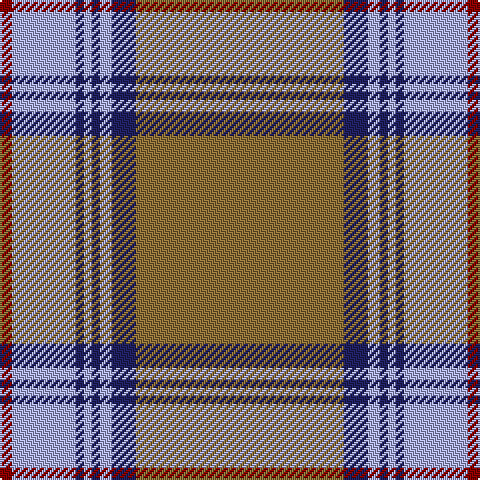

In pattern [GBWBWBWR](/patterns/gbwbwbwr/).

This was sourced from tartans-authority.  It is a [8 stripes tartan](/stripes/stripes8/).

Original link http://www.tartansauthority.com/tartan-ferret/display/5382/

## Thread count
DR/6 LP32 DB4 LP4 DB4 LP6 DB12 LT/104

## Palette
Each colour and its ΔE from the base-6 reference it is a variant of.

| Colour | Shade | Base | ΔE (OKLab) |
|---|---|---|---|
| DB | <code style="background-color:#202060;">#202060</code> `#202060` | B <code style="background-color:#2C4084;">#2C4084</code> | 0.11 |
| DR | <code style="background-color:#880000;">#880000</code> `#880000` | R <code style="background-color:#C80000;">#C80000</code> | 0.14 |
| LP | <code style="background-color:#A8ACE8;">#A8ACE8</code> `#A8ACE8` | W <code style="background-color:#F4F4F0;">#F4F4F0</code> | 0.22 |
| LT | <code style="background-color:#8C7038;">#8C7038</code> `#8C7038` | G <code style="background-color:#006400;">#006400</code> | 0.18 |

# Sample pattern

## Nearest tartans

The nearest existing variants by ΔTartan distance.

1. [President High School](/setts/s8/b166k14w12b20r14k6r40w6-b646464-k101010-ra00000-wffffff/) — ΔT 1.02
1. [Glen Moy #2](/setts/s12/r76g8b12w4b4w4b4g24r12b4r12w4-b441800-g604000-r888888-wfcfcfc/) — ΔT 1.12
1. [Doune (District)](/setts/s9/r20b22k4b6k4b4k16r80w8-b5c8ca8-k101010-r888888-wf8f8f8/) — ΔT 1.16
1. [Haddrell (2013)](/setts/s7/r4b8w36ba4w4ba82wa4-b1474b4-ba5c5c5c-rc80000-wc0c0c0-wafcfcfc/) — ΔT 1.16
1. [Scottish National Htg (Fashion)](/setts/s9/r132ra6g6ra6g32b16g6b6rb8-b4c0000-g006818-r888888-ra981c70-rba00048/) — ΔT 1.16
1. [Scottish National (hunting)](/setts/s9/g130b6ga6b6ga32ba16ga6ba6bb8-b800080-ba401000-bb600030-g808080-ga008000/) — ΔT 1.30
1. [Doune District Tartan Tartan Number: 4707. Earliest known date: 01/01/2002 A colour variation of Stewart Bute. See products available Copyright © Blair Urquhart, Comrie, 2015](/setts/s9/r20b22k4b6k4b4k16r80ka8-b5c8ca8-k101010-ka000000-r888888/) — ΔT 1.33
1. [Cavalier, Brown](/setts/s11/r80b20g4b4w4b6ga16r12b4r8w4-b1c1c1c-g789484-ga5c6428-ra07c58-we0e0e0/) — ΔT 1.36
1. [Cavalier, Red](/setts/s11/r80b20g4b4w4b6ra16r12b4r8w4-b1c1c1c-g789484-ra07c58-ra901c38-we0e0e0/) — ΔT 1.42
1. [Tunes of Glory (Film)](/setts/s8/y6g80b24y6k4w8k4y6-b242470-g785000-k101010-w98c8e8-yd87c00/) — ΔT 1.53

## Neighbour map

Every grey dot is one of 15726 variants placed by the first two principal components of the ΔTartan feature space (44% of its variance). Red is this tartan; blue dots are its nearest — click one to open its page.

<svg viewBox="0 0 640 380" role="img" style="max-width:100%;height:auto;border:1px solid #e0e0e0;border-radius:4px;display:block" xmlns="http://www.w3.org/2000/svg"><image href="/nn/cloud.v1.png" width="640" height="380"/><a href="/setts/s8/b166k14w12b20r14k6r40w6-b646464-k101010-ra00000-wffffff/"><circle cx="452.8" cy="128.4" r="4" fill="#3465a4"><title>President High School</title></circle></a><a href="/setts/s12/r76g8b12w4b4w4b4g24r12b4r12w4-b441800-g604000-r888888-wfcfcfc/"><circle cx="360.6" cy="119.3" r="4" fill="#3465a4"><title>Glen Moy #2</title></circle></a><a href="/setts/s9/r20b22k4b6k4b4k16r80w8-b5c8ca8-k101010-r888888-wf8f8f8/"><circle cx="372.6" cy="142.7" r="4" fill="#3465a4"><title>Doune (District)</title></circle></a><a href="/setts/s7/r4b8w36ba4w4ba82wa4-b1474b4-ba5c5c5c-rc80000-wc0c0c0-wafcfcfc/"><circle cx="378.7" cy="131.7" r="4" fill="#3465a4"><title>Haddrell (2013)</title></circle></a><a href="/setts/s9/r132ra6g6ra6g32b16g6b6rb8-b4c0000-g006818-r888888-ra981c70-rba00048/"><circle cx="397.3" cy="116.3" r="4" fill="#3465a4"><title>Scottish National Htg (Fashion)</title></circle></a><a href="/setts/s9/g130b6ga6b6ga32ba16ga6ba6bb8-b800080-ba401000-bb600030-g808080-ga008000/"><circle cx="393.8" cy="119.5" r="4" fill="#3465a4"><title>Scottish National (hunting)</title></circle></a><a href="/setts/s9/r20b22k4b6k4b4k16r80ka8-b5c8ca8-k101010-ka000000-r888888/"><circle cx="364.1" cy="140.8" r="4" fill="#3465a4"><title>Doune District Tartan Tartan Number: 4707. Earliest known date: 01/01/2002 A colour variation of Stewart Bute. See products available Copyright © Blair Urquhart, Comrie, 2015</title></circle></a><a href="/setts/s11/r80b20g4b4w4b6ga16r12b4r8w4-b1c1c1c-g789484-ga5c6428-ra07c58-we0e0e0/"><circle cx="370.2" cy="106.5" r="4" fill="#3465a4"><title>Cavalier, Brown</title></circle></a><a href="/setts/s11/r80b20g4b4w4b6ra16r12b4r8w4-b1c1c1c-g789484-ra07c58-ra901c38-we0e0e0/"><circle cx="368.3" cy="102.8" r="4" fill="#3465a4"><title>Cavalier, Red</title></circle></a><a href="/setts/s8/y6g80b24y6k4w8k4y6-b242470-g785000-k101010-w98c8e8-yd87c00/"><circle cx="354.0" cy="123.8" r="4" fill="#3465a4"><title>Tunes of Glory (Film)</title></circle></a><circle cx="411.5" cy="125.4" r="5" fill="#c00000"/></svg>

ID: /setts/s8/g104b12w6b4w4b4w32r6-b202060-g8c7038-r880000-wa8ace8/
