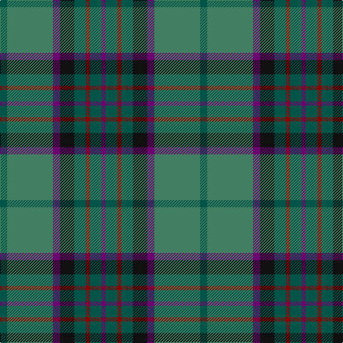

In pattern [BGRGKBGG](/patterns/bgrgkbgg/).

This was sourced from tartans-authority.  It is a [8 stripes tartan](/stripes/stripes8/).

Original link http://www.tartansauthority.com/tartan-ferret/display/2435/

## Attestations

This cloth appears in 2 source records; the oldest owns this page.

- pre 1996 — Scottish Power (Corporate) (tartans-authority, [record](http://www.tartansauthority.com/tartan-ferret/display/2435/))
- 01/01/1997 — Scottish Power (register-of-tartans, [record](https://www.tartanregister.gov.uk/tartanDetails.aspx?ref=3739))

## Thread count
Ga/10 G64 P10 K20 Ga16 DR6 Ga16 P/6

## Palette
Each colour and its ΔE from the base-6 reference it is a variant of.

| Colour | Shade | Base | ΔE (OKLab) |
|---|---|---|---|
| DR | <code style="background-color:#880000;">#880000</code> `#880000` | R <code style="background-color:#C80000;">#C80000</code> | 0.14 |
| G | <code style="background-color:#408060;">#408060</code> `#408060` | G <code style="background-color:#006400;">#006400</code> | 0.13 |
| Ga | <code style="background-color:#005448;">#005448</code> `#005448` | G <code style="background-color:#006400;">#006400</code> | 0.11 |
| K | <code style="background-color:#101010;">#101010</code> `#101010` | K <code style="background-color:#000000;">#000000</code> | 0.17 |
| P | <code style="background-color:#6C0070;">#6C0070</code> `#6C0070` | B <code style="background-color:#2C4084;">#2C4084</code> | 0.15 |

# Sample pattern

ID: /setts/s8/g10ga64b10k20g16r6g16b6-b6c0070-g005448-ga408060-k101010-r880000/
