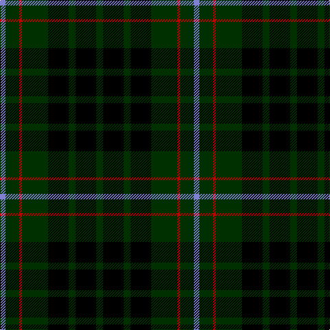

In pattern [BGRGKGKG](/patterns/bgrgkgkg/).

This was sourced from weddslist.  It is a [8 stripes tartan](/stripes/stripes8/).

Original link http://www.weddslist.com/cgi-bin/tartans/pg.pl?source=sts

## Thread count
B/8 DG20 R4 DG38 K30 DG10 K30 DG/10

## Palette
Each colour and its ΔE from the base-6 reference it is a variant of.

| Colour | Shade | Base | ΔE (OKLab) |
|---|---|---|---|
| B | <code style="background-color:#8080D0;">#8080D0</code> `#8080D0` | B <code style="background-color:#2C4084;">#2C4084</code> | 0.24 |
| DG | <code style="background-color:#003000;">#003000</code> `#003000` | G <code style="background-color:#006400;">#006400</code> | 0.18 |
| K | <code style="background-color:#000000;">#000000</code> `#000000` | K <code style="background-color:#000000;">#000000</code> | 0.00 |
| R | <code style="background-color:#C00000;">#C00000</code> `#C00000` | R <code style="background-color:#C80000;">#C80000</code> | 0.02 |

# Sample pattern

## Nearest tartans

The nearest existing variants by ΔTartan distance.

1. [MacAulay Hunting](/setts/s8/g12k32y2k32g16k8g24r4-g11450d-k000000-raa0000-yaaaaaa/) — ΔT 0.99
1. [MacAulay Hunting](/setts/s8/g12k32w2k32g16k8g24r4-g004c00-k000000-rc80000-wd0d0d0/) — ΔT 1.12
1. [Granger Family Tartan Tartan Number: 2226. Earliest known date: 1994 Designed by Steve Granger as a private family tartan. See products available Copyright © Blair Urquhart, Comrie, 2015](/setts/s6/k80b8k24b42g34k8-b1c1c1c-g00643c-k000000/) — ΔT 1.28
1. [Laois Irish County Tartan Tartan Number: 2252. Earliest known date: 1996 One of a series of Irish District tartans designed by Polly Wittering of the House of Edgar, with colours reminiscent of the Country with soft warm colours dominating. See products available Copyright © Blair Urquhart, Comrie, 2015](/setts/s9/k30b4k10b10k36g10k10g4k30-b5c6c8c-g6c841c-k000000/) — ΔT 1.35
1. [MacAulay Hunting](/setts/s8/g12k32w2k32g16k8g24r4-g006818-k101010-rc80000-wfcfcfc/) — ΔT 1.40
1. [MacAuley Hunting Clan Tartan Tartan Number: 827. Earliest known date: 1950 This shorter version tallies with the count published by M'Intyre North in 1881 as having been given him by Logan. There are two Clans of the name associated with districts as far apart as Dumbarton and Lewis and they have no family connection with each other. They are the MacAulays of Ardencaple associated with the MacGregors and the MacAulays of Lewis who are associated with the MacLeods. This sett in its shortened form begins to resemble the MacGregor tartan. See products available Copyright © Blair Urquhart, Comrie, 2015](/setts/s8/g12k32w2k32g16k8g24r4-g006818-k101010-rc80000-we0e0e0/) — ΔT 1.40
1. [Wilson's No.167](/setts/s10/k40b4k12g32ba8k18ba8g32k12b4-b5c8ca8-ba440044-g006818-k101010/) — ΔT 1.42
1. [MacCallum](/setts/s7/g16k4b2g8k12ba12k2-b4367ae-ba000052-g11450d-k000000/) — ΔT 1.45
1. [MacCallum](/setts/s7/g16k4w2g8k12b12k2-b00004c-g004c00-k000000-wd0d0d0/) — ΔT 1.46
1. [MacArthur](/setts/s5/k64g12k24g60y6-g11450d-k000000-yaaaa00/) — ΔT 1.47

## Neighbour map

Every grey dot is one of 15726 variants placed by the first two principal components of the ΔTartan feature space (44% of its variance). Red is this tartan; blue dots are its nearest — click one to open its page.

<svg viewBox="0 0 640 380" role="img" style="max-width:100%;height:auto;border:1px solid #e0e0e0;border-radius:4px;display:block" xmlns="http://www.w3.org/2000/svg"><image href="/nn/cloud.v1.png" width="640" height="380"/><a href="/setts/s8/g12k32y2k32g16k8g24r4-g11450d-k000000-raa0000-yaaaaaa/"><circle cx="321.2" cy="215.7" r="4" fill="#3465a4"><title>MacAulay Hunting</title></circle></a><a href="/setts/s8/g12k32w2k32g16k8g24r4-g004c00-k000000-rc80000-wd0d0d0/"><circle cx="310.8" cy="211.8" r="4" fill="#3465a4"><title>MacAulay Hunting</title></circle></a><a href="/setts/s6/k80b8k24b42g34k8-b1c1c1c-g00643c-k000000/"><circle cx="297.6" cy="246.1" r="4" fill="#3465a4"><title>Granger Family Tartan Tartan Number: 2226. Earliest known date: 1994 Designed by Steve Granger as a private family tartan. See products available Copyright © Blair Urquhart, Comrie, 2015</title></circle></a><a href="/setts/s9/k30b4k10b10k36g10k10g4k30-b5c6c8c-g6c841c-k000000/"><circle cx="275.4" cy="227.5" r="4" fill="#3465a4"><title>Laois Irish County Tartan Tartan Number: 2252. Earliest known date: 1996 One of a series of Irish District tartans designed by Polly Wittering of the House of Edgar, with colours reminiscent of the Country with soft warm colours dominating. See products available Copyright © Blair Urquhart, Comrie, 2015</title></circle></a><a href="/setts/s8/g12k32w2k32g16k8g24r4-g006818-k101010-rc80000-wfcfcfc/"><circle cx="324.5" cy="213.4" r="4" fill="#3465a4"><title>MacAulay Hunting</title></circle></a><a href="/setts/s8/g12k32w2k32g16k8g24r4-g006818-k101010-rc80000-we0e0e0/"><circle cx="327.5" cy="214.7" r="4" fill="#3465a4"><title>MacAuley Hunting Clan Tartan Tartan Number: 827. Earliest known date: 1950 This shorter version tallies with the count published by M'Intyre North in 1881 as having been given him by Logan. There are two Clans of the name associated with districts as far apart as Dumbarton and Lewis and they have no family connection with each other. They are the MacAulays of Ardencaple associated with the MacGregors and the MacAulays of Lewis who are associated with the MacLeods. This sett in its shortened form begins to resemble the MacGregor tartan. See products available Copyright © Blair Urquhart, Comrie, 2015</title></circle></a><a href="/setts/s10/k40b4k12g32ba8k18ba8g32k12b4-b5c8ca8-ba440044-g006818-k101010/"><circle cx="264.7" cy="219.0" r="4" fill="#3465a4"><title>Wilson's No.167</title></circle></a><a href="/setts/s7/g16k4b2g8k12ba12k2-b4367ae-ba000052-g11450d-k000000/"><circle cx="212.8" cy="251.6" r="4" fill="#3465a4"><title>MacCallum</title></circle></a><a href="/setts/s7/g16k4w2g8k12b12k2-b00004c-g004c00-k000000-wd0d0d0/"><circle cx="190.9" cy="242.1" r="4" fill="#3465a4"><title>MacCallum</title></circle></a><a href="/setts/s5/k64g12k24g60y6-g11450d-k000000-yaaaa00/"><circle cx="326.1" cy="259.7" r="4" fill="#3465a4"><title>MacArthur</title></circle></a><circle cx="279.0" cy="241.7" r="5" fill="#c00000"/></svg>

ID: /setts/s8/g10k30g10k30g38r4g20b8-b8080d0-g003000-k000000-rc00000/
