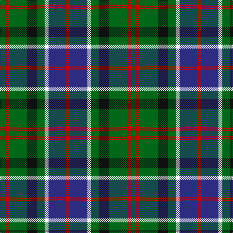

In pattern [GRGKGWBR](/patterns/grgkgwbr/).

This was sourced from tartans-authority.  It is a [8 stripes tartan](/stripes/stripes8/).

Original link http://www.tartansauthority.com/tartan-ferret/display/6050/

## Thread count
G/10 R8 G38 K20 G16 W8 DB36 R/8

## Palette
Each colour and its ΔE from the base-6 reference it is a variant of.

| Colour | Shade | Base | ΔE (OKLab) |
|---|---|---|---|
| DB | <code style="background-color:#2C2C80;">#2C2C80</code> `#2C2C80` | B <code style="background-color:#2A418A;">#2A418A</code> | 0.06 |
| G | <code style="background-color:#006818;">#006818</code> `#006818` | G <code style="background-color:#006100;">#006100</code> | 0.02 |
| K | <code style="background-color:#101010;">#101010</code> `#101010` | K <code style="background-color:#000000;">#000000</code> | 0.17 |
| R | <code style="background-color:#C80000;">#C80000</code> `#C80000` | R <code style="background-color:#CC0000;">#CC0000</code> | 0.01 |
| W | <code style="background-color:#FCFCFC;">#FCFCFC</code> `#FCFCFC` | W <code style="background-color:#F7F7F7;">#F7F7F7</code> | 0.01 |

# Sample pattern

## Nearest tartans

The nearest existing variants by ΔTartan distance.

1. [MacKean Dress (Personal)](/setts/s9/r6k12g24k6g6k12b18k6w6-b2c2c80-g006818-k101010-rc80000-we0e0e0/) — ΔT 0.93
1. [Soutar (Name)](/setts/s9/k40w6b40k6r6g40r20w6k40-b2888c4-g285800-k101010-rc80000-we0e0e0/) — ΔT 0.94
1. [Vosko Family Tartan Tartan Number: 373. Earliest known date: 1989 Designed for a wedding. See products available Copyright © Blair Urquhart, Comrie, 2015](/setts/s9/b50k24y8k18r12k18y8k24g50-b2c2c80-g006818-k101010-rc80000-ye8c000/) — ΔT 0.96
1. [Wilson's No.194](/setts/s10/b6w2k6g10r2k6r2g10k6w2-b440044-g006818-k101010-rc80000-we0e0e0/) — ΔT 0.96
1. [Brodie Hunting](/setts/s7/r8b32g32k32y4k32r8-b5c8ca8-g006818-k101010-rc80000-yd09800/) — ΔT 1.00
1. [Maitland](/setts/s9/g6b16g6k8g18y4b4y4r4-b000052-g11450d-k000000-raa0000-yaaaa00/) — ΔT 1.01
1. [Maitland](/setts/s9/g3b8g3k4g9y2b2y2r2-b000052-g11450d-k000000-raa0000-yaaaa00/) — ΔT 1.01
1. [Disciples of Christ Motorcycle Ministry (Switzerland)](/setts/s7/k44g42k10g24b24r6w8-b2888c4-g006818-k101010-r888888-we0e0e0/) — ΔT 1.03
1. [Disciples of Christ MM (Switzerland)](/setts/s7/k44g42k10g24b24r6w8-b2888c4-g006818-k101010-r888888-wfcfcfc/) — ΔT 1.04
1. [Wilson's No.176](/setts/s8/k16b6g26ba24y4ba24g26b6-b5c8ca8-ba440044-g006818-k101010-ye8c000/) — ΔT 1.04

## Neighbour map

Every grey dot is one of 15726 variants placed by the first two principal components of the ΔTartan feature space (44% of its variance). Red is this tartan; blue dots are its nearest — click one to open its page.

<svg viewBox="0 0 640 380" role="img" style="max-width:100%;height:auto;border:1px solid #e0e0e0;border-radius:4px;display:block" xmlns="http://www.w3.org/2000/svg"><image href="/nn/cloud.v1.png" width="640" height="380"/><a href="/setts/s9/r6k12g24k6g6k12b18k6w6-b2c2c80-g006818-k101010-rc80000-we0e0e0/"><circle cx="97.1" cy="234.9" r="4" fill="#3465a4"><title>MacKean Dress (Personal)</title></circle></a><a href="/setts/s9/k40w6b40k6r6g40r20w6k40-b2888c4-g285800-k101010-rc80000-we0e0e0/"><circle cx="131.7" cy="194.8" r="4" fill="#3465a4"><title>Soutar (Name)</title></circle></a><a href="/setts/s9/b50k24y8k18r12k18y8k24g50-b2c2c80-g006818-k101010-rc80000-ye8c000/"><circle cx="128.5" cy="212.5" r="4" fill="#3465a4"><title>Vosko Family Tartan Tartan Number: 373. Earliest known date: 1989 Designed for a wedding. See products available Copyright © Blair Urquhart, Comrie, 2015</title></circle></a><a href="/setts/s10/b6w2k6g10r2k6r2g10k6w2-b440044-g006818-k101010-rc80000-we0e0e0/"><circle cx="106.2" cy="219.5" r="4" fill="#3465a4"><title>Wilson's No.194</title></circle></a><a href="/setts/s7/r8b32g32k32y4k32r8-b5c8ca8-g006818-k101010-rc80000-yd09800/"><circle cx="152.9" cy="216.7" r="4" fill="#3465a4"><title>Brodie Hunting</title></circle></a><a href="/setts/s9/g6b16g6k8g18y4b4y4r4-b000052-g11450d-k000000-raa0000-yaaaa00/"><circle cx="131.0" cy="226.5" r="4" fill="#3465a4"><title>Maitland</title></circle></a><a href="/setts/s9/g3b8g3k4g9y2b2y2r2-b000052-g11450d-k000000-raa0000-yaaaa00/"><circle cx="131.0" cy="226.5" r="4" fill="#3465a4"><title>Maitland</title></circle></a><a href="/setts/s7/k44g42k10g24b24r6w8-b2888c4-g006818-k101010-r888888-we0e0e0/"><circle cx="152.7" cy="219.2" r="4" fill="#3465a4"><title>Disciples of Christ Motorcycle Ministry (Switzerland)</title></circle></a><a href="/setts/s7/k44g42k10g24b24r6w8-b2888c4-g006818-k101010-r888888-wfcfcfc/"><circle cx="148.0" cy="217.0" r="4" fill="#3465a4"><title>Disciples of Christ MM (Switzerland)</title></circle></a><a href="/setts/s8/k16b6g26ba24y4ba24g26b6-b5c8ca8-ba440044-g006818-k101010-ye8c000/"><circle cx="147.6" cy="230.9" r="4" fill="#3465a4"><title>Wilson's No.176</title></circle></a><circle cx="138.1" cy="223.4" r="5" fill="#c00000"/></svg>

ID: /setts/s8/g10r8g38k20g16w8b36r8-b2c2c80-g006818-k101010-rc80000-wfcfcfc/
