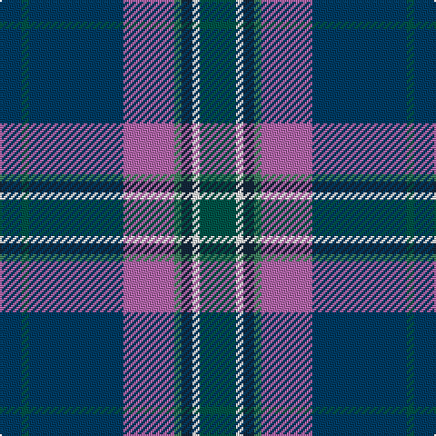

In pattern [BGBRGBWG](/patterns/bgbrgbwg/).

This was sourced from tartans-authority.  It is a [8 stripes tartan](/stripes/stripes8/).

Original link http://www.tartansauthority.com/tartan-ferret/display/6526/

## Thread count
DB/12 Ga4 DB52 P28 G4 DN6 W4 Ga/20

## Palette
Each colour and its ΔE from the base-6 reference it is a variant of.

| Colour | Shade | Base | ΔE (OKLab) |
|---|---|---|---|
| DB | <code style="background-color:#003C64;">#003C64</code> `#003C64` | B <code style="background-color:#2A418A;">#2A418A</code> | 0.08 |
| DN | <code style="background-color:#14283C;">#14283C</code> `#14283C` | B <code style="background-color:#2A418A;">#2A418A</code> | 0.15 |
| G | <code style="background-color:#408060;">#408060</code> `#408060` | G <code style="background-color:#006100;">#006100</code> | 0.14 |
| Ga | <code style="background-color:#005448;">#005448</code> `#005448` | G <code style="background-color:#006100;">#006100</code> | 0.10 |
| P | <code style="background-color:#B468AC;">#B468AC</code> `#B468AC` | R <code style="background-color:#CC0000;">#CC0000</code> | 0.21 |
| W | <code style="background-color:#F8F8F8;">#F8F8F8</code> `#F8F8F8` | W <code style="background-color:#F7F7F7;">#F7F7F7</code> | 0.00 |

# Sample pattern

## Nearest tartans

The nearest existing variants by ΔTartan distance.

1. [Wrigglesworth Family Canada (Personal)](/setts/s7/b30ba10g10b5r3y3ga3x2~b172d60-ba576982-g75786c-ga588658-ra20d22-yf9c75c/) — ΔT 0.77
1. [State Seal of Iowa (Fashion)](/setts/s8/b5ba43b18w4ba6r5g25y5x2~b003c64-ba1474b4-g604000-r880000-we8ccb8-ybc8c00/) — ΔT 0.82
1. [Suzugamine (Corporate)](/setts/s9/b4g5ga19ba5g5k5g5b36y3x2~b2c2c80-ba780078-g384020-ga006818-k000000-yd8d898/) — ΔT 0.92
1. [Margach, William (Personal)](/setts/s6/r4k3b18ra3ba34w3x2~b1474b4-ba003c64-k101010-ra8088c-rac8002c-we0e0e0/) — ΔT 0.99
1. [Blue Ridge Highlands Heritage](/setts/s8/b27ba9w3g6ba33w3bb3y2x2~b5c8ca8-ba2c2c80-bb680028-g00643c-wa8ace8-ye8c000/) — ΔT 0.99
1. [Kansai St Andrews Society](/setts/s10/b30w2r3w2ba14y3g14b18r2b3x2~b2c4084-ba000064-g005020-rc80028-we0e0e0-yec9d9d/) — ΔT 1.09
1. [Wilton (Toronto) (Personal)](/setts/s10/b9r1g9ba19w2ba19g9r1b9ra1x2~b5c5c5c-ba202060-g006818-rc80000-ra880000-we0e0e0/) — ΔT 1.10
1. [Cot-Hach (Personal)l)](/setts/s8/b3g10b5y1b10k1r4w1x4~b2c2c80-g003820-k101010-r880000-wfcfcfc-ye8c000/) — ΔT 1.10
1. [Laurentian University](/setts/s8/b2ba4w2ba28g28y3ba4ga2x2~b5c5c5c-ba203074-g005430-ga604000-we0e0e0-ye8c000/) — ΔT 1.16
1. [State Seal of Ohio (Fashion)](/setts/s9/b60y3b5ya5b9ba20y4g32w4x2~b2c2c80-ba441800-g006818-we8ccb8-ya08858-yabc8c00/) — ΔT 1.16

## Neighbour map

Every grey dot is one of 15726 variants placed by the first two principal components of the ΔTartan feature space (44% of its variance). Red is this tartan; blue dots are its nearest — click one to open its page.

<svg viewBox="0 0 640 380" role="img" style="max-width:100%;height:auto;border:1px solid #e0e0e0;border-radius:4px;display:block" xmlns="http://www.w3.org/2000/svg"><image href="/nn/cloud.v1.png" width="640" height="380"/><a href="/setts/s7/b30ba10g10b5r3y3ga3x2~b172d60-ba576982-g75786c-ga588658-ra20d22-yf9c75c/"><circle cx="273.1" cy="176.1" r="4" fill="#3465a4"><title>Wrigglesworth Family Canada (Personal)</title></circle></a><a href="/setts/s8/b5ba43b18w4ba6r5g25y5x2~b003c64-ba1474b4-g604000-r880000-we8ccb8-ybc8c00/"><circle cx="216.9" cy="168.6" r="4" fill="#3465a4"><title>State Seal of Iowa (Fashion)</title></circle></a><a href="/setts/s9/b4g5ga19ba5g5k5g5b36y3x2~b2c2c80-ba780078-g384020-ga006818-k000000-yd8d898/"><circle cx="221.1" cy="150.0" r="4" fill="#3465a4"><title>Suzugamine (Corporate)</title></circle></a><a href="/setts/s6/r4k3b18ra3ba34w3x2~b1474b4-ba003c64-k101010-ra8088c-rac8002c-we0e0e0/"><circle cx="273.1" cy="170.8" r="4" fill="#3465a4"><title>Margach, William (Personal)</title></circle></a><a href="/setts/s8/b27ba9w3g6ba33w3bb3y2x2~b5c8ca8-ba2c2c80-bb680028-g00643c-wa8ace8-ye8c000/"><circle cx="260.6" cy="141.2" r="4" fill="#3465a4"><title>Blue Ridge Highlands Heritage</title></circle></a><a href="/setts/s10/b30w2r3w2ba14y3g14b18r2b3x2~b2c4084-ba000064-g005020-rc80028-we0e0e0-yec9d9d/"><circle cx="279.7" cy="143.9" r="4" fill="#3465a4"><title>Kansai St Andrews Society</title></circle></a><a href="/setts/s10/b9r1g9ba19w2ba19g9r1b9ra1x2~b5c5c5c-ba202060-g006818-rc80000-ra880000-we0e0e0/"><circle cx="255.5" cy="154.1" r="4" fill="#3465a4"><title>Wilton (Toronto) (Personal)</title></circle></a><a href="/setts/s8/b3g10b5y1b10k1r4w1x4~b2c2c80-g003820-k101010-r880000-wfcfcfc-ye8c000/"><circle cx="242.4" cy="183.3" r="4" fill="#3465a4"><title>Cot-Hach (Personal)l)</title></circle></a><a href="/setts/s8/b2ba4w2ba28g28y3ba4ga2x2~b5c5c5c-ba203074-g005430-ga604000-we0e0e0-ye8c000/"><circle cx="297.8" cy="153.9" r="4" fill="#3465a4"><title>Laurentian University</title></circle></a><a href="/setts/s9/b60y3b5ya5b9ba20y4g32w4x2~b2c2c80-ba441800-g006818-we8ccb8-ya08858-yabc8c00/"><circle cx="283.2" cy="127.0" r="4" fill="#3465a4"><title>State Seal of Ohio (Fashion)</title></circle></a><circle cx="249.6" cy="161.2" r="5" fill="#c00000"/></svg>

ID: /setts/s8/g10w2b3ga2r14ba26g2ba6x2~b14283c-ba003c64-g005448-ga408060-rb468ac-wf8f8f8/
